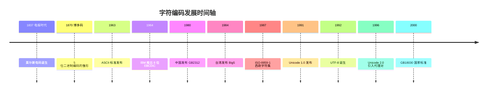

# 字符编码

> 计算机只能存储 0 和 1。要让计算机把文字存下来，就必须约定"哪个数字代表哪个字符"——这个约定就是**字符编码（character encoding）**。从电报时代到今天，编码的发展就是一部"从美国走向全世界"的历史。

## 编码发展时间轴



## 1 编码思想的源头：电报时代

### 莫尔斯电码（1837）

莫尔斯电码用"点、划、停顿"的组合来表示字母和数字，是最早的"用符号序列表示字符"的约定：

- `A` 是 `·—`，`B` 是 `—···`
- 出现频率越高的字母，编码越短（`E` 只有一个点）

它的核心思想——**用最短的码表示最常用的信息**——后来成为哈夫曼编码的灵感来源。

### 博多码（1870）

法国人 **Émile Baudot** 发明的博多码，用 **5 位**二进制数表示字符，只有 32 个组合，不够用就引入 **shift 切换**：同一个 5 位序列，在"字母档"和"数字档"下是不同字符。

"用状态切换来扩展容量"的思路，正是后来一切转义机制（如 UTF-8 的高位前缀）的祖先。

## 2 ASCII：一切编码的起点（1963）

### 时代背景

1960 年代初，各家计算机厂商（IBM、贝尔等）各用各的编码，相互之间没法交换数据。美国标准协会（ASA，后来的 ANSI）决定制定统一标准：

- **1963 年**：ANSI X3.4-1963 发布，即 ASCII（American Standard Code for Information Interchange，美国信息交换标准码）
- **1967 年**：修订版发布，调整了部分控制字符，成为我们今天熟悉的 ASCII

### 为什么是 7 位

ASCII 只用了 **7 位**，共 **128 个字符**。当时的传输习惯是 8 位一个字节，第 8 位空出来做**奇偶校验**（parity bit）。

### ASCII 的结构

| 范围 | 类型 | 内容 |
|---|---|---|
| 0x00 ~ 0x1F | 控制字符（33 个） | NUL 空、LF 换行、CR 回车、ESC 转义、BEL 响铃等 |
| 0x20 ~ 0x7E | 可打印字符（95 个） | 空格、数字、字母、标点 |
| 0x7F | 控制字符 | DEL 删除 |

可打印字符完整表（高 4 位为行、低 4 位为列）：

| 高\\低 | 0 | 1 | 2 | 3 | 4 | 5 | 6 | 7 | 8 | 9 | A | B | C | D | E | F |
|---|---|---|---|---|---|---|---|---|---|---|---|---|---|---|---|---|
| 0x2_ | SP | ! | " | # | $ | % | & | ' | ( | ) | * | + | , | - | . | / |
| 0x3_ | 0 | 1 | 2 | 3 | 4 | 5 | 6 | 7 | 8 | 9 | : | ; | < | = | > | ? |
| 0x4_ | @ | A | B | C | D | E | F | G | H | I | J | K | L | M | N | O |
| 0x5_ | P | Q | R | S | T | U | V | W | X | Y | Z | [ | \\ | ] | ^ | _ |
| 0x6_ | ` | a | b | c | d | e | f | g | h | i | j | k | l | m | n | o |
| 0x7_ | p | q | r | s | t | u | v | w | x | y | z | { | \| | } | ~ | DEL |

### ASCII 里的"心机"

- **大小写只差 0x20（32）**：`A` 是 0x41，`a` 是 0x61。大小写转换就是加减 32
- **数字连续**：`0` ~ `9` 是 0x30 ~ 0x39，字符转数值就是减去 0x30
- **字母连续**：`A`~`Z`、`a`~`z` 都连续排列，字符排序就是比较大小

```python
ord('A')        # 65 = 0x41
ord('a') - 32   # 97 - 32 = 65，大写化
ord('7') - ord('0')  # 55 - 48 = 7，字符转数值
```

### 局限

ASCII 只有 128 个字符，连带音调的欧洲文字（é、ü、ß）都放不下，更不用说中文、日文。于是各国开始各自扩展，进入了"诸侯混战"的时代。

## 3 地区编码的"诸侯混战"

### 一字节扩展：EBCDIC 与 ISO-8859

- **EBCDIC**：IBM 1964 年随 System/360 推出，8 位编码。字母之间不连续（隔 8 个码位），给排序带来麻烦，至今仍活在 IBM 大型机上
- **ISO-8859-1（Latin-1）**：1987 年 ISO 发布，8 位 256 个字符，在 ASCII 基础上扩展了 0xA0~0xFF，覆盖西欧语言。Windows 把它改造成 CP1252（0x80~0x9F 区与标准不同），这是网页编码混乱的常见来源之一

### 多字节编码：东亚的解法

一个字节最多 256 个字符，汉字有几万个，东亚国家只能使用**多字节编码**：

| 编码 | 时间 | 说明 |
|---|---|---|
| GB2312 | 1980 | 中国简体中文标准，收录 6763 个常用汉字（一级 3755 + 二级 3008），双字节 |
| Big5 | 1984 | 台湾繁体中文标准，收录 13053 个汉字（一级 5401 + 二级 7652），双字节 |
| Shift_JIS | 1982 | 日文编码（微软 CP932），双字节 |
| GBK | 1993 | GB2312 的扩展，收录 21886 个字符，向下兼容 GB2312，是 Windows 中文内码（CP936） |
| GB18030 | 2000 | 中国国家标准，1/2/4 字节变长，覆盖 Unicode 全部码位，2005 年起强制执行 |

### 混战的代价：乱码

同样的字节序列，按不同的字符集去解码，得到不同的文字——这就是**乱码**：

| 步骤 | 结果 |
|---|---|
| "中文" 用 GBK 编码 | 字节序列 `D6 D0 CE C4` |
| 按 ISO-8859-1 解码 | `ÖÐÎÄ`（经典乱码） |
| 按 UTF-8 解码 | 非法字节序列，出现 `�`（U+FFFD 替换字符） |

```python
'中文'.encode('gbk')                  # b'\xd6\xd0\xce\xc4'
b'\xd6\xd0\xce\xc4'.decode('latin-1')  # 'ÖÐÎÄ'
```

## 4 Unicode：一统天下的尝试

### 起源（1987 ~ 1991）

- 1987 年，Xerox 的 **Joe Becker** 与 Apple 的 Lee Collins、Mark Davis 提出统一字符集的想法
- 1989 年，**Unicode 联盟**（Unicode Consortium）成立，创始成员包括 Apple、Microsoft、IBM、Xerox 等公司
- **1991 年 10 月，Unicode 1.0 发布**：给世界上每一个字符分配一个唯一编号，这个编号叫**码位（code point）**，写作 `U+XXXX`，例如"中"是 U+4E2D
- 同一时期 ISO 也在制定 ISO/IEC 10646（UCS，通用字符集）。两边为了避免分裂，1991 年决定合并协调，共享同一张码位表

### 码位与平面

Unicode 把整个编码空间划分为 **17 个平面（plane）**，每个平面 65536 个码位，共 **1,114,112 个码位**（U+0000 ~ U+10FFFF）：

| 平面 | 名称 | 内容 |
|---|---|---|
| 0 | BMP 基本多文种平面 | 绝大多数常用文字，包括 CJK 基本区汉字 |
| 1 | SMP 补充多文种平面 | emoji、古代文字、音乐符号 |
| 2 | SIP 补充表意文字平面 | CJK 扩展 B 等生僻汉字 |
| 14 | SSP 补充专用平面 | 语言标记等 |
| 15~16 | PUA 私用区 | 厂商自定义字符 |

### 从 16 位到代理对（1996）

Unicode 1.0 原本只设计了 16 位（65536 个码位，即后来的 **UCS-2**），以为足够装下全世界的文字。结果很快发现不够：CJK 汉字加上各种符号，数量远超预期。

**1996 年 Unicode 2.0** 决定用**代理对（surrogate pair）**扩展：

- 保留 0xD800 ~ 0xDFFF 共 2048 个码位作为代理区，不分配给任何字符
- 将码位减去 0x10000 得到 20 位，拆成高 10 位和低 10 位，分别加上 0xD800、0xDC00，组成两个 16 位码元（共 4 字节）

> 例：😀 的码位是 U+1F600（1 号平面）→ UTF-16 编码为 `D8 3D DE 00`

### 字符集 vs 编码方案

Unicode 只规定了"**哪个字符是哪个数字**"（码位表），并没有规定"**数字怎么存进字节**"：

- **字符集（charset）**：字符 ↔ 码位的对应表。ASCII、GB2312、Unicode 都是字符集
- **编码方案**：码位 ↔ 字节序列的转换规则。UTF-8、UTF-16、UTF-32 都是 Unicode 的编码方案

ASCII 同时是字符集和编码方案（码位等于字节值）；GB2312 也是（双字节直接映射）。Unicode 则把两者分开了。

## 5 三种 UTF 编码

### UTF-32：最简单，也最浪费

直接存码位，固定 4 字节。处理简单，但空间浪费严重（英文文本比 ASCII 大 4 倍），一般只用于程序内部的临时处理。

### UTF-16：Windows 与 Java 的选择

- BMP 内的字符直接存 2 字节；补充平面的字符用代理对，存 4 字节
- 早期叫 **UCS-2**（固定 2 字节），1996 年引入代理对后正式称 UTF-16
- **Windows** 的系统 API（W 系列函数）和 **Java**（char 类型 16 位）都基于 UTF-16，这是历史包袱
- 存在**大小端**问题：UTF-16 LE（小端）和 UTF-16 BE（大端），文件用 BOM 区分

### UTF-8：兼容 ASCII 的变长编码（1992）

**1992 年 9 月**，Ken Thompson（Unix 之父之一）和 Rob Pike 在贝尔实验室的一次会议上，在一张餐巾纸上设计出了 UTF-8，随后用于他们开发的 Plan 9 操作系统，1993 年公开。

设计目标：

1. **兼容 ASCII**：U+0000~U+007F 用单字节，与 ASCII 完全一致，已有文件无需转换
2. **自同步**：任意位置截断或丢失字节，后续字节也能正确对齐，不会读错
3. **省空间**：英文 1 字节，欧洲文字 2 字节，汉字 3 字节

编码规则（变长 1~4 字节，用高位前缀标记长度和位置）：

| 码位范围 | 字节序列 | 说明 |
|---|---|---|
| U+0000 ~ U+007F | `0xxxxxxx` | 与 ASCII 完全一致 |
| U+0080 ~ U+07FF | `110xxxxx 10xxxxxx` | 拉丁扩展、希腊文等 |
| U+0800 ~ U+FFFF | `1110xxxx 10xxxxxx 10xxxxxx` | 中日韩文字，汉字 3 字节 |
| U+10000 ~ U+10FFFF | `11110xxx 10xxxxxx 10xxxxxx 10xxxxxx` | emoji、扩展汉字 |

最早的版本支持到 6 字节（31 位码位），2003 年的 RFC 3629 将上限收敛为 4 字节，对应 Unicode 的 0x10FFFF。

```python
'中'.encode('utf-8')     # b'\xe4\xb8\xad'，3 字节
'😀'.encode('utf-8')     # b'\xf0\x9f\x98\x80'，4 字节
b'\xe4\xb8\xad'.decode('utf-8')  # '中'
```

### 三种编码对比

| | UTF-8 | UTF-16 | UTF-32 |
|---|---|---|---|
| 字节数 | 1~4 变长 | 2 或 4 | 固定 4 |
| 兼容 ASCII | 完全兼容 | 不兼容 | 不兼容 |
| 英文空间 | 1 字节 | 2 字节 | 4 字节 |
| 汉字空间 | 3 字节 | 2 字节 | 4 字节 |
| 大小端问题 | 无 | 有 | 有 |
| 自同步 | 可以 | 不可以 | 不可以 |
| 主要用途 | Web、Linux、JSON 的事实标准 | Windows、Java 内部 | 内部处理 |

## 6 BOM 与大小端

BOM（Byte Order Mark，字节序标记）是文件开头的几个特殊字节，用来标识编码和字节序：

| 编码 | BOM | 说明 |
|---|---|---|
| UTF-8 | `EF BB BF` | 可选，仅作"我是 UTF-8"的标记 |
| UTF-16 BE | `FE FF` | 大端 |
| UTF-16 LE | `FF FE` | 小端 |

今天的事实标准是**无 BOM 的 UTF-8**（Linux 上带 BOM 的文件可能导致脚本第一行解析报错）。

## 7 乱码的真相与恢复

乱码的本质：**用编码 A 编码，用编码 B 解码**。常见场景：

- 网页的 `<meta charset>` 声明与实际编码不一致
- 文件在 Windows（GBK）和 Linux（UTF-8）之间传递
- 数据库连接字符集配置错误
- 邮件发送时编码声明错误

部分乱码可以"倒推"恢复：乱码只是换了一种解码方式，字节序列本身没变，用正确的编码再解一次即可。网上常见的"GBK 乱码还原"工具就是这个原理。

## 8 今天的事实标准

- **HTML5 默认 UTF-8**；JSON、XML 规范默认 UTF-8；Linux 文件系统、终端默认 UTF-8
- 中文环境下最常见的两种场景：**UTF-8（无 BOM）** 写代码、**GBK** 读旧文件
- emoji 是检验编码常识的好例子：它是 1 号平面的字符，UTF-8 存 4 字节、UTF-16 存代理对

## 相关笔记

- [计算机中的进制](./radix.md)：字节与十六进制的关系——一个字节用两位十六进制数表示
