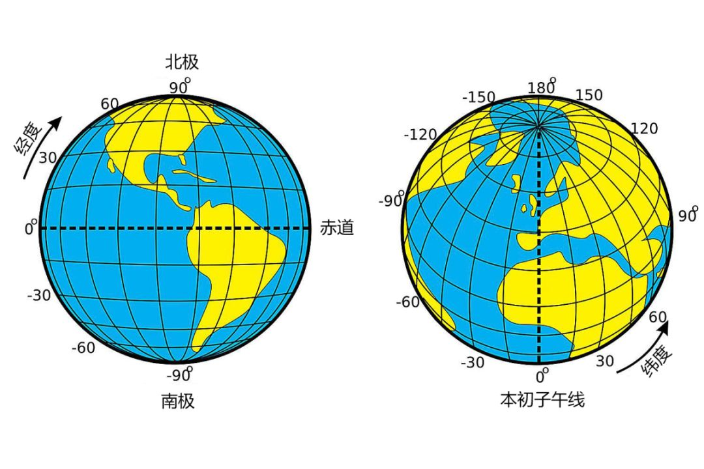
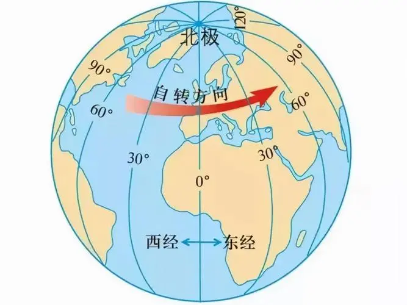

# 时区划分

> 这篇笔记从"时间"讲起：地球的运动产生了时间，人类发明了各种计时工具；为了统一各地不同的钟点，人类发明了时区；为了统一年份的计数，有了公元纪年；而计算机则用时间戳来统一表示时间。

## 地球的转动

银河系，以太阳为中心，地球围绕太阳转，同时，地球也在**自西向东**的转动。

如果从**地球北极**的视角来看，地球就是**逆时针**的转动。





面向太阳的是白天，背对太阳的就是黑夜，可以想象一个垂直于太阳方向的切面：

- 地球**自转一圈** → 一天（昼夜交替）
- 地球**公转一圈** → 一年（春夏秋冬）

## 地理的经纬度划分

为了描述地球上的位置，人类给地球画上了坐标：

纬度：以**赤道**为中心，定为 0度，分别向南、向北划分为 90度，并以 南纬、北纬命名

经度：以**本初子午线**为中心，定为 0度，分别向东、向西分为 180度，并以 东经、西经命名

（本初子午线的位置并不是天然的，后文"时区的发明"会讲到：1884 年它被正式定为格林尼治天文台所在经线）

## 人类对时间的发明

### 时间单位是天然的

人类早期并没有"钟表"，时间单位全部来自天体的运动：

- **日**：地球自转一圈
- **月**：月球绕地球转一圈（朔望月约 29.5 天）
- **年**：地球绕太阳转一圈（约 365.25 天）

### 计时工具的演进

"发明时间"其实是在发明**计量时间的工具**：

1. **日晷**：看太阳影子的方向和长短，但阴天、晚上就没法用
2. **刻漏（水钟）**：利用水流计时，不受天气影响，中国古称"铜壶滴漏"
3. **机械钟**：13 世纪欧洲出现，利用齿轮和擒纵机构
4. **摆钟**：1656 年荷兰人惠更斯发明，利用摆的等时性，精度大幅提升
5. **石英钟**：1927 年出现，利用石英晶体的稳定振动
6. **原子钟**：利用原子内部能级跃迁的固定频率，是目前最准的钟。1967 年起，"秒"被正式定义为**铯-133 原子跃迁 9,192,631,770 次**所用的时间

人类对"秒"的定义，从"一天的分割"变成了"原子的周期"，时间从此不再依赖地球的自转。

## 时区的发明

### 时差问题

因为地球**自西向东**自转，而东经为正、西经为负，所以**经度越大（越靠东），天黑得越早，天亮得也越早**。

陆地板块的分散，导致生活在各个地方的人，看到日出、日落的时间是不一样的。但我们都使用 **24小时制** 来度过一天，也都希望用 6~12 点表示上午、14~18 点表示下午，这就导致不同地区的人，各自有属于自己的时间。

当不同地区的人进行沟通交流时，涉及到时间就产生了区别：一方的某个时间点，并不是另一方的同一个时间点。比如一个地方的上午 9 点，在另一个地方可能已经是下午 8 点。这就是我们通常说的**时差**。

### 地方时

在铁路出现之前，每个地方都使用自己的**地方时**（以本地太阳升到最高为 12 点），大家互不干扰，也无所谓时差。

### 铁路逼出来的标准时间

19 世纪，铁路和电报出现了。火车时刻表、电报报文都需要统一的时间，否则调度就会混乱：

- 1840 年，英国大西部铁路最先统一使用"伦敦时间"（即后来的铁路时间）
- 1883 年 11 月 18 日，美国铁路公司统一采用"标准时间"，这一天被称为"有两个正午的一天"
- 1879 年，加拿大工程师**桑福德·弗莱明**提出：把地球划分为 24 个时区，每 15 度经度一个
- 1884 年，**国际经度会议**在美国华盛顿召开，正式确定：
  - 以英国**格林尼治天文台**所在经线为**本初子午线**（0 度经线）
  - 全球划分为 **24 个时区**，每个时区跨 15 度经度，相邻时区相差 1 小时
  - 以格林尼治时间为世界标准时间（GMT）

## 时区

### 时区的表示

时区用相对标准时间的偏移量来表示：**UTC+X**（东边）或 **UTC-X**（西边），X 为整数小时。

- **GMT**（格林尼治标准时间）：以格林尼治的太阳时为标准，历史上的世界标准时间
- **UTC**（协调世界时）：以原子钟为标准，比 GMT 更精确，通过闰秒与地球自转保持同步。现代计算机、网络协议中使用的标准
- **北京时间**：UTC+8，即东八区的时间

### 中国的时区

中国幅员辽阔，东西跨度约 5 个时区（从东五区到东九区），但全国统一使用**北京时间**（UTC+8）。这也是为什么新疆等地的人会觉得"天很晚才黑"。

### 夏令时

夏令时（DST）：夏天把时钟拨快 1 小时，以利用更长的白昼，部分国家使用。中国曾在 1986~1991 年实行过夏令时，后因弊大于利而取消。

## 纪年

钟点统一了（时区），年份也需要统一——这就是**纪年**。

### 公元纪年

#### 起因：为了算复活节

公元纪年，即公历纪元，原称**基督纪年**（Anno Domini，缩写 A.D.，意为"主的年份"）。

公元纪年由 6 世纪的修士**狄奥尼修斯·伊吉格斯**（Dionysius Exiguus）提出。当时他正在计算**复活节**的日期，需要一个统一的纪年起点，于是将耶稣出生的年份定为**公元元年**（即公元 1 年）。

#### 没有公元 0 年

注意：公元纪年**没有公元 0 年**。公元元年就是公元 1 年，公元前 1 年的下一年直接就是公元 1 年。如果把时间画成时间轴，公元元年就是坐标轴原点附近的位置。

后来考证，耶稣的实际出生年份大约在公元前 6~4 年（狄奥尼修斯算错了几年），但这并不影响公元纪年本身的使用。

#### 传播与确立

- 公元 525 年，狄奥尼修斯提出该纪年法
- 8 世纪，英国史学家**比德**在其著作中使用，使其在欧洲流传开来
- 1582 年，教皇格里高利十三世推行**格里高利历**（即现行公历），公元纪年随之成为西方世界的标准纪年

我们现在是公元 2026 年。

### 中国的纪年

#### 干支纪年

中国最早使用的纪年方式是**天干地支**纪年：

- 天干 10 个：甲乙丙丁戊己庚辛壬癸
- 地支 12 个：子丑寅卯辰巳午未申酉戌亥

天干地支两两组合，60 年一个循环，称为"一甲子"。商朝甲骨文中就已使用干支纪日，这种纪年法至今仍在农历中使用（如 2026 年是丙午年）。

#### 年号纪年

除了干支，古代还使用**年号纪年**。自汉武帝**建元元年**（公元前 140 年）起，皇帝即位要定年号，用"年号 + 年数"纪年，如"贞观三年"。明清时期基本一个皇帝一个年号，如康熙、乾隆。

#### 农历

传统历法**农历**是阴阳合历：月份按月相（阴历）确定，年份按太阳回归年（阳历）确定，通过"闰月"来调整，因此春节等节日每年在公历中的日期不固定。

#### 切换到公元纪年

- **1912 年**：辛亥革命爆发后次年（民国元年），中华民国成立，宣布**改用公历**（格里高利历），但纪年采用"民国纪年"（民国元年即 1912 年）
- **1949 年 9 月 27 日**：中国人民政治协商会议通过决议，中华人民共和国**正式采用公元纪年**，以公历为官方历法

此后中国官方一直使用公元纪年，而农历仍用于春节、中秋等传统节日的计算。

## 计算机的时间

### 统一的时间起点：时间戳

计算机遍布全球，日志、文件、网络协议都需要一个**全球统一、可以比较大小**的时间表示，于是有了**时间戳（timestamp）**：从某个约定的起点（epoch，纪元）开始，数经过了多少秒（或毫秒）。

### Unix 时间戳

计算机领域最著名的起点是 **1970 年 1 月 1 日 00:00:00 UTC**，也就是 Unix 时间戳的 0。原因很简单：Unix 操作系统诞生于 1969~1970 年的贝尔实验室，开发者顺手选了这个时间，用一个整数秒数来表示也足够简单。

```python
import time

time.time()  # 返回从 1970-01-01 00:00:00 UTC 至今的秒数
```

### 2038 年问题

早期的 Unix 时间戳用 32 位有符号整数存储，最大值为 2147483647，对应 2038 年 1 月 19 日。到那时 32 位整数就会溢出，类似 2000 年的"千年虫"问题。现代系统已普遍改用 64 位整数，可以覆盖到极远的未来。

### 其他时间起点

- **NTP**（网络时间协议）：1900 年 1 月 1 日
- **Windows FILETIME**：1601 年 1 月 1 日
- **儒略日**（天文领域）：公元前 4713 年 1 月 1 日

### 计算机里时间的完整描述

计算机表示一个时间点，需要三要素：

1. **时间戳**：绝对时刻，如 `1754323200`
2. **时区**：显示时转换为本地时间，如 UTC+8
3. **格式**：人类可读的字符串，如 ISO 8601 的 `2026-08-05T10:30:00+08:00`

同一个时间戳，在不同时区的机器上显示出的"当地时间"不同，这就是为什么部署服务器时一定要统一使用 UTC。

## 对时间的描述

一个完整的时间描述，包含：

- **年月日**：2026 年 8 月 5 日
- **星期**：星期三
- **上/下午**：上午 / 下午 / 晚上
- **时分秒**：10:30:25
- **时区**：UTC+8（北京时间）

标准化的写法（ISO 8601）用**日期 + T + 时间 + 时区偏移**表示：

```
2026-08-05T10:30:25+08:00
```

计算机内部存的是时间戳（秒数），展示给人类看的才是"年月日时分秒"。
