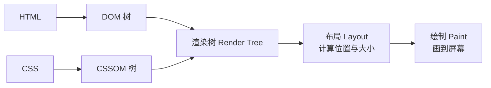
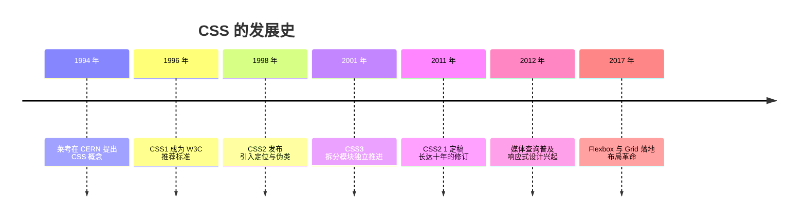
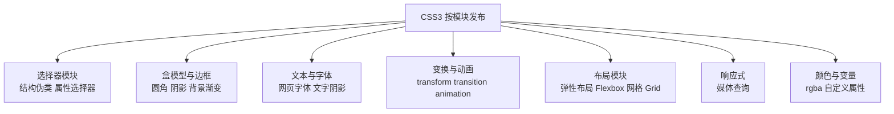
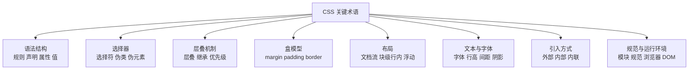
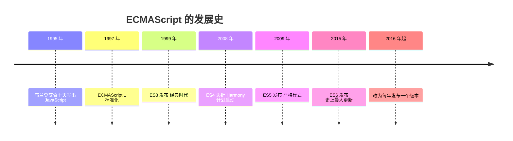
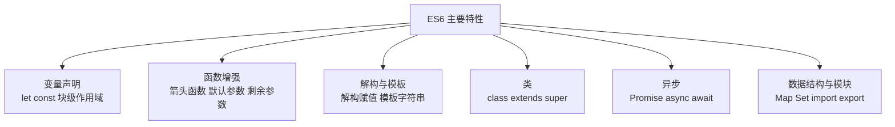

# Html5 CSS3 ES6

## 0x01. HTML5

HTML5 是 HTML 的第五个版本，2014 年成为 W3C 推荐标准。它的核心思想是：**让网页能表达"结构"、承载"多媒体"、运行"应用"**。

各 HTML 的 Element 内容参考网址：[https://developer.mozilla.org/zh-CN/docs/Web/HTML/Reference/Elements](https://developer.mozilla.org/zh-CN/docs/Web/HTML/Reference/Elements)

HTML5 的新特性可以简单分成几类：

| 分类 | 内容 |
|---|---|
| 语义化标签 | `header`、`nav`、`main`、`article`、`section`、`aside`、`footer`——用标签名表达"这块内容是什么" |
| 表单增强 | input 新类型（email、number、date、color…）、`placeholder`、`datalist` |
| 多媒体 | `<video>`、`<audio>` 原生播放音视频，不再依赖 Flash |
| 图形 | `<canvas>`（位图画布）、`<svg>`（矢量图形） |
| 本地存储 | `localStorage`、`sessionStorage`、`IndexedDB` |
| 新 API | `fetch`（网络请求）、Geolocation（定位）、WebSocket（长连接）、Web Worker（多线程）、History API |

## 0x02. CSS3 是什么

### 是啥

CSS，全名是 Cascading Style Sheets，中文名叫**层叠样式表**。用来控制 **HTML 元素**在浏览器中的显示样式，比如：显示在浏览器的什么位置，大小是多少，颜色是什么样等等。

关键是理解这个 **层叠（cascade）**。单词 cascade，指一层叠一层的瀑布，比如：国内的 **德天跨国大瀑布**。样式（style）就像这种分层瀑布一样一层层的叠加覆盖：


### 典型样例

```css
p {
  color: red;
  width: 500px;
  border: 1px solid black;
}
```

一条 CSS 规则的结构：**选择器 `p`** 选中元素 → **声明块 `{...}`** 里写一条条**声明**（属性: 值）→ 浏览器按声明渲染元素。

### CSS 引擎渲染过程

浏览器拿到 HTML 和 CSS 后，是这样把它变成画面的：



简单理解：HTML 描述"有哪些元素"（DOM 树），CSS 描述"每个元素长什么样"（CSSOM 树），两者合并成渲染树，再计算位置、画出像素。计算位置时，深度遍历 DOM 对象，先计算子节点，再合并父节点。

## 0x03. CSS 的发展史（按时间顺序）



- **1994 年**：**莱考（Håkon Wium Lie）**在 CERN 提出 CSS 概念。当时网页排版靠 HTML 标签里塞各种表现属性，越来越混乱，他的想法是——**结构与表现分离**：HTML 只管内容结构，样式交给独立的表
- **1996 年**：**CSS1** 成为 W3C 推荐标准，涵盖字体、颜色、边距等最基础的样式
- **1998 年**：**CSS2** 发布，引入定位（position）、伪类、媒体类型等
- **2001 年**：CSS3 启动，但不再是一个整体标准，而是**拆成一个个模块独立推进**（见 0x04）
- **2011 年**：CSS2.1 定稿——修订过程长达十年，说明"让浏览器统一"有多难
- **2012 年**：媒体查询（@media）普及，**响应式设计**兴起，一套样式适配手机和电脑
- **2017 年**：Flexbox 与 Grid 在主流浏览器全部落地，CSS 第一次有了真正成熟的**布局体系**

## 0x04. CSS3：模块化的新特性

CSS3 最大的变化是**组织方式**：以前 CSS1/CSS2 是一整份文档，必须整体发布；CSS3 把规范拆成几十个**模块**，每个模块有自己的版本号、独立演进，浏览器可以**部分实现**——这就是"CSS3 兼容性"问题的由来，也是"CSS 模块（Module）"这个术语的背景。



各模块的代表特性：

| 模块 | 新特性 |
|---|---|
| 选择器 | `:nth-child()` 等结构伪类、属性选择器增强 |
| 盒模型与边框 | `border-radius` 圆角、`box-shadow` 阴影、`box-sizing` |
| 背景与渐变 | 多背景、`linear-gradient()` / `radial-gradient()` 渐变 |
| 文本与字体 | `@font-face` 网页字体、`text-shadow` |
| 变换 | `transform` 2D/3D：`rotate()`、`scale()`、`translate()` |
| 过渡与动画 | `transition` 过渡、`@keyframes` + `animation` 动画 |
| 布局 | **Flexbox**（一维）、**Grid**（二维）、多列 |
| 响应式 | `@media` 媒体查询 |
| 颜色与变量 | `rgba()` / `hsl()`、CSS 自定义属性（变量） |

## 0x05. CSS 关键术语分类（词汇表）

把整理过的关键术语按"回答什么问题"分成 8 类：**规则长什么样**、**作用在谁身上**、**冲突了谁生效**、**元素长什么样**、**怎么排列**、**内容怎么显示**、**样式怎么引入**、**依赖什么环境**。



### 5.1 语法结构：一条 CSS 规则长什么样

| 术语 | 说明 |
|---|---|
| 规则集 | 简称规则，由一个或多个**选择器**、一个**声明块**组成，形如 `p{xx:yy;}` |
| 声明（declaration） | 元素的**某个属性**以及它的**值**，每条声明以分号 `;` 结尾 |
| 声明块 | 用大括号 `{}` 括起来的多条声明 |
| 属性 | 某种样式的名称，比如 border、color 等，不区分大小写 |
| 简写属性 | 允许在一行中设置多个属性值的属性，如 `border: 2px solid red` |
| 值 | 属性可设置的某种值，比如 color 属性的 red，和属性之间用冒号 `:` 隔开，也不区分大小写 |
| 函数 | 由函数名、括号、函数参数组成，可以成为属性的值，如 `calc()`、`rotate()` 等 |
| @规则 | 读作 **at-rules**，是一些特殊规则，是指令，指示 CSS 应该**执行的内容**或**表现的方式**，如 `@import` |
| 注释 | 供开发人员阅读、被 CSS 引擎忽略的文本，以 `/*` 开头、`*/` 结尾的文本内容块 |

### 5.2 选择器：样式作用在谁身上

| 术语 | 说明 |
|---|---|
| 选择器（selector） | CSS 规则将作用到的 HTML 元素。包含多种类型：元素选择器、ID 选择器、类选择器、属性选择器、伪类/伪元素选择器、全局选择器 |
| 类名（class） | HTML 元素的一个属性，用于对元素进行 CSS 样式分组，拥有相同 class 名称的元素，使用 class 对应的 CSS 规则 |
| 伪类 | 样式化特定元素的**特定状态**，如鼠标指针停留在超链接上面为 `a:hover` |
| 伪元素 | 表示一个元素的**某个部分**而不是元素自己，如 `::first-line` 表示第一行 |
| 包含选择符 | 将多个选择器隔开的**空格**，表示选择器之间是包含关系，从左往右层次嵌套；如 `li em` 表示选择 `<li>` 标签内的 `<em>` 标签 |
| 相邻选择符 | 将多个选择器隔开的**加号**，表示选择器是相邻的兄弟节点；如 `h1 + p` 表示选择相邻 `h1` 元素的 `p` 元素 |
| 选择器列表符 | 将多个选择器隔开的**逗号**，表示多个选择器共用同一条规则 |
| 初级选择符 | 将多个选择器隔开的**右尖括号**，表示选择**初代子级** HTML 元素；如 `ul > li` |

### 5.3 层叠机制：冲突时谁生效

| 术语 | 说明 |
|---|---|
| 层叠（cascade） | 是一种规则，也叫**层叠规则**：在相同类型的选择器时，出现在后面的 CSS 规则会覆盖前面的同名规则 |
| 继承 | 一些子级 HTML 元素的属性会继承父级元素的属性样式，有一些则不会 |
| 优先级 | 多个 CSS 规则作用于同一个 HTML 元素时，CSS 规则的生效顺序。总体来说，**越具体的选择器，优先级越高**，如 ID > class > tag |
| !important | 忽略浏览器的优先级计算，直接让该属性生效（一种技巧） |
| 级联层（@layer） | 是一种 @规则，提供了一种样式的覆盖方式（一种技巧） |

### 5.4 盒模型：元素长什么样

| 术语 | 说明 |
|---|---|
| 盒装模型 | 每一个 HTML 元素被视为一个**带有内外厚度的矩形**：外厚度称为 **margin**，内厚度称为 **padding**，矩形的 4 条边也有宽度和颜色；甚至一个**文字**也是一个盒装矩形 |
| 外边距（margin） | HTML 元素外侧的空间 |
| 内边距（padding） | HTML 元素内部、内容周围的空间 |
| 边框（border） | HTML 元素的边界，可以设置宽度、类型、颜色属性 |

### 5.5 布局：元素如何排列

| 术语 | 说明 |
|---|---|
| 文档流 | 同**流式布局** |
| 流式布局 | 默认情况下，浏览器将页面中的 HTML 元素，从左往右、从上到下，像水流流动一样平铺 |
| 块级 vs 行内元素 | HTML 元素是否独占一行：独占就是**块级**，否则就是**行内** |
| 浮动 | HTML 元素脱离默认的流式布局，像船一样漂浮在页面上 |

### 5.6 文本与字体：内容如何显示

| 术语 | 说明 |
|---|---|
| 文字 vs 文本 | 文字注重的是**单个字符**的属性，如字体类型；文本更注重**字符之间**的属性，如文本间距 |
| 字体类型 | 浏览器中显示字体的类型，比如宋体、黑体、微软雅黑等 |
| 字体大小 | 字体所呈现的大小，比如 10px |
| 字体颜色 | HTML 元素内出现的文字所呈现的颜色 |
| 文本行高 | 一行文字所占的高度（含行距），属性 `line-height` |
| 文本字间距 | 字符与字符之间的间距，属性 `letter-spacing` |
| 文本位置 | 文本显示的位置，如左对齐、居中、右对齐 |
| 阴影 | 文字旁边的黑色内容，可以设置水平偏移量、垂直偏移量、模糊半径和**基色**（`text-shadow`） |

### 5.7 样式表的三种引入方式

| 术语 | 说明 |
|---|---|
| 外部样式表 | 使用 `<link rel="" href="">` 标签引入的 CSS 文件，最推荐：一处修改，全站生效 |
| 内部样式表 | 在页面内部的 `<style>` 标签内的 CSS 样式，仅对当前页面生效 |
| 内联样式 | 写在 HTML 元素的 `style` 属性内的 CSS 样式，优先级最高（有 !important 除外），难以复用 |

### 5.8 规范与运行环境

| 术语 | 说明 |
|---|---|
| CSS 模块（Module） | CSS 属性的一种分组 |
| CSS 规范（Specifications） | 由 W3C 等组织发布的关于 CSS 内容的文档，针对**浏览器开发人员**，而非 Web 应用开发人员 |
| 浏览器支持 | CSS 最终是在浏览器中运行的，因此需被浏览器支持，并不是每一种 CSS 属性都会被浏览器支持 |
| DOM（Document Object Model） | 文档对象模型，HTML 元素在浏览器内存中的存在形式 |

## 0x06. ECMAScript6

就是我们常说的 JavaScript。

### ECMAScript 是什么

ECMAScript 是 JavaScript 语言的**规范标准**（JavaScript 是它在浏览器里的实现）。ES6（ECMAScript 2015）是第六版，引入了 `let`/`const`、箭头函数、类、Promise、模块化等现代语法，是今天前端开发的基础。

### ECMAScript 的发展史（按时间顺序）



- **1995 年**：**布兰登·艾奇（Brendan Eich）**在 Netscape 用 10 天设计出 JavaScript（最初叫 Mocha，后改名 LiveScript，再改名 JavaScript——蹭 Java 的热度）
- **1997 年**：Netscape 把语言提交给 ECMA 国际组织标准化，诞生 **ECMAScript 1**
- **1999 年**：**ES3** 发布，这是"经典时代"——`var`、函数、原型链都是这个时代的产品，统治了浏览器十几年
- **2008 年**：**ES4** 因各方意见分裂被放弃，转向 **Harmony（和谐）** 计划——最终成果就是 ES6
- **2009 年**：**ES5** 发布：严格模式、JSON 内置、数组的 `map`/`filter` 等方法
- **2015 年**：**ES6（ES2015）** 发布，历史上最大的一次更新，现代 JavaScript 的起点
- **2016 年起**：改为**每年发布一个版本**（ES2016、ES2017…），小步快跑；ES2017 带来了 `async/await`

### 语法功能分组



| 分组 | 代表特性 | 作用 |
|---|---|---|
| 变量声明 | `let`、`const` | 块级作用域，取代 `var` 的坑 |
| 函数增强 | 箭头函数、默认参数、剩余参数 `...args` | 更简洁的写法；箭头函数不绑定自己的 this |
| 解构赋值 | `const {a, b} = obj`、`const [x, y] = arr` | 从对象/数组批量取值 |
| 模板字符串 | 反引号 `` ` `` 加 `${name}` | 拼接、换行不再靠 `+` 和 `\n` |
| 类 | `class`、`extends`、`super` | 面向对象语法糖（底层仍是原型链） |
| 异步编程 | `Promise`、`async/await` | 解决回调地狱，异步代码像同步一样写 |
| 数据结构 | `Map`、`Set` | 比 Object/Array 更合适的数据结构 |
| 模块化 | `import`、`export` | 代码按模块组织，替代全局变量满天飞 |
| 元编程 | `Symbol`、`Proxy`、`Reflect` | 语言底层的扩展能力 |

新旧写法对比：

```js
// ES6 之前
var arr = [1, 2, 3].map(function (x) { return x * 2; });

// ES6
const arr = [1, 2, 3].map(x => x * 2);
```

## 0xFF. 参考地址

1. [https://wangdoc.com/javascript/](https://wangdoc.com/javascript/)
2. [https://es6.ruanyifeng.com/](https://es6.ruanyifeng.com/)
3. [https://developer.mozilla.org/zh-CN/docs/Web/CSS](https://developer.mozilla.org/zh-CN/docs/Web/CSS)
