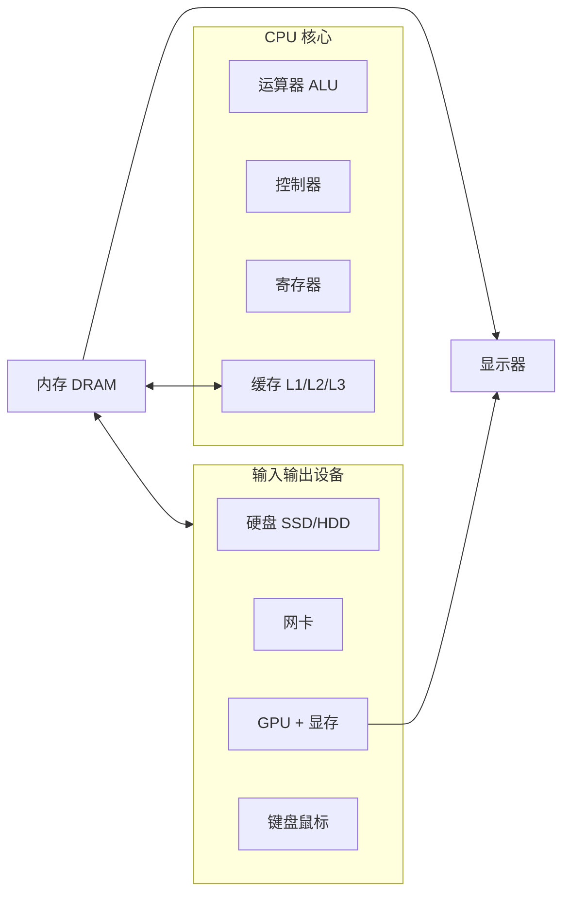
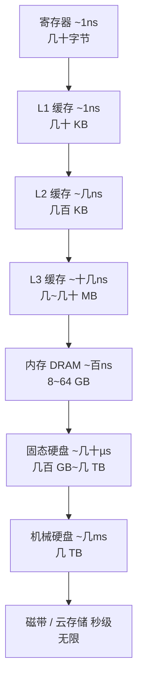
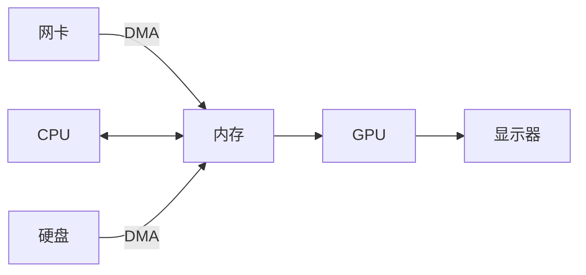

# 计算机硬件

> 一台计算机看起来又复杂又神秘：CPU、内存、硬盘、网卡、显卡、显示器……但拆开来看，所有部件都围绕一个 1945 年就定下的蓝图——**冯·诺依曼结构**——在分工协作。这篇笔记逐个讲清楚每个硬件是干什么的，更重要的，讲清楚它们**如何被组织在一起，共同完成一件工作**。

## 一、总蓝图：冯·诺依曼结构

### 1. 存储程序思想

1945 年，数学家 **冯·诺依曼（John von Neumann）** 在《First Draft of a Report on the EDVAC》中提出了一条革命性的思想——**存储程序（stored-program）**：

> **程序指令和数据一样，都是二进制数，一起存放在存储器（内存）里；计算机按顺序取出指令并执行。**

在今天看来这理所当然，但在当时，计算机的"程序"是插线板上一根根的线缆和开关，改程序就是改硬件。冯·诺依曼把"程序"变成了**内存中的数据**——换程序不再动硬件，只需换一批数据。今天你双击一个新软件就能运行，全靠这个思想。

### 2. 五大部件

冯·诺依曼结构把计算机划分为**五大部件**：

| 部件 | 现代对应物 | 职责 |
|---|---|---|
| 运算器（ALU） | CPU 的一部分 | 算术运算、逻辑运算 |
| 控制器（CU） | CPU 的一部分 | 取指令、译码、指挥其他部件 |
| 存储器 | 内存（RAM） | 存放指令和数据 |
| 输入设备 | 键盘、鼠标、硬盘、网卡 | 把外部信息送入计算机 |
| 输出设备 | 显示器、硬盘、网卡 | 把结果送出去 |

> 注意：**硬盘和网卡既是输入又是输出设备**——数据进出计算机，都要经过它们。

### 3. 现代计算机的物理组织



- **CPU**：负责"想"（计算），但它自己不带数据，数据要从内存拿
- **内存**：CPU 的工作台，程序和数据在这里"现场"存放
- **硬盘/网卡/键盘/显示器**：负责"进"和"出"
- **总线**（图上没画）：连接这一切的"高速公路"

关键认知：**所有数据都在内存里流动。** CPU 不直接读硬盘、不直接收网卡——它只和内存打交道，所有输入输出都先把数据搬进内存，再由 CPU 处理。理解了这一点，就理解了整台计算机。

## 二、CPU：计算机的大脑

### 1. CPU 里有什么

一个 CPU 核心由三部分组成：

- **控制单元（CU）**：负责"取指令 → 译码 → 指挥执行"，是发号施令的总司令
- **运算单元（ALU）**：负责真正的计算——加减乘除、与或非、比较
- **寄存器（Register）**：CPU 内部的一小撮存储，存取速度最快，存正在运算的数
- **缓存（Cache）**：CPU 内嵌的小块高速存储，下一节详说

### 2. 指令周期：CPU 是怎么干活的

CPU 每干一件小事，都走同一条流水线——**指令周期（instruction cycle）**：

```
取指（fetch）→ 译码（decode）→ 执行（execute）→ 写回（write back）
```

以执行 `1 + 2` 为例：

1. **取指**：控制器按"程序计数器（PC）"指向的地址，从内存中取出指令
2. **译码**：控制器识别出"这是一条加法指令"
3. **执行**：ALU 把寄存器里的 1 和 2 加起来
4. **写回**：结果 3 存回寄存器（或写回内存）

主频 3 GHz 的 CPU 每秒重复这个循环约 **30 亿次**——所谓"3 GHz"就是**每秒钟的时钟周期数**。一条指令往往需要多个时钟周期。

### 3. 核心、线程与超线程

- **核心（core）**：一个核心 = 一条独立的指令周期流水线，多核 = 多个"大脑"可以真并行
- **线程（thread）**：操作系统调度的最小单位，一个核心同一时刻只能跑一个线程
- **超线程（Hyper-Threading）**：Intel 2002 年引入的技术，把一个物理核模拟成两个**逻辑核**——核心内很多部件（缓存、控制逻辑）在执行一条指令时是空闲的，超线程让它们同时伺候第二条指令。8 核 16 线程，就是"8 个物理核，当 16 个逻辑核用"

> 注意区分：**核心是硬件概念，线程是软件概念**。超线程让"线程"有了硬件影子，这也是操作系统课程里让人头大的地方。

### 4. 缓存：CPU 和内存之间的缓冲带

CPU 太快了，内存太慢了。一个 CPU 时钟周期约 0.3 纳秒，而访问一次内存要 **几十到上百纳秒**——**CPU 的运算速度比内存快两个数量级**。如果每次取数都去内存，CPU 大部分时间都在干等，这种现象叫**内存墙（memory wall）**。

解法是在 CPU 里塞几层小容量、超高速的缓存：

| 缓存 | 容量 | 速度 | 特点 |
|---|---|---|---|
| L1 | 几十 KB | ~1 纳秒（几个时钟周期） | 分指令缓存和数据缓存，每核独有 |
| L2 | 几百 KB | ~几纳秒 | 每核独有 |
| L3 | 几 MB ~ 几十 MB | ~十几纳秒 | 多核共享 |

- 缓存用 **SRAM**（静态随机存储器）实现，内存用 **DRAM**（动态随机存储器）。SRAM 快但贵，所以只能做一小块；DRAM 慢但便宜，所以能做成几个 GB 的内存条
- 缓存的魔法在于**局部性原理**：程序访问的数据在时间和空间上都是扎堆的（循环、连续数组），CPU 会把整块（64 字节一个 cache line）一起搬进缓存，下一次访问直接命中
- 多核共享 L3 带来一个新问题：核 A 改了某个数据，核 B 的缓存里还是旧值。CPU 通过**缓存一致性协议**（如 MESI）保证各核缓存同步

> 小知识：**L1 延迟是纳秒级，内存延迟是百纳秒级，硬盘是毫秒级。** 记住这三个数量级，后面所有"为什么这么设计"都有答案了。

## 三、内存：程序的舞台

### 1. 内存是什么

**内存（Memory，RAM）** 是程序运行的"现场"：程序指令、数据、变量、打开的文件内容，运行期间都摆在内存里。内存的两个特点决定了它的角色：

- **随机访问**：按地址直接存取任意位置，速度恒定（所以叫 RAM，Random Access Memory）
- **断电丢失**：内存是易失性存储（volatile），关机后数据清空——所以关机前要"保存"，保存就是写进硬盘

> 中文里"内存"这个名字很贴切：它就像人的**短期记忆**，正在想的事都在这，但睡一觉（关机）就忘；硬盘是**长期记忆**，笔记本写下来，十年后还在。

### 2. 为什么内存是 DRAM

内存条上的颗粒是 **DRAM（动态随机存储器）**。它的原理是电容存电荷表示 0/1，但**电容会漏电**，所以必须每隔几毫秒"刷新"（重新充电）一次——"动态"就是指这个持续刷新。

- 内存访问延迟约 **50~100 纳秒**，比 L3 缓存还慢一个数量级
- 现在的内存是 **DDR SDRAM**（双倍速率），DDR4 常见 2133~3200 MHz，DDR5 已到 4800+ MHz。每个时钟周期传两次数据，所以叫"双倍"

### 3. 地址空间：内存的"门牌号"

内存按字节编址，每个字节有一个地址。CPU 通过**地址总线**指定要访问哪个位置：

- 32 位地址总线 → 最多 2^32 = **4 GB**，这就是老电脑"内存到 4G 就上不去"的原因
- 64 位地址总线 → 2^64 ≈ **160 亿 GB**，物理上不可能用满

### 4. 虚拟内存：给每个程序一块"虚拟大陆"

这是操作系统与硬件协作的经典例子：**虚拟内存（virtual memory）**。操作系统给每个程序一个**虚构的巨大地址空间**（64 位下约 16 EB），程序以为自己独占整个内存；真实的物理内存由 OS 统一分配，通过 MMU（内存管理单元，CPU 内的硬件）完成**虚拟地址 → 物理地址**的映射。内存不够时，OS 把暂时不用的页挪到硬盘上的**交换分区（swap / 页面文件）**，用的时候再换回来。

> 这一节是操作系统章节的引子，硬件层面的知识到"MMU 做地址翻译、按页（4 KB）管理"即可。

## 四、硬盘：持久的大仓库

### 1. 机械硬盘 HDD：会转的唱片

机械硬盘把数据写在**盘片**（铝合金/玻璃圆盘）表面的磁性涂层上，读写靠一个悬在盘片上方几纳米处的**磁头**：

- 盘片以 **5400 / 7200 转/分钟** 旋转，磁头在盘片表面"扫"出一个个磁道、扇区
- 读数据要经历**寻道**（磁头移动到目标磁道）→ **旋转等待**（等目标扇区转到磁头下）→ 读取
- 机械运动决定了它**随机读写很慢**（毫秒级延迟），但顺序读写还行（百 MB/s 级）

### 2. 固态硬盘 SSD：没有机械部件的闪存

SSD 用 **NAND 闪存**存储：每个存储单元是一个浮栅晶体管，靠**电荷**有无表示 0/1，没有盘片、没有磁头、没有马达：

- **随机读写也是微秒级**，比机械硬盘快两个数量级，这正是电脑"换 SSD 如换新机"的原因
- 接口：老式 **SATA**（理论 6 Gb/s ≈ 750 MB/s），现代 **NVMe** 走 PCIe 总线（Gen3 x4 约 3.5 GB/s），快数倍
- 代价：闪存有**擦写寿命**（每个单元约 1千~10万次），主控通过**磨损均衡**把写入摊到所有单元上；机械硬盘寿命则取决于物理磨损

### 3. 存储金字塔：整个计算机的"粮仓体系"

把前面讲过的所有存储放在一起，是一张经典的**金字塔**：



**越往上越快、越贵、越小；越往下越慢、越便宜、越大。** 整个计算机的性能，本质上就是操作系统和硬件共同在这条金字塔上做"搬运"——把常用的数据往上挪，把不常用的往下放。没有哪一层能互相替代，这就是为什么**缓存、内存、硬盘三者缺一不可**。

## 五、主板与总线：把部件连起来的纽带

### 1. 总线：部件之间的高速公路

CPU、内存、硬盘、网卡、显卡都插在**主板（Motherboard）**上，主板用**总线（bus）**把所有人连起来。总线按传输内容分三类：

| 总线 | 干什么 | 由什么决定 |
|---|---|---|
| **数据总线** | 传数据 | 宽度决定一次传多少字节（64 位 = 一次 8 字节） |
| **地址总线** | 说"我要访问哪个地址" | 宽度决定寻址空间（32 位 = 4 GB） |
| **控制总线** | 发命令（读、写、中断） | —— |

### 2. 从南北桥到 PCIe：总线架构的变迁

- **2008 年以前**：内存控制器、各种设备控制器都挂在主板**芯片组**上，分"北桥"（管内存、显卡，快）和"南桥"（管硬盘、USB，慢）。CPU 访问内存要绕道北桥
- **2008 年（Intel Nehalem）**：**内存控制器被集成进 CPU**，CPU 直连内存，延迟大降。北桥名存实亡，剩下的南桥改叫**芯片组（PCH）**
- 今天：CPU 与显卡、NVMe 硬盘、网卡之间用 **PCIe（PCI Express）** 总线直连

**PCIe** 是现代的通用高速总线，由若干条 **lane（通道）** 组成，每条 lane 是一个双向高速串行链路：

| 版本 | 每条 lane 单向带宽 |
|---|---|
| PCIe 3.0（2010） | ~1 GB/s |
| PCIe 4.0（2017） | ~2 GB/s |
| PCIe 5.0（2019） | ~4 GB/s |

- 显卡占 **x16** 条 lane，NVMe 硬盘 x4，网卡 x1~x8
- 显卡 4K 游戏每帧要传几 GB 数据，全靠 x16 的带宽；这就是"插错插槽显卡降速"的原因

### 3. 一次典型的"搬运"：CPU 读硬盘文件

把 CPU、内存、总线、硬盘串起来看一次读文件：

```
1. 程序执行 read() → 操作系统收到请求
2. CPU 通过总线告诉硬盘控制器："把扇区 100 的数据读到内存地址 0x400000"
3. 硬盘 DMA（直接内存访问）——数据由硬盘控制器直接写进内存，不经过 CPU
4. 数据就位后，硬盘控制器向 CPU 发一个【中断】，CPU 从内存读取数据继续干活
```

> 这里有个计算机体系里最重要的思想：**DMA + 中断**。硬盘、网卡这类慢速设备，如果让 CPU 盯着它逐字节拷贝，CPU 会被彻底拖死。所以设备直接和内存之间搬运数据（DMA），搬完再喊 CPU 一声（中断）。**CPU 只负责发起和收尾，不负责搬运。**

## 六、网卡：与世界连接

### 1. 网卡是谁

**网卡（NIC，Network Interface Card）** 是计算机与外部世界（局域网、互联网）之间的唯一通道。它要做的事比想象中多：

- **收**：把网线/无线信号里的比特流解析成一个个**以太网帧**，检查帧头里的 **MAC 地址**（48 位，出厂时烧录、全球唯一）是不是自己的，是就收下
- **发**：把要发送的数据封装成帧，打上自己的 MAC 和目标的 MAC，转成电信号/无线信号发出去

### 2. 数据怎么进出内存

网卡是典型的"DMA 设备"：

- **接收**：网卡收到数据 → 直接 DMA 写入内存中的接收缓冲区 → 发中断通知 CPU → 操作系统把数据交给应用程序
- **发送**：程序把数据写到内存 → CPU 通知网卡"去 0xXXXX 拿数据" → 网卡 DMA 读出并发出

**整个收发过程，数据流过内存但不经过 CPU 的"手"**——CPU 只在开始和结束时各点一次头。高端网卡还有**多队列**（多个 CPU 核可以并行处理不同连接）、**校验和卸载**（帧校验由网卡硬件算，不再占 CPU），目的只有一个：**把 CPU 从 IO 中解放出来做计算**。

> 顺带一提：服务器网卡早已不是"一块卡"，而是几十 Gbps 的智能网卡，自带 CPU 和内存，能卸载更多协议处理——这是云计算的硬件底座之一。

## 七、GPU：专职并行计算的"画图工"

### 1. 显示器为什么需要显卡

先看显示器：它本质是几百万个发光点的**栅格阵列**（如 1920×1080 = 207 万个像素）。显示器自己不"想"画面，它只做一件事——**以固定频率（刷新率，60/120/144 Hz）刷新屏幕**，而屏幕上每个像素显示什么颜色，需要某个处理器去算。

**GPU（Graphics Processing Unit）** 就是干这个的处理器。整个链条是：

```
CPU 告诉 GPU"画这个场景"（顶点、光照、纹理数据）
   → GPU 按渲染管线逐像素算出颜色，写入显存（VRAM）中的帧缓冲（framebuffer）
   → 显卡以 60 次/秒 的频率把帧缓冲扫描输出为视频信号（HDMI/DP）
   → 显示器收到信号，点亮对应像素
```

### 2. 为什么 GPU 这么快：大规模并行

和 CPU 的设计哲学完全相反：

| | CPU | GPU |
|---|---|---|
| 核心 | 几个~几十个**强核心**，单核极快 | 数千个**弱核心**，单核很慢 |
| 擅长 | 复杂的串行逻辑、分支判断 | 简单的并行计算，越多越好 |
| 比喻 | 一个精通十八般武艺的老师傅 | 一千个只会"乘法"的流水线工人 |

画面渲染正是"流水线工人"的活：**207 万个像素，每个像素的颜色怎么算互不相关**——完美并行。GPU 让上千个核心各算各的像素，几十毫秒就算完一帧；用 CPU 硬算，一帧要几秒。

- 显存（VRAM）是 GPU 自己的高带宽内存（GDDR），带宽是内存的数倍——渲染一帧要读写海量像素数据，带宽比容量更关键
- 视频播放看似是"播放器"在干活，其实是 **GPU 硬件解码**（H.264/H.265 专用电路）把 CPU 彻底解放

### 3. GPGPU：GPU 不只是画图

2006 年 NVIDIA 发布 **CUDA**，开放 GPU 的并行能力给通用计算，GPU 从此变成**通用并行处理器（GPGPU）**：

- **AI 训练**：深度学习就是海量矩阵乘法，GPU 的数学本质和它渲染像素的数学本质一模一样
- **挖矿**：加密货币的哈希运算，同样是海量并行计算
- 科学计算、视频转码、光线追踪

> 今天"显卡"这个词已经名不副实——GPU 是计算机里**仅次于 CPU 的第二大处理器**，某些场景下（AI 训练）它才是主角。

## 八、完整的一天：硬件如何协作

把前面所有部件串起来，走一遍"早晨打开电脑看一个视频"的全过程：

### 1. 开机：从没电到操作系统

```
按下电源键
 → 主板供电，CPU 上电，从主板 BIOS/UEFI（固化在闪存里的固件）取第一条指令
 → POST 自检：检查内存、显卡、硬盘是否就位
 → UEFI 从启动盘（SSD）读出引导程序（bootloader）
 → 引导程序把操作系统内核从硬盘读到内存
 → 内核接管一切：初始化内存管理、设备驱动……
```

**开机的一瞬间，是硬件和固件在跳舞**：CPU 此刻还不知道"硬盘"是什么，它只是按地址去取指令，而这些指令恰好来自 BIOS，BIOS 又恰好把内核从硬盘搬进了内存。

### 2. 打开浏览器：请求的旅程



1. **点图标**：鼠标（输入设备）通过中断把"点击"送给 CPU → CPU 运行操作系统的图形界面代码，找到浏览器程序
2. **加载程序**：操作系统向硬盘控制器发 DMA 请求，浏览器程序代码从 SSD 读进内存（要用哪部分才读哪部分，这就是虚拟内存的按需分页）
3. **请求视频**：浏览器把"给我这个视频"的数据交给网卡，网卡 DMA 发出；对方服务器把数据发回来，网卡 DMA 写入内存并中断通知 CPU
4. **解码渲染**：CPU 把视频数据的"解码"任务交给 GPU 硬件解码器，GPU 把每帧画面算进显存帧缓冲，扫描输出到显示器——你看到了画面
5. **中间穿插**：整个过程中，CPU 在内存、缓存、寄存器之间跑来跑去执行着几十万个指令周期，硬盘和网卡都在用 DMA 悄悄搬运，GPU 在几千个核上并行算像素

### 3. 总结：这台机器的"组织分工"

| 部件 | 在整体中的角色 |
|---|---|
| CPU | **决策者**：执行指令，指挥全局；不做数据搬运 |
| 内存 | **舞台**：所有数据都在这里汇聚、流动 |
| 缓存/寄存器 | CPU 身边的**速记本**：热点数据就近存放 |
| 硬盘 | **仓库**：断电也不丢数据，DMA 进出 |
| 网卡 | **外交官**：与世界交换数据，DMA 进出 |
| GPU | **画师**：并行算图、算矩阵；显存帧缓冲直通显示器 |
| 总线 | **高速公路**：连接一切，决定搬运速度 |
| 显示器/键盘鼠标 | **脸和手**：人机交互的进出口 |

**一台计算机工作的本质**：所有数据汇聚在内存，CPU 负责"想"，GPU 负责"画"，硬盘和网卡用 DMA 负责"搬"，总线负责"连通"，操作系统负责"调度"。硬件提供能力，协作产生结果——任何一台电脑，无论多贵，干活的都是这套组合拳。
