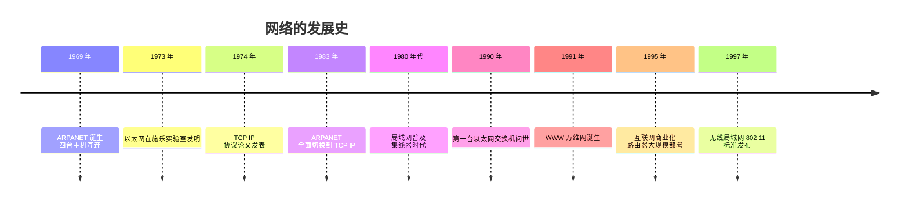
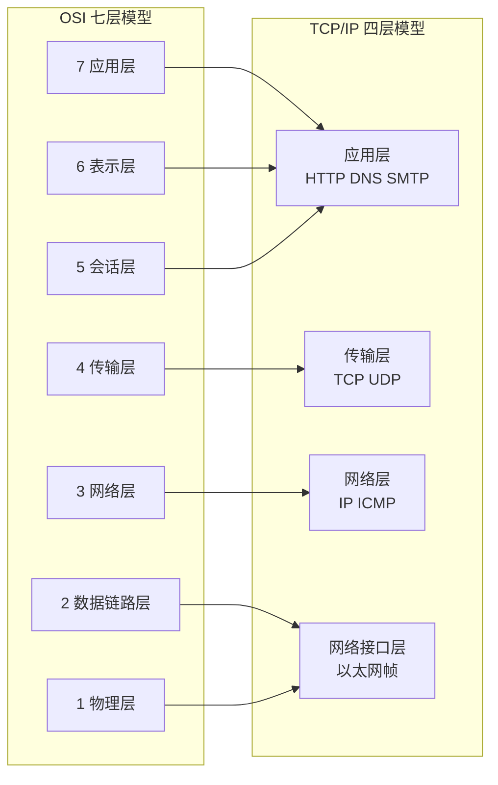
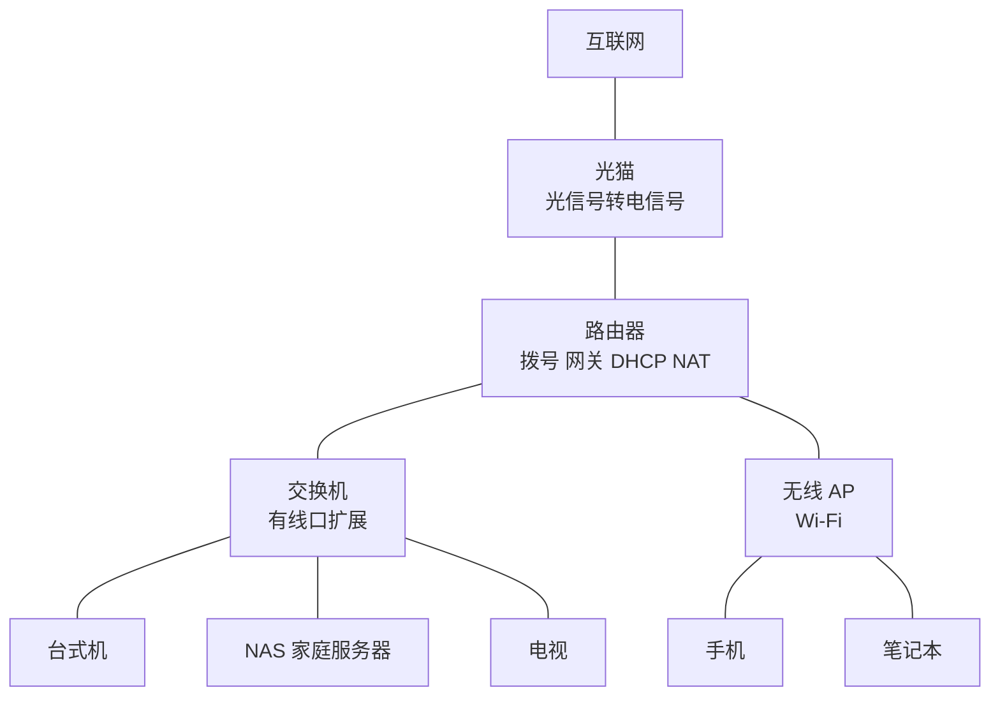
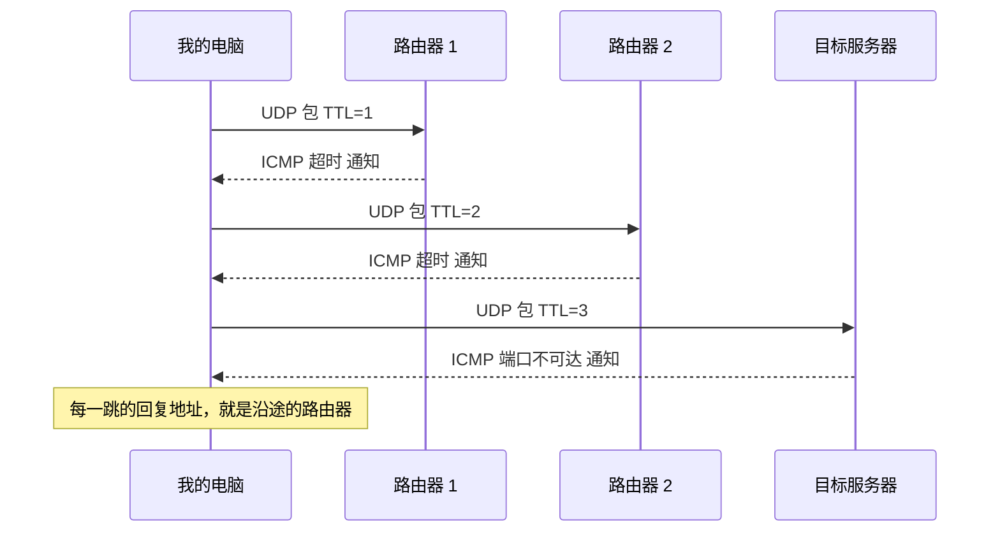

# 网络基础与网络设备

> 网络是把计算机"连起来"的科学：两台电脑之间，数据到底是怎么送过去的？从 1969 年的四台主机，到今天地球上的几十亿台设备，网络靠的是一套地址、协议和一件件硬件设备。这篇笔记从整体上认识网络，重点讲清楚那些每天都在干活、却很少被注意的设备——交换机、路由器。

## 1 什么是网络

网络（Network）就是**多台计算机互相连接、交换信息**的系统。上网的本质，是把数据从一台机器送到另一台机器。这件事要解决两个核心问题：

1. **怎么找到对方**——需要"地址"
2. **怎么把数据送过去**——需要"路径"和"规则"

围绕这两个问题，诞生了地址体系（IP、MAC、端口）、协议体系（TCP/IP）和硬件设备（交换机、路由器……）。网络之所以是"网络"，就是因为它不是把所有电脑一对一接起来，而是让每台设备只连到"网络设备"上，由这些设备负责转发——就像城市的道路系统，而不是每户人家之间直接修一条路。

## 2 网络的发展史（按时间顺序）



### 1969：ARPANET，互联网的起点

1969 年 10 月，美国国防部高级研究计划局（DARPA）建立了 **ARPANET**，最初只有四台主机（加州大学洛杉矶分校、斯坦福研究所等四所机构），用电话线路互连。它是互联网的祖先——"互联网（Internet）"这个名字，指的就是"网络的网络"。

### 1973：以太网，局域网的开端

1973 年，**鲍勃·梅特卡夫（Bob Metcalfe）**在施乐帕洛阿尔托研究中心（Xerox PARC）发明了**以太网（Ethernet）**：多台电脑用同轴电缆连成一条"总线"，靠"先听后发、冲突重发"的规则共享线路。今天我们家里、公司里用的有线网络，本质都是以太网的进化版。

### 1974：TCP/IP 提出

1974 年，**文特·瑟夫（Vint Cerf）**和**鲍勃·卡恩（Bob Kahn）**发表了 TCP 协议论文，后来发展成 **TCP/IP 协议族**——一套"数据如何打包、如何寻址、如何可靠送达"的规则。它不依赖任何一家厂商、任何一条线路，正是这种开放设计，让后来的网络可以无限扩张。

### 1983：TCP/IP 成为标准

1983 年 1 月 1 日，ARPANET 从旧的 NCP 协议**全面切换到 TCP/IP**（这一天被称为 flag day），TCP/IP 从此成为互联网的事实标准，沿用至今。

### 1990：交换机问世

1990 年，美国 Kalpana 公司推出了第一台**以太网交换机**。它和集线器外表相似，但内部会"学习"每台电脑的地址并精准转发，让局域网从"大家抢一条线"进化到"各走各的路"。

### 1991：万维网诞生

1991 年，**蒂姆·伯纳斯-李**在 CERN 发明了 **WWW（万维网）**，从此网络不再是专家的工具，浏览器让普通人也能上网。1995 年互联网商业化，路由器大规模部署，网络进入千家万户。

## 3 网络中的地址与协议

### 三个"地址"：IP、MAC、端口

| 地址 | 层次 | 样子 | 作用 |
|---|---|---|---|
| IP 地址 | 网络层 | `192.168.1.10`（4 字节） | 逻辑地址，标识"在哪张网上"，会变化 |
| MAC 地址 | 数据链路层 | `00:1A:2B:3C:4D:5E`（6 字节） | 物理地址，烧录在网卡里，出厂唯一 |
| 端口 | 传输层 | `80`、`443`、`22` | 标识"主机上的哪个程序" |

打个比方：IP 地址是"城市里的门牌号"，MAC 地址是"人的身份证号"，端口是"楼里的门"。送信先按门牌号找到楼，再按门找到人。

### 协议分层：OSI 七层与 TCP/IP 四层

网络太复杂，所以把功能拆成**层**，每一层只负责一件事，下层为上层服务。经典的教学模型是 OSI 七层，现实中用的是简化的 TCP/IP 四层：



| TCP/IP 层 | 典型协议/设备 | 关键概念 |
|---|---|---|
| 应用层 | HTTP、DNS、SMTP | 我们直接接触的协议 |
| 传输层 | TCP、UDP | 端口、可靠/不可靠 |
| 网络层 | IP、ICMP | IP 地址、路由器、路由表 |
| 网络接口层 | 以太网 | MAC 地址、交换机 |

**记法**：哪一层负责什么，可以按设备记——**交换机工作在数据链路层（2 层），路由器工作在网络层（3 层）**，这也是常说的"二层设备""三层设备"。

## 4 网络硬件设备（重点）

### 网卡（NIC）

计算机上网的"接口"。有线网卡、无线网卡都是网卡。它负责把数据封装成**以太网帧**发送到线路上，并从线路接收帧。**MAC 地址就烧录在网卡里**，出厂时由厂商分配，理论上全球唯一。

### 集线器（Hub）：广播信号的老古董

集线器工作在**物理层**，功能非常简单：从哪个端口收到信号，就**原样转发给其他所有端口**。结果是：

- 所有端口**共享带宽**，同一时刻只有一台设备能发数据（其他都在等）
- 收到别人的数据也得照单全收，再由网卡判断"是不是给我的"（凭 MAC 地址过滤）

集线器已经被交换机完全取代，现在了解它主要是为了对比理解"为什么交换机更好"。

### 交换机（Switch）：局域网的交通管理员

交换机工作在**数据链路层**，是局域网的核心设备：

1. 从某个端口收到一个帧，先看**源 MAC 地址**，记进一张 **MAC 地址表**（哪个 MAC 在哪个端口，靠"学习"建立）
2. 查表找到**目标 MAC 对应的端口**，只把帧从那个端口送出去；表里没有的，才广播给所有端口

好处立竿见影：每个端口**独享带宽**，支持全双工（同时收发），设备之间互不干扰。家里装修布线、公司组网，用的都是交换机。

### 路由器（Router）：不同网络之间的快递员

路由器工作在**网络层**，解决交换机解决不了的问题：**跨网络转发**。局域网内部的通信靠交换机就够了，但访问外网（互联网）、不同网段之间的通信，必须经过路由器。

路由器内部有一张**路由表**（哪里可以到达、走哪条路，静态配置或由路由协议学习而来）：

1. 收到 IP 包，解封装，看**目标 IP 地址**
2. 查路由表决定**下一跳**（next hop）交给谁
3. 重新封装后送出

**交换机和路由器的本质区别**：

| | 交换机 | 路由器 |
|---|---|---|
| 工作层次 | 数据链路层（2 层） | 网络层（3 层） |
| 认什么地址 | MAC 地址 | IP 地址 |
| 转发的依据 | MAC 地址表（学习而来） | 路由表（配置/协议学习） |
| 连接什么 | 同网段的设备 | 不同网络 |
| 隔离广播域 | 不能 | 能 |

### 网关（Gateway）

网关是"出门的那扇门"。局域网内的设备要访问外网，数据包必须先发给**默认网关**——通常就是路由器的 IP（如 `192.168.1.1`）。所以"网关"往往不是一台独立设备，而是路由器在局域网里扮演的角色。

### 无线 AP 与无线路由器

**无线 AP（Access Point，接入点）**把有线网络变成 Wi-Fi：手机、笔记本通过无线信号接入。很多"无线路由器"其实是三合一设备——**路由器 + 交换机 + 无线 AP**，一个盒子全包了。

### 光猫（ONT）

光纤入户的转换设备：把光纤里的**光信号**转换成网线里的**电信号**。它是家庭网络的起点，光猫后面再接路由器、交换机、AP。

### 设备全家福对比

| 设备 | 工作层 | 转发依据 | 一句话 |
|---|---|---|---|
| 集线器 | 物理层 | 无（广播信号） | 老古董，所有人抢一条线 |
| 交换机 | 数据链路层 | MAC 地址表 | 局域网内精准转发 |
| 路由器 | 网络层 | IP 路由表 | 跨网络指路 |
| 网关 | 网络层 | — | 局域网出口，通常是路由器 |
| 无线 AP | 数据链路层 | MAC 地址 | 有线变无线 |
| 光猫 | 物理层 | — | 光信号 ↔ 电信号 |

### 一个典型家庭网络拓扑



## 5 数据包的旅程：IP 不变，MAC 变

理解了设备和地址，就能看懂数据跨网络传输的全过程。以"电脑 A 访问互联网上的服务器"为例：


具体步骤：

1. 电脑 A 发现目标 IP **不在同一个网段**，于是把包交给**默认网关**（路由器）
2. 问一下"网关的 MAC 是什么"（ARP 协议），把帧的目标 MAC 写成网关的 MAC，交给交换机
3. 交换机查 MAC 表，把帧送到路由器端口
4. 路由器拆开帧，看目标 IP，查路由表找到**下一跳**，重新封装（目标 MAC 换成下一跳的 MAC）发出去
5. 之后每一跳都重复"查路由表 → 换 MAC → 转发"，直到到达服务器所在的局域网
6. 最后一台交换机把帧送到服务器，服务器逐层解封装，数据交给应用程序

关键点：**IP 地址全程不变（标识"找谁"），MAC 地址每一跳都变（标识"下一站是谁"）**。路由器就像接力赛，MAC 是棒，IP 是终点。

## 6 局域网、广域网与互联网

| 概念 | 范围 | 典型例子 |
|---|---|---|
| LAN 局域网 | 一个房间/一栋楼 | 家里的 Wi-Fi、公司的内网 |
| WAN 广域网 | 跨城市、跨国家 | 运营商骨干网、专线 |
| Internet 互联网 | 全球互连 | 你正在访问的万维网 |

局域网内通常使用**私有 IP 地址**（`10.x.x.x`、`172.16~31.x.x`、`192.168.x.x`），这些地址只在局域网内有效。设备要上网，靠路由器的 **NAT（网络地址转换）** 把私有 IP 转换成公网 IP——这也是为什么家里所有设备共用一个宽带账号。

## 7 常用排错命令

| 命令 | 作用 | 典型输出 |
|---|---|---|
| `ipconfig`（Windows）/ `ip addr`（Linux） | 查看本机 IP、网关、MAC | `IPv4 地址: 192.168.1.10` |
| `ping 目标` | 测试到目标是否通、延迟多少 | `来自 8.8.8.8 的回复: 时间=20ms` |
| `tracert 目标`（Windows）/ `traceroute`（Linux） | 查看每一跳经过的路由器 | 逐跳 IP 列表 |
| `nslookup 域名` | 查域名对应的 IP | `www.example.com → 93.184.216.34` |

排查思路：先 `ping 网关`（本地通不通）→ 再 `ping 外网 IP`（路由通不通）→ 再 `ping 域名`（DNS 通不通）——三步定位问题出在哪一层。

## 8 用 Python 跟踪 IP 的路由

`tracert` 能显示"到达一个 IP 经过了哪些路由器"，这就是**路由跟踪（traceroute）**。用 Python 也能自己实现一套，还能做系统命令做不到的事——比如对比两次跟踪、观察路由变化。

### traceroute 的原理：TTL 与 ICMP

核心思路是"让数据包自己报出每一跳"：

- 每个 IP 包里有个 **TTL（生存时间）** 字段，每经过一个路由器就减 1，减到 0 就丢弃
- 丢弃时路由器会按 ICMP 协议**回一条"超时"通知**，告诉发送方"我在这里"
- 于是：发 TTL=1 的包 → 第一跳路由器回信；发 TTL=2 → 第二跳回信……直到到达目标



### 纯 Python 实现

用 UDP 发包（目标端口选一个没人监听的端口），用原始套接字接收 ICMP 回复：

```python
import socket


def traceroute(host, max_hops=30, timeout=2):
    """UDP 方式跟踪到 host 的路由，返回 [(跳数, IP 或 None)]"""
    target = socket.gethostbyname(host)
    print(f'跟踪 {host} -> {target}')
    hops = []
    for ttl in range(1, max_hops + 1):
        # 收 ICMP 回复的套接字
        recv = socket.socket(socket.AF_INET, socket.SOCK_RAW, socket.IPPROTO_ICMP)
        recv.settimeout(timeout)
        # 发 UDP 包的套接字，TTL 从 1 开始递增
        send = socket.socket(socket.AF_INET, socket.SOCK_DGRAM, socket.IPPROTO_UDP)
        send.setsockopt(socket.IPPROTO_IP, socket.IP_TTL, ttl)
        try:
            send.sendto(b'', (target, 33434 + ttl))
            _, addr = recv.recvfrom(512)
            hop_ip = addr[0]
        except socket.timeout:
            hop_ip = None
        finally:
            send.close()
            recv.close()
        hops.append((ttl, hop_ip))
        print(f'{ttl:2d}  {hop_ip if hop_ip else "* * * 超时"}')
        if hop_ip == target:      # 目标主机回了"端口不可达"，到达终点
            print('到达目标主机')
            break
    return hops


traceroute('www.baidu.com')
```

注意：构造原始套接字需要权限——**Windows 要以管理员运行，Linux 要用 sudo**。

### 免权限方案：调用系统命令

不想碰原始套接字，直接调用系统的 `tracert` / `traceroute`，用 Python 解析输出也行：

```python
import subprocess

result = subprocess.run(
    ['tracert', '-d', '8.8.8.8'],   # -d 不解析主机名，速度更快
    capture_output=True, text=True, timeout=60
)
print(result.stdout)
```

### 观察"路由调整"

互联网的路径**不是固定的**。运营商会持续调整路由：

- **故障切换**：某条线路断了，BGP 自动把流量切到备用线路
- **负载均衡**：同一目标有多条路径时，流量轮流走不同线路
- **维护调整**：运营商割接、扩容后路径变长或变短

所以"刚才 ping 延迟突然变高"往往不是网络坏了，而是**路径变了**。用 Python 很容易验证——间隔几秒跟踪两次，逐跳对比：

```python
first = traceroute('8.8.8.8')
import time
time.sleep(10)
second = traceroute('8.8.8.8')

for (h1, ip1), (h2, ip2) in zip(first, second):
    state = '相同' if ip1 == ip2 else '变化'
    print(f'第 {h1:2d} 跳  {ip1 or "*"}  vs  {ip2 or "*"}  {state}')
```

观察要点：

- 某几跳 IP 不同 → 走了不同的中间路径（负载均衡或路由调整）
- 跳数变多/变少 → 路径整体调整了
- 中间出现 `* * *` → 该路由器不回 ICMP 超时通知（正常现象），不代表链路不通

## 相关笔记

- [计算机中的进制](./radix.md)：IP 地址 `192.168.1.10` 就是 4 个字节的二进制数，用点分十进制写出来而已
