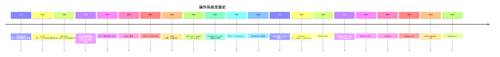
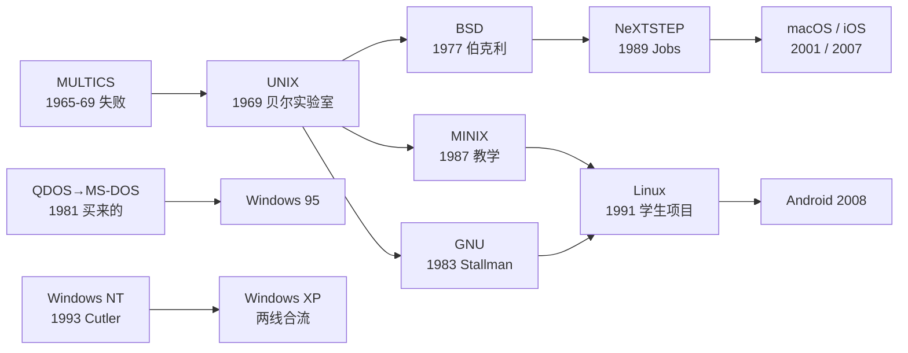

# 操作系统发展史

> 今天桌面上的三大操作系统——**Windows、macOS、Linux**——全都不是"设计出来的"，而是**人和思想交锋出来的**。它们分别从三条路上走来：Windows 起家于买来的 DOS，macOS 继承了 UNIX 的血统，Linux 则是一个芬兰学生 1991 年的"个人爱好"。这篇笔记按时间线梳理这段历史：谁、在什么背景下、做了什么。

## 一、史前时代：操作系统诞生之前（1940s ~ 1950s）

### 1. 手工操作时代

最早的计算机（ENIAC 等）**没有操作系统**。"运行程序"是这么干的：

1. 程序员把程序写成卡片，用**打孔机**打到纸卡上
2. 专职**操作员**抱着一摞卡片走向计算机
3. 把卡片放进读卡机，按下启动按钮，等程序跑完
4. 取下打印结果，下一个程序再上机

问题显而易见：**机器大部分时间在等人**。计算机一秒钟能做几十万次运算，而操作员换一次卡片要好几分钟——机器利用率极低。

### 2. 批处理：第一个"操作系统"

1956 年，通用汽车与 IBM 开发了 **GM-NAA I/O**——公认的**第一个操作系统**。它的核心思想是**批处理（batch processing）**：把一摞程序的卡片一次性喂给机器，由一个常驻内存的**监控程序（monitor）**自动执行完一个、接着执行下一个，操作员不用再来回折腾。

> 从这个词也能看出操作系统最初的定位：**管理硬件、让机器更高效地运转**。50 年后这句话依然成立，只是"硬件"变复杂了。

## 二、分时系统与 UNIX：现代操作系统的血脉（1960s ~ 1970s）

### 1. 分时系统：让很多人"同时"用一台电脑

1961 年，MIT 的 **Fernando Corbató** 团队做出 **CTSS**——**第一个分时系统（time-sharing system）**。它的魔法：把 CPU 时间切成极小的时间片，轮流分给每个用户，切换得足够快，于是**每个人都觉得电脑是自己的**。

分时思想把昂贵的计算机从"一人独占"变成了"众人共享"，直接催生了下面这个著名的失败项目——而它又以戏剧性的方式生出了 UNIX。

### 2. MULTICS：雄心勃勃的失败

1965 年，**MIT + 贝尔实验室 + 通用电气** 联合启动 **MULTICS** 项目（MULTiplexed Information and Computing Service）：一个支持上千用户、面向未来的大型分时系统。项目过于宏大，拖了 4 年，1969 年**贝尔实验室退出**。

### 3. 1969：UNIX 在废机房诞生

退出项目的贝尔实验室研究员 **Ken Thompson** 手痒了——他想玩自己写的《星际旅行》游戏，但实验室的机器都不适合。于是他找到一台无人使用的 **PDP-7 小型机**，在一个月内写出了第一个 UNIX 原型。

- 名字 **UNICS** 是同事 Peter Neumann 的戏谑——取"UNI"与 MULTICS 相对，意为"阉割版 MULTICS"，后来拼成了 **UNIX**
- 1970 年代，Thompson 和 **Dennis Ritchie**（发明了 C 语言）一起开发；**1973 年，UNIX 用 C 语言彻底重写**——这是决定性的一步：UNIX 从此**可移植**，换个机器只需重新编译，不用重写

> 1969 年还有两件事：贝尔实验室的游戏梦没实现，但现代操作系统家族最重要的一个分支诞生了。

### 4. UNIX 的传播与裂变

- **1974 年**：Thompson 和 Ritchie 在《Communications of the ACM》发表论文《The UNIX Time-Sharing System》，学术圈震动
- **1975 年**：贝尔实验室向大学廉价授权 UNIX 源码（教学用）
- **1977 年**：加州大学伯克利分校的研究生 **Bill Joy** 把 UNIX 加上虚拟内存、vi 编辑器等改进，汇编成 **BSD**（Berkeley Software Distribution）——BSD 后来成为 macOS、iOS 的直系祖先

### 5. GNU 与 MINIX：Linux 的两个"前辈"

- **1983 年**：MIT 研究员 **Richard Stallman** 因为受不了闭源软件的掣肘，宣布 **GNU 计划**——重写一套完全自由的 UNIX 兼容系统。他开发了编译器 GCC、编辑器 Emacs、Shell（bash）等一整套工具，但缺一个**内核**
- **1987 年**：荷兰教授 **Andrew Tanenbaum** 为教学写了 **MINIX**——一个迷你 UNIX，只有 1.2 万行代码，随他的教科书发行。售价很便宜，代码全部公开

> 记住这两个名字：**GNU 提供了 Linux 的工具，MINIX 启发了 Linux 的诞生**。后面第五节会讲到。

## 三、Apple：从车库到图形界面革命（1976 ~ 至今）

### 1. 车库里的苹果与图形界面的源头

- **1976 年**：**Steve Wozniak** 和 **Steve Jobs** 在车库里造出 Apple I，1977 年推出 **Apple II**——第一台大获成功的个人电脑
- 1979 年，Jobs 参观施乐 PARC 研究中心，看到了**图形界面（GUI）**——用鼠标点图标，而不是敲命令。他认定这就是个人电脑的未来
- **1983 年**：苹果发布 **Lisa**，首个商用 GUI 电脑，但 $9995 的售价让它惨败
- **1984 年 1 月 24 日**：**Macintosh** 发布，超级碗广告《1984》把 Mac 塑造成打破"老大哥"（IBM）的叛逆者。随机的 **System 1** 操作系统让"普通人第一次用电脑不用背命令"——GUI 时代就此开启

> 严格说，GUI 是施乐 PARC 发明的，但把它做成大众商品的是苹果。微软后来也"借鉴"了这套交互——苹果告微软抄袭，微软靠与苹果的交叉授权协议胜诉，这是 Windows 与 macOS 纠缠的开端。

### 2. 1985：Jobs 出走与 NeXTSTEP

1985 年，Jobs 在与 CEO 的权力斗争中失败，**被自己创立的公司赶了出去**。他立刻创办 **NeXT**，目标做出"终极"电脑。NeXT 的电脑卖得不好，但它的操作系统 **NeXTSTEP** 极尽优雅——**基于 BSD 与 Mach 微内核**，是当时最先进的图形操作系统。

### 3. 1997：回归与 Mac OS X

1996 年，濒临破产的苹果（Mac OS 经典版已老态龙钟）**以 4.29 亿美元收购 NeXT**——主要目的就是 NeXTSTEP。1997 年 **Jobs 回归**，随后以 NeXTSTEP 为地基重写了操作系统：

- **2001 年 3 月**：**Mac OS X 10.0（Cheetah）** 发布——基于 UNIX（BSD + Mach），从此 macOS 与 Linux 成了远亲

之后的版本命名是一部有趣的编年史：

| 版本 | 代号 | 年份 | 轶事 |
|---|---|---|---|
| 10.0 | Cheetah | 2001 | 首个 Mac OS X |
| 10.4 | Tiger | 2005 | 首个支持 Intel 芯片 |
| 10.6 | Snow Leopard | 2009 | 最后一个支持 PowerPC；性能优化代表作 |
| 10.7 | Lion | 2011 | 首个纯 64 位 |
| 10.9 | Mavericks | 2013 | 从"大猫"改为**加州地名**，免费 |
| 10.12 | Sierra | 2016 | 正式改名为 **macOS** |
| 11 | Big Sur | 2020 | 首个支持 **M1 自研芯片**，Intel 时代落幕 |

### 4. iPhone 与 Apple Silicon

- **2007 年**：iPhone 发布，iOS（源自 Mac OS X 的精简版，XNU 内核）开启智能手机时代
- **2020 年**：M1 芯片发布，macOS 迁到 **ARM 架构**——苹果继"68k → PowerPC → Intel"后完成第四次换芯，也完成了"软硬件全自研"的闭环

## 四、Microsoft：从 DOS 到 Windows（1975 ~ 至今）

### 1. 1975：微软成立，第一桶金来自"买"来的系统

- **1975 年**：**Bill Gates** 和 **Paul Allen** 成立微软
- **1981 年**：IBM 要做个人电脑，找微软要操作系统。微软自己写不出来，花 **5 万美元**买下了西雅图电脑公司 Tim Paterson 写的 **QDOS**（Quick and Dirty OS，诨名"又脏又快的操作系统"），改名为 **MS-DOS**，随 IBM PC 发售

> 这个决定塑造了微软未来 20 年：**DOS 是单任务的字符系统**，没有图形界面，没有多任务——它的基因决定了 Windows 早期的挣扎。

### 2. 1985~1990：Windows 艰难起步

- **1985 年 11 月**：**Windows 1.0** 发布——注意，它不是操作系统，只是**跑在 DOS 之上的图形外壳**，被讥讽为"垃圾"
- **1990 年**：**Windows 3.0** 大获成功，图形界面终于立住

### 3. 1993：Windows NT——另一条高贵血脉

微软内部有条秘密战线的故事：1988 年，微软从 DEC 挖来 **Dave Cutler**——曾设计 VMS 系统的传奇工程师——让他从零写一个**真正的现代操作系统**。1993 年 7 月，**Windows NT 3.1** 发布：抢占式多任务、独立内核、为服务器而生。

> 从此 Windows 家族有**两条血脉**：面向普通用户的 **DOS 线**（95/98/Me）和面向技术的 **NT 线**。两条线最终于 2001 年合流。

### 4. 1995：Windows 95——桌面系统之王

1995 年 8 月 24 日，**Windows 95** 发布，全球排队抢购，诞生了那个著名的"开始按钮"。它把 DOS 和图形界面熔为一体，自带 **开始菜单、任务栏**——桌面操作系统的交互范式沿用至今。

### 5. 新世纪：XP 的辉煌与 Vista 的滑铁卢

| 版本 | 年份 | 内核 | 命运 |
|---|---|---|---|
| Windows 2000 | 2000 | NT 5.0 | 服务器/专业用户，NT 线成熟 |
| Windows ME | 2000 | DOS | 最后一款 DOS 线，口碑最差 |
| **Windows XP** | 2001 | NT 5.1 | **两线合流**，史上最成功，统治桌面十余年 |
| Windows Vista | 2006 | NT 6.0 | 华丽但臃肿，兼容性崩坏，一代"败笔" |
| Windows 7 | 2009 | NT 6.1 | 吸取教训，接棒 XP 成为经典 |
| Windows 8 | 2012 | NT 6.2 | 强推触屏磁贴，砍掉开始菜单，用户用脚投票 |
| Windows 10 | 2015 | NT 10.0 | 回归+免费升级，大一统（"最后一个 Windows"） |
| Windows 11 | 2021 | NT 10.0 | 换皮+新要求，居中任务栏 |

- **2000 年**：Gates 卸任 CEO，**Steve Ballmer** 接任（2000~2014），微软进入"开发者,开发者,开发者"的时代
- **2014 年**：**Satya Nadella** 接任，微软转向"云优先"（Azure），甚至向 Linux 全面示好

## 五、Linux：一个芬兰学生的"爱好"（1991 ~ 至今）

### 1. 1991：著名的新闻组帖子

1991 年，芬兰赫尔辛基大学 21 岁的学生 **Linus Torvalds**，觉得教学用的 MINIX 不够用，决定自己写一个操作系统内核。**1991 年 8 月 25 日**，他在 comp.os.minix 新闻组发帖：

> Hello everybody out there using minix -
> I'm doing a (free) operating system (just a hobby, won't be big and professional like gnu) for 386(486) AT clones.

> "大家好，我正为 386 兼容机做一个（免费的）操作系统（只是个爱好，不会像 GNU 那样庞大和专业）。"

**9 月 17 日**，Linux 0.01 发布（约 1 万行代码）；**10 月 5 日**，0.02 发布并公开下载。

### 2. 1992：GPL 与"微内核论战"

- **1992 年 2 月**：Linus 把 Linux 采用 **GPL 许可证**（GNU 的版权协议）——这一决定让 GNU 积累的工具与 Linux 内核结合，构成完整的自由操作系统。Linus 事后承认，如果不是 GPL，"Linux 很可能走不出去"
- **1992 年 1 月**：Tanenbaum 在新闻组发表《Linux is obsolete》，与 Linus 展开著名的**微内核 vs 宏内核论战**。Tanenbaum 认为 1992 年还写宏内核是"倒退三十年"，Linus 反驳"实际能跑赢理论"——今天 Linux 的统治地位说明谁赢了

### 3. 从内核到发行版

Linux 只是**内核**，搭配 GNU 工具、图形环境才能用。于是出现了把一切打包好的**发行版（distribution）**：

| 发行版 | 年份 | 人物/组织 | 特点 |
|---|---|---|---|
| Slackware | 1993 | Patrick Volkerding | 最早的仍存活发行版，极简保守 |
| Debian | 1993 | Ian Murdock（名字来自他和女友 Debra） | 自由软件精神的典范 |
| Red Hat | 1994 | Marc Ewing | 商业 Linux 先驱，后来的 RHEL |
| Ubuntu | 2004 | Mark Shuttleworth | 基于 Debian，"为人类服务"，让 Linux 上桌面 |

- **1994 年**：Linux 1.0（约 17 万行代码）
- **1996 年**：Linux 2.0；企鹅 **Tux** 诞生（Larry Ewing 画，名字意为 Torvalds + UniX）
- **2005 年**：Linux 内核贡献者管理协调困难，Linus 花两周写了 **Git** 版本控制系统——如今全世界软件开发的基建
- **2008 年**：Google 基于 Linux 内核发布 **Android**，Linux 借手机成为**用户量最大的操作系统**
- 今天：Linux 统治着服务器、超算（Top500 前十全部是 Linux）、嵌入式与云计算

### 4. GNU/Linux 命名之争

Stallman 坚持系统应叫 **GNU/Linux**：内核是 Linux，但编译器、Shell、工具几乎全部来自 GNU。Linus 回应"叫什么都行，只要有商业可行性"。今天争议仍在，但"Linux"已深入人心。

## 六、时间轴总览

## 七、三者的血缘与格局

### 1. 一张家谱

### 2. 三个命运

| | Windows | macOS | Linux |
|---|---|---|---|
| 出身 | 商人的精明（买来的 DOS） | 艺术家的执着（被赶走也要做） | 学生的兴趣（just a hobby） |
| 血统 | DOS 平民 + NT 贵族两条线 | UNIX（BSD + Mach） | UNIX 思想（宏内核 + POSIX） |
| 内核 | 闭源 NT | 闭源 XNU（开源部分） | 开源 Linux |
| 主战场 | 桌面、办公、游戏 | 桌面、设计、开发 | 服务器、嵌入式、超算 |
| 关键人物 | Gates、Cutler | Jobs、Wozniak、Thompson | Torvalds、Stallman、Thompson |

### 3. 历史的回环

- **UNIX 是共同祖先**：macOS 和 Linux 都流着贝尔实验室的血；连 Windows 的精神导师（Dave Cutler）都带着 DEC 血统
- **失败的项目孕育成功**：MULTICS 失败了，但它的理念由退出者带进了 UNIX；Vista 失败了，但它的地基（NT 6.x）成就了 Win7/10
- **个人的力量被低估**：三个操作系统全部起步于个人或极小的团队——Ken Thompson 的实验室、Jobs 的车库、Linus 的宿舍

> 操作系统发展史讲到最后，会发现技术只是表象，**人和选择才是主线**：Gates 选择买 DOS，Jobs 选择图形界面，Linus 选择 GPL——每一个选择都改变了今天几十亿人用的设备。
