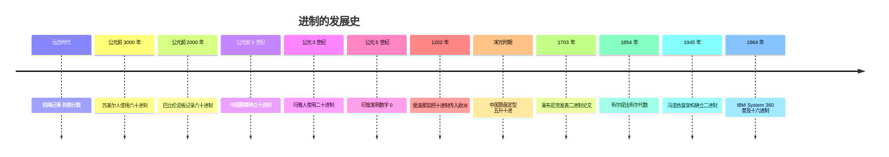
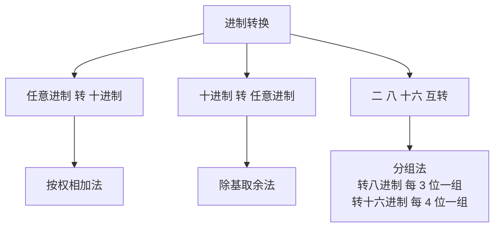

# 计算机中的进制

> 进制是计算机的基石。人类从数手指开始发明了十进制，而机器只懂高低电平的二进制。这中间横跨了几千年的历史，也藏着一套简洁的换算规则。

## 1 什么是进制

"进制"的全名叫做**进位计数制**，是一种人为认定的**带进位**的计数方法。

有带进位的，自然就有**不带进位**的——最常见的例子就是"正"字计数法。

小时候，班里选班长，大伙投票，总有一个小伙伴会在黑板上、在班长候选人名字的下面写"正"字，来记录候选人的得票数。一个"正"字五画，数到最后还得数一数一共有多少画，再除以 5 才能算出票数——没有位权，只做简单累加，这就是**不带进位**的计数。

所说的**进位**，通常就是：每一位上的数运算时，都是逢 X 进一位：

- 逢十进一 → **十进制**（我们最常用）
- 逢二进一 → **二进制**（计算机内部）
- 逢十六进一 → **十六进制**（程序员读写）

在一种数制中，**能使用的数码的个数**称为该数制的**基数（base）**，也就是数制名称的由来：

| 数制 | 基数 | 数码 |
|---|---|---|
| 二进制 | 2 | 0、1 |
| 八进制 | 8 | 0 ~ 7 |
| 十进制 | 10 | 0 ~ 9 |
| 十六进制 | 16 | 0 ~ 9、A ~ F |

### 生活中的进制

- **十进制**：10 根手指，人类天生的计数工具
- **六十进制**：时间（60 秒 = 1 分、60 分 = 1 时）、角度（60 分 = 1 度）——来自四千多年前的巴比伦人

让我印象最深的是**算盘**。上小学的时候上课还学过，当时自己的算盘还是个"老古董"。算盘的计数很有意思：下珠四颗各代表 1，上珠一颗代表 5，下珠满 5 就用一颗上珠代替，这叫**五升**；而每一位上满十才向前一位进一，也就是**逢十进一**。所以算盘并不是"五进制"，而是**五升十进**的十进制计数器。

## 2 进制的发展史（按时间顺序）

进制不是某个人一次发明的，而是不同文明各自摸索出来的：



### 六十进制：巴比伦人的遗产

苏美尔人和巴比伦人用泥板记账，留下了六十进制的记录（约公元前 2000 年）。为什么要选 60？因为 60 的约数特别多（1、2、3、4、5、6、10、12、15、20、30、60），做分数运算非常方便。直到今天，**时间和角度**仍然在用六十进制：60 秒一分钟、60 分一度。

### 十进制：印度的发明，阿拉伯的传播

十进制位值制的成熟，关键在于**数字 0** 的发明——公元 5 世纪左右，印度人率先使用 0 占位，"10"、"205" 这样的写法才成立。9 世纪阿拉伯人把它带到欧洲，1202 年意大利数学家斐波那契在《算盘书》中正式引入，从此十进制成为全球通用的计数体系。

### 二进制：从数学游戏到机器语言

- **1679 年**，德国数学家**莱布尼茨**开始研究二进制，1703 年发表论文《二进制算术的阐述》。他甚至曾用二进制去解释《周易》的阴阳，不过这更多是一种巧合式的联想
- **1854 年**，英国数学家**布尔**提出布尔代数，把"真/假"变成 0 和 1 的运算，这是二进制登上历史舞台的理论基础
- **1945 年**，冯·诺依曼在《EDVAC 报告》中确立了"程序存储"的计算机架构，从此**二进制成为机器语言**：电路只有两种稳定状态，正好对应 0 和 1

### 十六进制：IBM 的推广

1964 年 IBM 发布 **System/360**，把 **8 位字节**确立为业界标准。16 = 2⁴，**一位十六进制恰好等于四位二进制**，字节和十六进制完美对齐，十六进制从此成为程序员读懂机器数据的"翻译语言"。

## 3 常见的四种进制

| 进制 | 基数 | 数码 | 为什么存在 |
|---|---|---|---|
| 二进制 | 2 | 0、1 | 机器内部：电路的高低电平 |
| 八进制 | 8 | 0 ~ 7 | 早期计算机字长是 3 的倍数（12/24/36 位），3 位一组 |
| 十进制 | 10 | 0 ~ 9 | 人类的习惯：10 根手指 |
| 十六进制 | 16 | 0 ~ 9、A ~ F | 程序员读写：4 位一组，与字节对齐 |

换个角度理解四种进制：

- **二进制**：机器按"位"表示，只有 0 和 1
- **八进制**：机器按"3 位一组"表示（一位八进制 = 3 个二进制位）
- **十进制**：人类按"数位"表示
- **十六进制**：机器按"4 位一组"表示（一位十六进制 = 4 个二进制位），两个十六进制位正好表示一个字节

## 4 位、字节与进制的关系

从最小的单位往上数：

- **位（bit）**：一个二进制位，只有 0 或 1，是计算机最小的信息单位
- **半字节（nibble）**：4 个二进制位，正好是一位十六进制数
- **字节（byte）**：8 个二进制位，正好是两位十六进制数，是计算机存取的基本单位

所以：

> 一个 8 位的字节，用两位十六进制数就能表示（0x00 ~ 0xFF）

**进制越大，用的位数越少**。同一个数 255 的四种写法：

| 进制 | 写法 | 位数 |
|---|---|---|
| 二进制 | 11111111 | 8 位 |
| 八进制 | 0o377 | 3 位 |
| 十进制 | 255 | 3 位 |
| 十六进制 | 0xFF | 2 位 |

进一步梳理三者关系：**二进制**描述的是机器的物理状态，**字节**是机器存取的基本单位，**进制**是人类选择的读写符号。十六进制之所以高效，正是因为 16 = 2⁴，与字节 8 = 2³ 天然对齐。

### 0 ~ 15 对照表

| 十进制 | 二进制 | 八进制 | 十六进制 |
|---|---|---|---|
| 0 | 0000 | 0 | 0 |
| 1 | 0001 | 1 | 1 |
| 2 | 0010 | 2 | 2 |
| 3 | 0011 | 3 | 3 |
| 4 | 0100 | 4 | 4 |
| 5 | 0101 | 5 | 5 |
| 6 | 0110 | 6 | 6 |
| 7 | 0111 | 7 | 7 |
| 8 | 1000 | 10 | 8 |
| 9 | 1001 | 11 | 9 |
| 10 | 1010 | 12 | A |
| 11 | 1011 | 13 | B |
| 12 | 1100 | 14 | C |
| 13 | 1101 | 15 | D |
| 14 | 1110 | 16 | E |
| 15 | 1111 | 17 | F |

### 位、字节与字符

- 1 字节 = 8 位 = 2 个十六进制位
- 1 个 Unicode 字符（BMP 平面内）= 16 位 = 2 字节 = 4 个十六进制位，所以字符码位写作 `U+XXXX`

## 5 进制之间的转换

是否有必要专门学？有——读日志、看内存、调试二进制文件时，能一眼看懂 `0x` 开头的东西，靠的就是下面这几条规则：



### 方法一：按权相加法（任意进制 → 十进制）

一个数 b(n-1)...b1b0，从右往左每一位乘上它的**权**（基数的 n 次方），再相加：

> 数值 = b(n-1) × X^(n-1) + ... + b1 × X¹ + b0 × X⁰

例：二进制 `1101` → 十进制

```
1101 = 1×2³ + 1×2² + 0×2¹ + 1×2⁰ = 8 + 4 + 0 + 1 = 13
```

例：十六进制 `0x3F` → 十进制

```
0x3F = 3×16¹ + 15×16⁰ = 48 + 15 = 63
```

### 方法二：除基取余法（十进制 → 任意进制）

用目标进制不断除，记录余数，**从下往上**读：

例：`768` → 十六进制

```
768 ÷ 16 = 48 … 0
 48 ÷ 16 =  3 … 0
  3 ÷ 16 =  0 … 3
```
从下往上读：**0x300**

例：`25` → 二进制

```
25 ÷ 2 = 12 … 1
12 ÷ 2 =  6 … 0
 6 ÷ 2 =  3 … 0
 3 ÷ 2 =  1 … 1
 1 ÷ 2 =  0 … 1
```
从下往上读：**11001**

### 方法三：分组法（二 ↔ 八 / 十六）

二进制与八、十六进制的互转**不用算**，直接分组：

- 二进制 → 八进制：每 **3 位**一组（3 位二进制正好有 8 种状态，对应一位八进制数码）
- 二进制 → 十六进制：每 **4 位**一组（4 位二进制正好有 16 种状态，对应一位十六进制数码）
- 反向同理：一位八进制展开成 3 位二进制，一位十六进制展开成 4 位二进制

例：`0x3F` → 二进制

```
3 = 0011，F = 1111  →  0011 1111
```

例：二进制 `110110` → 八进制

```
110 110  →  66（八进制）
```

八进制与十六进制之间没有直接的分组关系，需要先转成二进制或十进制。

## 6 为什么计算机用二进制

- **物理上最简单**：电路只有两种稳定状态——高电平/低电平、有磁/无磁、开/关。若用十进制，就要区分 10 种电压，成本高还容易出错
- **抗干扰**：只有 0/1 两种状态，电压在一定的范围内都算有效，噪声不容易造成误判
- **逻辑代数**：布尔的"与、或、非"正好对应电路的与门、或门、非门，二进制运算可以直接映射成电路运算
- **运算简单**：二进制的加法表、乘法表都只有 4 条规则，电路设计最简单

## 7 为什么程序员爱用十六进制

- **与字节对齐**：一个字节正好两位十六进制数，看内存就是看 `0x` 开头的两两一组
- **位运算直观**：掩码 `0xFF`、`0xF0` 一眼能看懂
- **颜色表示**：CSS 的 `#RRGGBB`，红色就是 `#FF0000`
- **地址表示**：内存地址、端口号习惯用十六进制，与字节的换算不用心算

那八进制为什么没落？因为早期计算机的字长是 12、24、36 位（3 的倍数），3 位一组很自然；8 位字节成为标准后，4 位一组（十六进制）取代了它。如今八进制只剩少数场景还在用——比如 Unix 文件权限 `777`（rwx 三位一组）。

## 相关笔记

- [字符编码](./encoding.md)：Unicode 码位用十六进制表示，一个字节两个十六进制位
