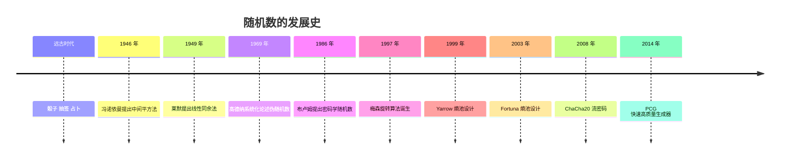
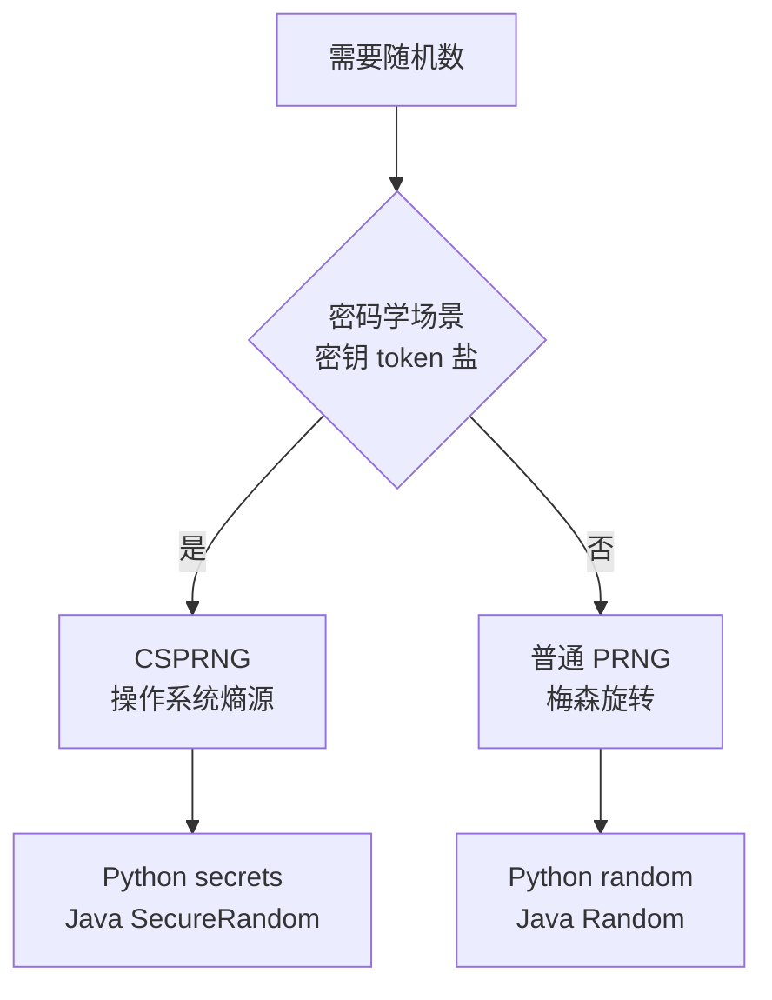

# 计算机中的随机数

> 产生一个 0 ~ 10 之间的随机数，生成一个 10 位长度的随机字符串，掷一次骰子……"随机"无处不在。但计算机是**确定性的机器**，它到底是怎么产生随机数的？答案是：从物理世界的噪声，到数学公式的迭代，人类为"随机"造出了三代不同的工具。

## 1 什么是随机数

随机数，就是**无法提前预测**的数字序列。它的用途遍布计算机世界的各个角落：

- **游戏**：掷骰子、抽卡、刷怪、地图生成
- **模拟**：蒙特卡洛方法、统计学抽样
- **密码学**：密钥、token、盐（salt）、初始化向量（IV）
- **工程**：负载均衡随机分配、抽样测试

最简单的例子：产生一个 0 ~ 10 之间的随机整数，或一段 10 位长度的随机字符串——前者在 Python 里是 `random.randint(0, 10)`，后者是随机从字母和数字中抽取 10 次拼起来。

注意，"随机"和"等可能"是两个概念：均匀分布要求每个值出现的概率相等（掷骰子），但随机数也可以是其他分布（如模拟身高的正态分布）。日常说的"随机数"，默认指**均匀分布**的随机数。

## 2 随机数的发展时间轴



## 3 真随机数：人类的遗产

随机数并不是计算机发明的。人类掷骰子、抽签、占卜了几千年，这些靠**物理过程**产生的随机数，叫**真随机数**。

计算机也能获得真随机数——从**物理熵源**采集噪声：

- CPU 时钟抖动、磁盘 IO 时间、网络包到达间隔
- 鼠标移动轨迹、键盘按键时间
- 麦克风/摄像头的环境噪声
- 专门的硬件随机数芯片（利用量子效应）

真随机的特点是**不可预测、不可复现**——但代价是**慢**，而且无法满足"需要复现同一个序列"的场景（比如调试、回放）。所以真随机数通常只用来做"种子"，交给伪随机数生成器去扩张成大量随机数。

## 4 伪随机数：冯·诺依曼的"罪孽"

### 中间平方法（1946）

1946 年，冯·诺依曼为曼哈顿计划中的蒙特卡洛模拟，提出了**中间平方法（middle-square method）**：

1. 取一个数作为种子，如 1234
2. 平方：1234² = 1522756
3. 取中间几位作为下一个数：2275
4. 重复

这个方法开创了"**用确定的算术公式产生随机序列**"的思路，但质量很差：序列容易退化成 0 或陷入很短的循环。冯·诺依曼自己评价道：

> 任何试图用算术方法产生随机数字的人，无疑都处在罪孽之中。

这句话点出了伪随机数的本质：**算法是确定的，随机是"看起来"的**。

### 什么是伪随机数

伪随机数生成器（PRNG，Pseudo-Random Number Generator）是一个**确定性算法**：

```
种子 seed → 算法迭代 → 随机数序列
```

- 给定相同的**种子**，产生的序列**完全相同**（可复现）
- 序列看起来没有规律，但本质上是一个巨大的**循环**，循环长度叫**周期**
- "伪随机"不是"假随机"：只要周期足够长、统计特性足够好，在绝大多数场景下可以当作真随机来用

## 5 线性同余法：LCG（1949）

1949 年，**德里克·莱默（D. H. Lehmer）**提出了**线性同余法（Linear Congruential Generator）**，这是最早也最经典的伪随机数算法：

```
X(n+1) = (a × X(n) + c) mod m
```

- `m`：模数（决定周期的上限）
- `a`：乘数
- `c`：增量
- `X(0)`：种子

### Java 的 java.util.Random 就是 LCG

Java 的 `java.util.Random` 正是线性同余法，参数是：

```
a = 0x5DEECE66D
c = 0xB
m = 2^48
```

种子（48 位）每调用一次，按上面的公式更新一次。用 Python 可以完整模拟它：

```python
m = 2**48
a = 0x5DEECE66D
c = 0xB
seed = 42

for _ in range(3):
    seed = (a * seed + c) % m
    print(seed >> 16)  # Java 的 nextInt() 取高 32 位
```

### LCG 的缺点

- **周期最多只有 m**，参数选得不好周期会更短
- **低位的随机性很差**：最低一位的周期只有 2（0、1 交替），所以用 LCG 时绝不能用低比特位
- **可预测**：只要拿到连续的几个输出，就能反推出种子，因此**绝不能用于密码学**

## 6 梅森旋转：MT19937（1997）

1997 年，日本的松本真和西村拓士提出了**梅森旋转算法（Mersenne Twister）**：

- 周期长达 **2^19937 - 1**，实际使用中永远不会循环
- 均匀分布的性质极好，计算速度快
- 成为主流编程语言的标准随机数实现（如 Python 的 `random` 模块、C++ 的 `mt19937`）

它和 LCG 一样是伪随机数，也有同样的宿命：**可预测**。只要观察到 624 个连续输出，就能反推出内部状态，所以依然不能用于密码学。

## 7 密码学安全的随机数：CSPRNG

普通的伪随机数"看起来随机"，但密码学要求的是**不可预测**：即使拿到前面所有输出，也不能推出下一个。满足这个要求的生成器叫**密码学安全的伪随机数生成器（CSPRNG）**。

### 熵池：把真随机变成密码学随机

思路是把"慢的真随机"和"快的算法"结合起来：

1. **收集熵**：不断采集系统噪声（时钟、鼠标、键盘、IO），存入一个**熵池（entropy pool）**
2. **混合扩散**：用加密算法把熵池搅匀（Yarrow、Fortuna 是经典设计）
3. **输出**：从熵池中取数据，经加密算法（如 ChaCha20）生成随机序列

常见的实现：

- Linux：`/dev/urandom`、`getrandom()` 系统调用（内核 3.17+ 使用 ChaCha20）
- Windows：CNG 的 `BCryptGenRandom`
- 库：Python 的 `secrets`、Java 的 `java.security.SecureRandom`

### CSPRNG 的用途

- 密钥、token、session id
- 密码哈希的盐（salt）
- 初始化向量（IV）、nonce
- UUID v4（122 个随机位）

## 8 随机种子

种子（seed）是伪随机数生成器的**初始状态**，也是原笔记里留下的问题：**"这里的随机种子是什么？"**

- 种子决定了后续产生的**整个序列**
- 同一个种子 + 同一个算法 → **完全相同的随机序列**
- 不给种子 → 系统自动取当前时间、系统熵等作为种子

种子的两大用处：

1. **可复现**：实验、测试、调试时固定种子，结果可以重复

```python
import random

random.seed(42)
print([random.random() for _ in range(3)])

random.seed(42)   # 重新设置同样的种子
print([random.random() for _ in range(3)])  # 输出完全相同
```

2. **确定性世界**：很多游戏用种子生成地图/世界——《我的世界》输入同一个世界种子，生成的地形完全相同，玩家之间靠种子号分享世界

Java 中同理：`new Random(42)` 固定种子，`new Random()` 自动取系统时间作为种子。

## 9 怎么选：三种随机数的对比

| | 真随机数 | 伪随机数 PRNG | 密码学安全 CSPRNG |
|---|---|---|---|
| 来源 | 物理熵源 | 确定性算法 + 种子 | 熵源 + 加密算法 |
| 可预测 | 不可 | 可（输出能反推） | 不可 |
| 可复现 | 不可 | 同种子可复现 | 不可 |
| 速度 | 慢 | 快 | 中 |
| 代表 | 硬件噪声 | MT19937、LCG | ChaCha20、Fortuna |
| 典型用途 | 提供种子/熵 | 游戏、模拟、洗牌 | 密钥、token、盐 |



## 10 实践示例

### Python：产生 0 ~ 10 的随机数

```python
import random

random.randint(0, 10)   # 0 ~ 10 之间的随机整数
random.random()         # 0.0 ~ 1.0 之间的随机小数
random.choice(['a', 'b', 'c'])  # 随机选一个
```

### Python：10 位随机字符串

```python
import random
import string

alphabet = string.ascii_letters + string.digits
''.join(random.choices(alphabet, k=10))  # 例如 'a7Kx2Qp9eZ'
```

安全场景（密码重置 token、激活码）用 `secrets` 而不是 `random`：

```python
import secrets
import string

alphabet = string.ascii_letters + string.digits
''.join(secrets.choice(alphabet) for _ in range(10))
```

### 洗牌

`random.shuffle(list)` 底层是**Fisher-Yates 洗牌算法**：从后往前，每步把当前元素和前面随机一个位置交换，保证每个排列等概率。

### Java

```java
new Random().nextInt(11);                  // 0 ~ 10，自动取种子
new Random(42).nextInt();                  // 固定种子，可复现
java.security.SecureRandom.getInstanceStrong().nextInt();  // 密码学安全
```

## 参考

- Java 中的 `java.util.Random` 源码（线性同余实现）
- Donald Knuth, *The Art of Computer Programming*, Volume 2, Section 3.2.1（伪随机数生成的经典论述）
