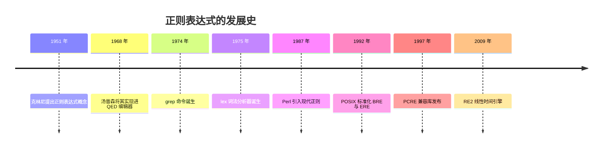
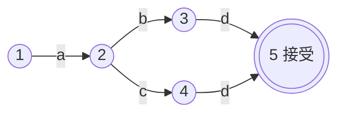
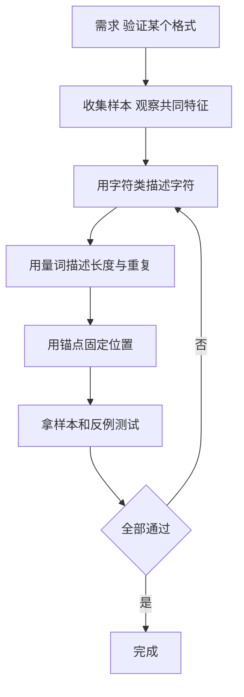

# 理解正则表达式

编程中，总会遇到正则表达式，只是简单、复杂而已。简单的，我们网上搜搜就解决了，而复杂的就容易头大。关键的是，正则表达式很重要，就像一把瑞士军刀，掌握了这个利器，能轻松地解决很多问题。

所以呢，有必要掌握这个利器。

很多不一样的文本字符串，却有着相同的格式，比如：

**邮箱**
> 76976678x@qq.com、88976655x@qq.com、smallzh@yeah.net

**手机号**
> 1559878880x、1559878880x、1559878880x

**身份证号**
> 1307261994010189xx、1307261994010209xx、1307261994010119xx

等等...

注：以上除了 smallzh@yeah.net 外，纯属虚构，勿当真!!!

那如果遇到一个需求，比如验证邮箱、手机号、身份证号码，这时就需要描述这些"相同的格式"，要怎么做？

就该 **正则表达式** 登场了。

小结一下，正则表达式就是

> 文本字符串的 **特征**
>
> 出自《精通正则表达式》

它的含义，就这么简单。

## 1 什么是正则表达式

正则表达式（Regular Expression）是一门**描述文本格式的小语言**：用一套符号，把"长什么样"写成规则，然后让机器去**匹配、提取、替换**。

- **匹配**：判断一段文本是否符合格式（校验手机号）
- **提取**：从大段文本中抓出想要的部分（从日志中抓 IP）
- **替换**：把符合格式的部分换成别的内容（脱敏手机号）

比如手机号的格式，用正则描述就是：

```
1[3-9]\d{9}
```

翻译成人话：以 `1` 开头，第二位是 `3~9`，后面再跟 9 位数字——正好 11 位。

### 正则 ≠ 通配符

注意别把正则和**通配符（wildcard）**搞混：文件管理器里的 `*.txt` 是通配符（`*` 表示"任意一串"），不是正则。正则是 `^.*\.txt$`——通配符只是"前缀/后缀匹配"的简写，正则是一门完整的匹配语言。

## 2 正则表达式的发展史（按时间顺序）

正则不是一开始就是现在这样的，它走过了"数学概念 → 编辑器工具 → 编程语言"的历程：



### 1951：数学家的发明

美国数学家**斯蒂芬·克林尼（Stephen Kleene）**在研究神经网络的论文中提出"正则集"的概念——描述**有限状态自动机能够识别的语言**。"正则表达式"这个名字就来自这里，它最初是纯数学概念，与计算机编程无关。

### 1968：进入文本编辑器

**肯·汤普森（Ken Thompson）**（Unix 之父之一）把正则表达式实现进了 QED 文本编辑器，让它第一次有了实用的价值。后来又移植到了 Unix 的 `ed` 编辑器。

### 1974：grep 的诞生

传说 1974 年的一个深夜，有人向汤普森提出需求："能不能有个命令，找出文件里匹配某种模式的行？"汤普森在 `ed` 的基础上，一夜之间抽出了 `grep` 命令。`grep` 的名字就来自 `ed` 的操作 `g/re/p`——**g**lobally search a **r**egular **e**xpression and **p**rint。

1975 年，**麦克·莱斯克**写了词法分析器生成器 `lex`，**阿尔弗雷德·阿霍**扩展出 `egrep`（支持扩展正则），编译器和文本处理从此离不开正则。

### 1987：Perl 让正则流行起来

**拉里·沃尔（Larry Wall）**在 Perl 语言中引入了功能强大的正则引擎：后向引用、非贪婪匹配、环视（lookahead）……这就是我们熟悉的"现代正则"。1997 年，**菲利普·哈泽尔**写了 PCRE（Perl 兼容正则库），把 Perl 风格正则带到 PHP、Java、Python 等几乎所有语言中。

### 2009：RE2 与性能危机

**罗斯·考克斯（Russ Cox）**指出传统引擎存在"灾难性回溯"的性能陷阱（见第 4 节），并发布了 **RE2**——一个线性时间、永不回溯爆炸的引擎（Go 语言内置）。

## 3 基本语法

### 字符类：描述"是什么字符"

| 写法 | 含义 | 示例 |
|---|---|---|
| `abc` | 字面字符，原样匹配 | `cat` 匹配 "cat" |
| `.` | 任意一个字符（默认不含换行） | `a.c` 匹配 "abc"、"a1c" |
| `[abc]` | 字符类：其中任意一个 | `[abc]` 匹配 a、b 或 c |
| `[a-z]` | 字符区间 | `[0-9]` 匹配任意数字 |
| `[^abc]` | 排除：除这些之外任意一个 | `[^0-9]` 匹配非数字 |
| `\d` | 数字，等价 `[0-9]` | |
| `\w` | 字母、数字、下划线，等价 `[a-zA-Z0-9_]` | |
| `\s` | 空白字符（空格、制表符、换行） | |
| `\D` `\W` `\S` | 上面三者的取反 | |

### 量词：描述"出现多少次"

| 写法 | 含义 |
|---|---|
| `*` | 0 次或多次（`ab*` 匹配 a、ab、abb…） |
| `+` | 1 次或多次（`ab+` 匹配 ab、abb…） |
| `?` | 0 次或 1 次（`ab?` 匹配 a、ab） |
| `{n}` | 恰好 n 次（`\d{11}` 恰好 11 位数字） |
| `{n,}` | 至少 n 次 |
| `{n,m}` | n 到 m 次 |

### 锚点与边界：描述"出现在哪里"

| 写法 | 含义 | 示例 |
|---|---|---|
| `^` | 行首 | `^cat` 匹配行首的 cat |
| `$` | 行尾 | `cat$` 匹配行尾的 cat |
| `\b` | 单词边界 | `\bcat\b` 只匹配单词 cat，不匹配 catalog |

### 分组与或：组合出复杂规则

| 写法 | 含义 | 示例 |
|---|---|---|
| `()` | 分组并捕获 | `(ab)+` 匹配 ab、abab… |
| `(?:)` | 分组但不捕获 | `(?:ab)+` 同效果但不占用捕获编号 |
| `\1` | 后向引用：引用第 1 个分组捕获的内容 | `(a)\1` 匹配 aa |
| `\|` | 或 | `cat\|dog` 匹配 cat 或 dog |
| `\` | 转义：把特殊字符变成字面量 | `\.` 匹配点号本身 |

### 一个完整例子

匹配一个简单的 IP 地址格式：

```
^(\d{1,3}\.){3}\d{1,3}$
```

`\d{1,3}\.`（1~3 位数字加一个点）重复 3 次，再跟 1~3 位数字——用锚点 `^...$` 把整个字符串框住，保证是"完整匹配"而不是"部分包含"。

## 4 匹配原理：状态机

正则表达式为什么能"匹配"？因为引擎会把模式编译成一个**有限状态自动机**，然后让文本一个字符一个字符地"走"这个状态图。

以 `a(b|c)d` 为例，它的状态图是这样：



文本 "acd" 从状态 1 出发：读 `a` 到 2，读 `c` 到 4，读 `d` 到 5——到达接受状态，**匹配成功**。

### NFA 与 DFA

| | DFA（确定性） | NFA（非确定性） |
|---|---|---|
| 每一步 | 只有一条路可走 | 可能同时有多条路可走 |
| 速度 | 线性，永不回溯 | 可能回溯，最坏指数级 |
| 表达能力 | 有限 | 支持后向引用等高级特性 |

传统引擎（Python、Java、Perl、JavaScript）大多是 **NFA**：走到分叉时先试一条路，失败就回头试另一条——这个"回头"叫**回溯（backtracking）**。

### 灾难性回溯

有些模式会让回溯呈指数级爆炸：

```
(a+)+b     # 匹配由 a 组成的字符串，最后跟 b
```

用 `aaaaaaaaaaaaaaaaaaaaaaaaaaaaaac`（一串 a 最后跟个 c）去匹配它：每一层括号都要尝试"多分一个 a、少分一个 a"的所有组合，全都失败后才放弃——**时间随 a 的数量指数增长**，几分钟都匹配不完。这种问题叫 ReDoS（正则拒绝服务），攻击者可以用一小段输入让服务器卡死。

应对办法：模式写得简单清晰、避免嵌套量词（`(a+)+`、`(a|a)*` 这类）、必要时用 RE2 这类无回溯的引擎。

## 5 流派与引擎

正则有好几个"方言"，主要流派：

| 流派 | 代表 | 特点 |
|---|---|---|
| POSIX BRE | `grep`（默认）、`sed` | 基本正则：`+`、`?`、`\|` 要转义才生效 |
| POSIX ERE | `grep -E`、`awk` | 扩展正则：`+`、`?`、`\|` 原生支持 |
| PCRE | Perl、PHP、`pcregrep` | 现代正则：后向引用、非贪婪、环视 |
| RE2 | Go 语言 | 线性时间，不支持后向引用 |

各语言常用工具的支持情况：

| 语言/工具 | 引擎 | 备注 |
|---|---|---|
| Python `re` | 类 PCRE | 支持环视、后向引用；lookbehind 要求定长 |
| Java | PCRE 风格 | 支持 `\p{Han}` 等 Unicode 属性 |
| JavaScript | ECMAScript | ES2018+ 支持环视、命名分组 |
| grep -E | ERE | 无环视、无后向引用 |

## 6 实战：验证三种格式

回到开头的问题——验证邮箱、手机号、身份证：

```python
import re

# 手机号：1 开头，第二位 3~9，共 11 位数字
re.fullmatch(r'1[3-9]\d{9}', '15598788801')     # 匹配

# 邮箱（简化版）：名字 + @ + 域名，域名至少带一个点
re.fullmatch(r'[\w.-]+@[\w-]+(\.[\w-]+)+', 'smallzh@yeah.net')  # 匹配

# 身份证：17 位数字 + 最后一位数字或 X
re.fullmatch(r'\d{17}[\dXx]', '130726199401018912')  # 匹配
```

注意：`re.fullmatch` 要求整个字符串匹配（相当于自动加上 `^...$`），这是"验证"场景的正确用法。

**正则只能校验格式，校验不了真实性**。比如身份证号码最后一位是前 17 位的加权校验码，要验证真伪得写算法算一遍；邮箱能否收到信、手机号是否真实存在，正则都无能为力。

### 写正则的工作流



## 7 常见坑与技巧

### 贪婪与懒惰

量词默认是**贪婪**的：能多匹配就多匹配。`<.+>` 匹配 `<b>加粗</b>` 时会一口气吃到最后一个 `>`（整个字符串）。想要"最短匹配"，量词后加 `?`：

```
<.+?>    # 懒惰版：只吃到第一个 >
```

### 点号不匹配换行

`.` 默认不含换行。想匹配跨行内容，Python 用 `re.S` 标志（其他语言是 `(?s)` 内联标志）。

### 转义地狱

反斜杠本身在正则和字符串里都要转义。Python 原始字符串（`r'...'`）能少一层转义；在正则里匹配一个反斜杠要写 `\\`，匹配 `\` 后跟数字要写 `\\d` 而不是 `\d`（后者是"数字"）。

### 中文匹配

- Python：`[一-龥]`（Unicode 基本汉字区）
- Java / JavaScript（u 标志）：`\p{Han}` 更准确

### 写好可维护的正则

- 用**在线工具**（如 regex101）边写边测，它会实时展示匹配过程和分组
- Python 的 `re.VERBOSE` 模式允许在正则里写空格和注释：

```python
phone = re.compile(r'''
    ^1        # 1 开头
    [3-9]     # 第二位 3~9
    \d{9}$    # 后 9 位数字
''', re.VERBOSE)
```

- 命名分组 `(?P<name>...)`（Python）或 `(?<name>...)`（Java、JS）让提取出来的内容语义清晰

## 参考书籍

1. 《精通正则表达式》（Jeffrey Friedl）—— 正则最经典的著作，本书对正则的定义"文本字符串的特征"也出自这里
