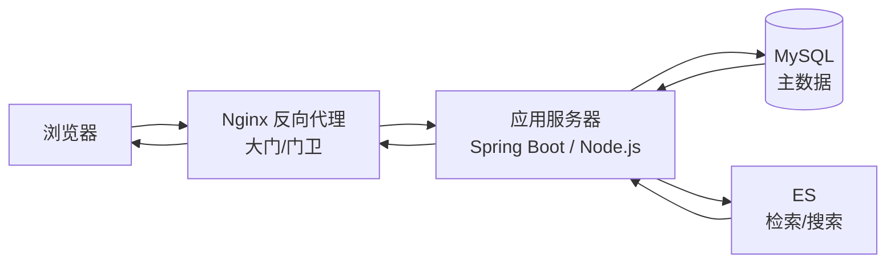
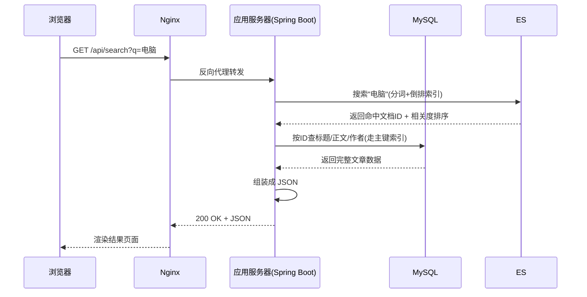
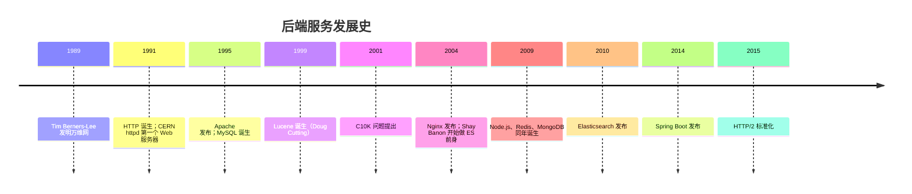

# 后端服务

> 前端页面背后，是一个看不见的**后端世界**。你在搜索框敲下一个关键词、点一下按钮，请求会先打到 **HTTP 服务器**（Nginx、Node.js、Spring Boot……），再被转发给业务代码，业务代码去查**数据库**和**搜索引擎（ES）**，最后结果沿着原路返回屏幕。这篇笔记介绍后端的三类核心服务：**HTTP 服务器、数据库、ES 数据检索**，按时间线梳理它们从哪来，但重点讲清楚——**它们各自负责什么、如何协作**。

## 一、后端世界的地图：一次请求的旅程

先看全景。一个典型的后端架构，从用户点击到数据返回是这样的：



- **Nginx**：站在最前面，负责"接待"——把请求转发给合适的应用，扛住海量并发
- **应用服务器**：执行真正的业务逻辑——校验参数、算价格、组织数据
- **数据库（MySQL 等）**：存主数据——用户、订单、文章，保证不丢不错
- **ES（Elasticsearch）**：做检索——"搜一下包含'电脑'的文章"，这是关系数据库不擅长的事

> 记住分工的一句话：**Nginx 管"到不了应用"，应用管"业务怎么算"，MySQL 管"数据怎么存"，ES 管"数据怎么搜"。**

## 二、HTTP 服务器：世界的大门

### 1. HTTP 是什么

**HTTP（HyperText Transfer Protocol，超文本传输协议）** 是浏览器与服务器之间的"通用语言"，1991 年由 CERN 的 **Tim Berners-Lee** 发明（他在 1989 年发明了万维网 WWW，HTTP 就是它的运输协议）。

HTTP 是典型的**请求-响应**模型：

- **请求**：浏览器发出 `GET /search?q=电脑 HTTP/1.1`——方法 + 路径 + 协议版本
- **响应**：服务器返回 `200 OK` + 内容

一个 HTTP 报文（以请求为例）：

```http
POST /api/order HTTP/1.1
Host: blog.smallzh.top
Content-Type: application/json

{"goods": "键盘", "count": 1}
```

**方法**：`GET`（读）、`POST`（写）、`PUT`（改）、`DELETE`（删）、`PATCH`（局部改）——含义约定俗成，后端按此分派逻辑。

**状态码**：响应的"体检结果"。

| 状态码 | 含义 | 常见场景 |
|---|---|---|
| 2xx | 成功 | 200 OK、201 已创建 |
| 3xx | 重定向 | 301/302 跳转、304 缓存命中 |
| 4xx | 客户端错误 | 404 页面不存在、403 无权限 |
| 5xx | 服务器错误 | 500 程序崩了、502 网关问题、503 过载 |

**无状态**：HTTP 自己不记得"你是谁"——两次请求互不相识，所以后端需要**会话（Session）**或 **Cookie/Token** 来记住用户身份。这是 HTTP 最经典的设计权衡：无状态才好扩展，记忆交给上层解决。

### 2. HTTP 服务器 vs 应用服务器

"服务器"这个词有两个层次，常被混用：

| | HTTP 服务器（Web Server） | 应用服务器（Application Server） |
|---|---|---|
| 代表 | Nginx、Apache、Caddy | Spring Boot、Node.js（Express/Koa）、Django |
| 干什么 | 处理**静态资源**（html/js/图片）+ 转发请求 + 负载均衡 | 执行**业务逻辑**，动态生成内容 |
| 比喻 | 酒店前台：分房、带路 | 酒店后厨：真正做饭 |

一个典型的**前后端分离**架构中，Nginx 把 `/static/*` 直接返回静态文件，把 `/api/*` 反向代理给应用服务器：

```nginx
server {
    location /api/ { proxy_pass http://backend:8080; }   # 动态请求转给应用
    location /    { root /www/static; }                  # 静态文件直接给
}
```

### 3. HTTP 服务器发展史：从"一台电脑"到"C10K"

| 时间 | 事件 | 人物/组织 | 意义 |
|---|---|---|---|
| 1991 | **CERN httpd**，第一个 Web 服务器 | Tim Berners-Lee | 万维网公开上线，服务器诞生 |
| 1993 | NCSA httpd 发布 | 伊利诺伊大学 | 第一个大众 Web 服务器 |
| 1995 | **Apache** 发布 | 社区（基于 NCSA 补丁，"a patchy server"的谐音） | 20 年霸主，一度占全球服务器 6 成以上 |
| 2004 | **Nginx** 发布 | Igor Sysoev（俄罗斯） | 解决 C10K，今天的默认选择 |
| 2009 | **Node.js** 发布 | Ryan Dahl | JS 登上后端，事件驱动写服务器 |
| 2014 | **Spring Boot** 发布 | Pivotal/社区 | Java 后端"开箱即用" |

**C10K 问题**是这段历史的主线：2001 年 Dan Kegel 提出——如何用一台服务器支撑 **1 万个并发连接**？传统 Apache 每来一个连接就开一个进程/线程（1 万连接 = 1 万进程，内存直接爆掉），Nginx 改用**事件驱动 + 单进程多连接**：一个进程同时照看成千上万个连接，谁有数据就处理谁，没有就等。**从"人海战术"到"一个人管一万张桌子"**，这就是 Nginx 胜出的核心。

> Node.js 也用同一套思想（事件循环），所以它能用很轻的资源撑起高并发——代价是单线程里不能有耗时操作（如慢 SQL），否则整个进程卡住。

## 三、数据库：数据的仓库

### 1. 为什么不用文件存数据

最朴素的想法：把数据存进文件不就行了？开发中很快会遇到四个问题：

- **并发**：两个人同时改一个文件，谁覆盖谁？
- **一致性**：订单表和库存表要一起成功或一起失败，文件做不到
- **查询**：几百万行里找出"姓张的用户"，文件只能一行行扫
- **安全**：进程崩溃、断电时，文件写到一半怎么办？

**数据库（Database）** 就是解决这些问题的软件：它把数据组织成有结构的表，提供索引加速查询、事务保证一致、日志保证不丢。

### 2. 关系型数据库：SQL 的天下

**关系型数据库（RDBMS）** 把数据组织成**表（table）**——行是记录，列是字段，表之间用**主键/外键**关联。查询语言是 **SQL**：

```sql
-- 查所有在 2024 年之后注册、名字里带"张"的用户
SELECT id, name, email
FROM users
WHERE name LIKE '张%' AND created_at > '2024-01-01'
ORDER BY created_at DESC
LIMIT 10;
```

**事务（Transaction）** 是它的招牌：保证一批操作**要么全部成功、要么全部回滚**，这就是 **ACID**（原子性、一致性、隔离性、持久性）。转账就是最经典例子——扣款和入账必须同时发生。

**索引（Index）** 是它快的秘密：数据库默认用 **B+ 树**组织索引，从几百万行里查一条记录，走索引只需几十次比较（树的高度），没有索引就是全表扫描。**"建没建对索引"是后端性能面试的第一题。**

主流关系型数据库简史：

| 数据库 | 诞生 | 创始人/组织 | 特点 |
|---|---|---|---|
| **Oracle** | 1979 | Larry Ellison | 第一个商用 SQL 数据库，企业界王者 |
| **PostgreSQL** | 1986 | Michael Stonebraker（伯克利 POSTGRES 项目） | 功能最全的开源数据库，程序员最爱 |
| **MySQL** | 1995 | Michael Widenius（瑞典，以女儿 My 命名） | 最流行的开源数据库，Web 标配 |

> 有趣：MySQL 被 Sun 收购（2008）、Sun 又归了 Oracle（2010）之后，创始人 Monty 愤而 fork 出 **MariaDB**——开源世界的恩怨情仇。

### 3. NoSQL：当关系模型不够用

2000 年代，互联网规模暴涨，关系型数据库在高并发、海量数据、灵活结构面前吃力。于是 **NoSQL（Not Only SQL）** 运动兴起，各走各的路：

| 类型 | 代表 | 诞生 | 特点 |
|---|---|---|---|
| 键值（KV） | **Redis** | 2009（Salvatore Sanfilippo） | 全内存、微秒级读写，缓存/队列之王 |
| 文档 | **MongoDB** | 2009（Dwight Merriman 等） | JSON 式文档，schema 灵活，游戏/日志常用 |
| 列族 | **HBase / Cassandra** | 2008~2010 | 海量分布式存储，互联网大厂标配 |
| 图 | **Neo4j** | 2007 | 关系网络：好友、社交、风控 |

关系型 vs NoSQL 的分工在今天已不是"谁替代谁"，而是**各管一段**：MySQL 存必须严格一致的主数据（订单、账户），Redis 缓存热点数据（登录态、排行榜），MongoDB 存结构灵活的文档（帖子、埋点）。**后端架构的一半工作，就是决定哪份数据放哪个库。**

## 四、ES：让数据"搜"起来

### 1. 为什么数据库搜不了"模糊搜索"

在 MySQL 里执行 `WHERE content LIKE '%电脑%'`——猜猜会发生什么？**全表扫描**：把每一行的 content 从头到尾比一遍。几百万篇文章 × 每篇几千字，一次搜索要扫几个 GB 的文本，耗时数秒，而且数据库的 B+ 树索引对"包含"语义毫无办法（它只能加速"前缀匹配"）。

搜索引擎要解决三个数据库做不到的事：

1. **分词**："我喜欢电脑"要能拆成"我/喜欢/电脑"
2. **相关性排序**：搜"电脑"，含"电脑"的词频越高、越靠前的文章排前面
3. **海量文本检索**：千万级文档毫秒返回

### 2. 倒排索引：搜索引擎的心脏

数据库的索引（B+ 树）是**正排**的——"文档 → 包含哪些词"。搜索引擎反过来，建一张**倒排索引（inverted index）**——"**词 → 出现在哪些文档**"：

| 词 | 文档列表 |
|---|---|
| 电脑 | 文档 1、3、7 |
| 键盘 | 文档 2、3 |
| 机械 | 文档 2、5、7 |

搜"电脑"时，直接查表命中文档 1、3、7——**一步到位，跟数据量无关**。分词器负责把文章切成词表，中文分词（如 IK 分词器）还要懂"机械键盘"是词、"机械"也是词。

> 这个概念值得记住：**正排索引"文档找词"，倒排索引"词找文档"。** 全文搜索快如闪电，全靠这张反着建的表。

### 3. Elasticsearch：把 Lucene 变成分布式服务

**Lucene** 是 Doug Cutting 1999 年用 Java 写的全文搜索库——搜索引擎的"发动机"，但只是一套库，需要自己编程调用、自己管理。2004 年，**Shay Banon** 先做了一个基于 Lucene 的搜索工具 Compass，写得不满意，**2010 年重写并发布 Elasticsearch**——把 Lucene 包成一个"开箱即用的搜索服务器"：

- **分布式**：数据自动切成**分片（shard）**分散到多台机器，每片有**副本（replica）**——一台机器挂了数据不丢，这是它和"单机搜索库"的本质区别
- **RESTful API**：一切操作都是 HTTP + JSON——它自己就是一台"应用服务器"

```bash
# 建索引（相当于数据库的"表"）
curl -X PUT http://es:9200/articles

# 写入文档（相当于 insert）
curl -X POST http://es:9200/articles/_doc -H 'Content-Type: application/json' \
  -d '{"title": "机械键盘选购", "content": "键盘的手感和轴体有关……"}'

# 全文检索（相当于 select ... like）
curl -X POST 'http://es:9200/articles/_search' -H 'Content-Type: application/json' \
  -d '{"query": {"match": {"content": "机械键盘"}}}'
```

配套的还有 **Logstash**（采集日志）和 **Kibana**（可视化看板），合称 **ELK**——几乎每个公司的日志系统都是这套组合。

### 4. 数据库 + ES：双写架构

那是不是有了 ES 就不要 MySQL 了？**恰恰相反**，生产环境里它们总是一起出现，各司其职：

```
写路径：  应用 → MySQL（主数据，事务保证） ──同步──→ ES（检索副本）
读路径：  用户搜"键盘" → ES 秒出文档ID → 拿 ID 去 MySQL 查详情 → 展示
```

- **MySQL 是"真相"**：交易、账号、报表都从这里读，保证 ACID
- **ES 是"搜索镜像"**：只服务"搜"，坏了也不影响主业务（重建即可）
- 同步方式：同步调用、**消息队列**（异步，削峰）、**CDC**（监听 MySQL 的 binlog 自动同步到 ES，如 Canal）

> 这是后端最重要的架构思想之一：**一份数据，多种视图。** 用关系库保证正确性，用搜索引擎保证检索体验，用缓存保证速度——每个系统只干它最擅长的事。

## 五、完整流程：一个搜索功能的背后

把三类服务串起来，看"在博客站搜'电脑'"这一个小动作发生了什么：



- 全程 **ES 只负责"找"，MySQL 只负责"取"**——搜索引擎不用存完整数据，数据库不用做全文检索
- Nginx 全程只"转发"，应用全程只"组装"
- 数据写进来的时候则反过来：MySQL 先落库（事务保证），再异步同步给 ES

## 六、时间轴总览



## 七、总结：后端的三板斧

| 服务 | 一句话职责 | 核心知识点 |
|---|---|---|
| HTTP 服务器 | 大门：收请求、转请求 | HTTP 报文、状态码、反向代理、事件驱动 |
| 数据库 | 仓库：存得下、查得准、不丢不错 | SQL、事务 ACID、B+ 树索引、分库分表 |
| ES | 检索：搜得快、排得准 | 倒排索引、分词、分布式分片、双写架构 |

> 后端服务的演进史本质上是一件事：**让"请求"这条路越走越宽**——HTTP 服务器解决"来多少都能接住"，数据库解决"存多少都不乱"，搜索引擎解决"数据再多也能秒搜"。三者协同，才有了你屏幕上那句"搜索结果共 12,345 条，用时 0.02 秒"。
