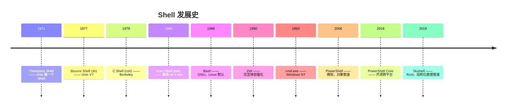

# 终端与 Shell

> 这篇笔记讲两个总是成对出现的概念：**终端（Terminal）** 是"屏幕 + 键盘"，**Shell** 是"解释命令的程序"。它们的关系，就像电话机和接线员——终端负责连通，Shell 负责听懂你说了什么。重点会按时间顺序梳理 Shell 的发展：从 sh 到 bash、zsh，从 cmd 到 PowerShell，再到新生的 fish、Nushell。

## 一、终端（Terminal）

### 1. 终端的诞生：物理设备

今天说"终端"，指的是电脑上的一个窗口。但"终端"这个词最初是一个**物理设备**。

1960~70 年代，计算机是又大又贵的**大型机（mainframe）**，一台主机由很多人共用。人们不能搬着主机到处走，于是出现了**终端**：一台只有键盘和显示器的设备，通过线缆连到远处的主机。终端自己没有计算能力，只负责两件事——**把键盘输入发给主机，把主机返回的内容显示出来**。

最常见的早期终端是**电传打字机（Teletype，简称 TTY）**：一台可以收发文字的电报机。它在纸带上打印主机输出的内容，操作员敲击按键输入命令。

> 今天的很多术语都来自这段历史：Linux 里的 `TTY`、`/dev/tty`、伪终端 `pty`，名字都源于 Teletype。

### 2. CRT 终端与 VT100

后来电传打字机被**CRT 终端**（阴极射线管显示器 + 键盘）取代，屏幕代替了纸张。1978 年，DEC 公司发布 **VT100** 终端，它定义了一套**转义序列（escape sequence）**标准（如 `\x1b[31m` 让文字变红、`\x1b[H` 移动光标），也就是今天熟知的 **ANSI 转义码**。

VT100 太成功了，以至于**今天的终端模拟器仍然兼容 VT100 的转义序列**——你在终端里看到的颜色、光标移动、清屏，用的还是 1978 年的协议。

### 3. 现代终端：终端模拟器

硬件终端早已消失，但"终端"这个词留了下来。今天的终端是**终端模拟器（terminal emulator）**——一个软件窗口，模拟当年硬件终端的行为：

- Windows：**Windows Terminal**（微软 2019 年发布，2020 年 1.0）
- macOS：**Terminal.app**、**iTerm2**
- Linux：GNOME Terminal、Konsole
- 编辑器内置：VS Code 的集成终端、JetBrains 的终端面板

> Windows 用户常混淆：**Windows Terminal 是终端模拟器**，它里面跑的 Shell 是 PowerShell 或 cmd；而"命令提示符"和"Windows PowerShell"窗口，则是各自绑定了单个 Shell 的旧式终端。Windows Terminal 把它们都装进了自己的标签页。

### 4. 终端负责什么

终端不解析命令，它只负责"**显示与交互**"：

- 渲染 Shell 输出的字符，解释 ANSI 转义码（颜色、加粗、光标移动）
- 把按键（包括 Ctrl+C、方向键、粘贴）交给 Shell，并把结果回显到屏幕
- 提供字体、配色、标签页、分屏、复制粘贴等体验功能

**终端不知道 `ls` 是什么**——它只是把 `ls` 这几个字符交给 Shell，再把 Shell 返回的内容画出来。

### 5. 终端复用器：tmux（虚拟终端）

一个终端窗口里通常只运行一个 Shell，但真实场景下往往不够：

- SSH 登录服务器操作到一半网络断了，正在运行的命令和任务全部中断
- 一个窗口里想同时跑日志、编辑器、监控命令，来回切换很麻烦
- 想在一屏里左右分栏，同时看多个程序的输出

**tmux**（terminal multiplexer，**终端复用器**）就是解决这些问题的工具：它是运行在终端模拟器**里面**的一层软件，把一个终端窗口扩展成多个虚拟终端。它由 **Nicholas Marriott** 于 **2007 年**发布（出身 OpenBSD 社区，前辈是 1987 年的 **GNU screen**），如今是服务器运维和开发的必备工具。

tmux 的三个核心概念：

- **Session（会话）**：一整套虚拟终端。会话可以**脱离（detach）**——退出终端、断开 SSH 都没关系，会话里的程序继续运行；下次登录后执行 `tmux attach` 就能**重新接上（attach）**，一切如初
- **Window（窗口）**：会话内的"标签页"，一个会话可以有多个窗口
- **Pane（窗格）**：窗口内的分屏，把一个窗口切成上下、左右多个区域

层次关系：

```
终端模拟器（Windows Terminal / iTerm2 / VS Code）
   └── tmux（会话 / 窗口 / 窗格）
          └── Shell（bash / zsh / PowerShell）
```

常用命令（简短）：

```shell
# 会话管理
tmux new -s work            # 新建名为 work 的会话
tmux ls                     # 列出所有会话
tmux attach -t work         # 重新接入 work 会话（SSH 断线后恢复现场）
tmux kill-session -t work   # 结束会话
```

进入 tmux 后，所有操作通过**前缀键 Ctrl+b** 触发：

| 按键（Ctrl+b 后） | 作用 |
| --- | --- |
| `c` / `0`~`9` | 新建窗口 / 切换窗口 |
| `%` / `"` | 左右分屏 / 上下分屏 |
| 方向键 | 在窗格间移动 |
| `x` | 关闭当前窗格 |
| `z` | 当前窗格全屏 / 还原 |
| `d` | 脱离会话（程序继续运行） |
| `$` / `,` | 重命名会话 / 重命名窗口 |

> 常用的工作流：`tmux new -s dev` 开始干活 → 分屏同时开日志和编辑器 → 下班或断开 SSH（Ctrl+b d 脱离）→ 下次登录 `tmux attach -t dev` 无缝继续。这正是 tmux 被称为"虚拟终端"的原因：**终端窗口关了，会话还在。**

## 二、Shell

### 1. Shell 是什么

计算机的**内核（Kernel）**管理着硬件和资源，用户不能直接操作内核。**Shell（壳）** 是包裹在内核之外的程序，负责**接收用户的命令，解释并执行**——它是用户与操作系统之间的翻译官。

Shell 有两个身份：

1. **交互式命令解释器**：你敲一行 `ls -l`，它解析并执行，把结果输出
2. **脚本语言**：把命令写进脚本文件，Shell 逐行解释执行——脚本编程（shell scripting）

Shell 也是"一切皆文件"的 Unix 哲学的一部分：程序之间通过**管道（`|`）**传递文本流，`ps | grep java` 就是把前一个命令的输出作为后一个命令的输入。

### 2. Shell 的发展（按时间顺序）



#### sh 时代：Unix Shell 的奠基（1971~1983）

- **1971 年，Thompson Shell**：Unix 之父 **Ken Thompson** 写出的第一个 Shell，功能很弱，但确立了"命令行交互"这个交互形态
- **1977 年，Bourne Shell（sh）**：AT&T 的 **Stephen Bourne** 在 Unix V7 中重写了 Shell，加入变量、循环、条件判断等脚本能力，让 Shell 从"命令输入器"进化成"编程语言"。sh 此后成为 Unix 的标准 Shell，**POSIX 标准中的 Shell 规范就是它的后裔**
- **1979 年，C Shell（csh）**：Berkeley 的 **Bill Joy**（后来 Sun 公司的联合创始人）开发，语法模仿 C 语言，并带来了**别名（alias）、命令历史、作业控制**等增强交互体验的特性。它的改进版 **tcsh** 增加了命令行补全
- **1983 年，Korn Shell（ksh）**：AT&T 的 **David Korn** 开发，目标是"sh 的兼容 + csh 的体验"，两者优点兼收。但 ksh 曾长期是商业软件，限制了传播

这个阶段的特点：**sh 是标准，csh/ksh 是增强**。都还是"文本命令解释器"。

#### bash 与 zsh：自由软件的双雄（1989~1990）

- **1989 年，Bash（Bourne Again Shell）**：GNU 项目（自由软件基金会）的 **Brian Fox** 编写，名字是对 Bourne Shell 的致敬（Bourne Again 谐音 born again，"重生"）。它做到了两件事：
  - **完全兼容 sh**，Unix 世界里所有 sh 脚本都能跑
  - 交互体验不输 csh/ksh：历史、补全、别名、作业控制、可编程提示符
- **1990 年，Zsh**：普林斯顿大学的学生 **Paul Falstad** 开发，融合 ksh、tcsh 的优点，交互体验做到极致：智能补全、拼写纠正、主题系统

后来的故事：

- **Bash 成为 Linux 发行版的默认 Shell**，也长期是 macOS 的默认 Shell（macOS 10.3 起）
- **Zsh 依托 oh-my-zsh 插件生态流行起来**，2019 年 macOS Catalina 起，**苹果把 macOS 默认 Shell 从 bash 换成了 zsh**（bash 3.2 因 GPL 协议问题不再更新，zsh 成为默认）

> 在今天的 Linux/macOS 上，**`sh` 是标准、`bash` 是事实标准、`zsh` 是交互体验之王**。

#### Windows 阵营：cmd 与 PowerShell（1981~2006）

Unix 的 Shell 一脉相承，Windows 走了另一条路：

- **1981 年，COMMAND.COM**：DOS 时代的 Shell，功能简陋，一直延续到 Windows 9x
- **1993 年，cmd.exe**：Windows NT 内置，是今天"命令提示符"的原型。它的批处理（`.bat`）语法与 Unix Shell 完全不同，功能也弱得多
- **2006 年，PowerShell 1.0**：微软终于给 Windows 一个现代 Shell。它的革命性设计是**对象管道**：Unix Shell 的管道里流的是"文本"，而 PowerShell 管道里流的是 **.NET 对象**——`Get-Process | Sort-Object CPU -descending` 排序的是真实的数据对象，而不是字符串，不需要再写复杂的文本解析

#### 新一代：fish 与 Nushell（2005~2019）

- **2005 年，fish（Friendly Interactive SHell）**：追求"开箱即用"——安装即有语法高亮、自动建议、tab 补全，几乎不需要配置
- **2019 年，Nushell（Nu）**：作者 **Jonathan Turner** 用 **Rust** 编写。它把"对象管道"的思想推到极致：管道中流动的是**结构化数据**（表、记录），`ls | where size > 1MB | sort-by size` 直接对数据操作，摆脱了"文本 + 正则表达式"的解析地狱。对现代开发者来说，它更像"在命令行里写脚本查数据"

> 一个有趣的演进脉络：**文本管道（sh/bash）→ 对象管道（PowerShell）→ 数据表管道（Nushell）**。从"处理字符串"到"处理数据"，Shell 一直在跟着时代升级。

### 3. 各家 Shell 对比

| Shell | 诞生 | 作者/组织 | 代表作 | 特点 |
| --- | --- | --- | --- | --- |
| sh（Bourne） | 1977 | Stephen Bourne | Unix V7 | Unix 标准脚本语言 |
| csh | 1979 | Bill Joy | BSD | C 语法、别名、历史 |
| ksh | 1983 | David Korn | AT&T | 兼容 sh + csh |
| **bash** | 1989 | GNU（Brian Fox） | Linux 默认 | sh 兼容 + 交互增强 |
| **zsh** | 1990 | Paul Falstad | macOS 默认 | 交互体验最佳，插件生态 |
| fish | 2005 | Axel Liljencrantz | — | 开箱即用 |
| **PowerShell** | 2006 | 微软 | Windows 默认 | 对象管道，.NET 基础 |
| **Nushell** | 2019 | Jonathan Turner | Rust 编写 | 结构化数据管道 |

## 三、终端与 Shell 的关系

### 1. 一句话总结

> **终端是"屏幕 + 键盘"，Shell 是"解释命令的程序"。终端负责显示和输入，Shell 负责听懂和执行。**

一个类比：终端像**电话机**，Shell 像**接线员**。你对着电话机（终端）说话，接线员（Shell）听懂你的话，帮你接通对应的人（程序）；电话机本身不认识你要找谁。

### 2. 打开一个终端窗口时，发生了什么

1. 你双击终端模拟器（Windows Terminal、iTerm2 等）
2. 模拟器创建一个**伪终端（pty）**——模拟一条"电缆"连接主机
3. 模拟器启动**默认 Shell**（Windows 上是 PowerShell，Linux 上是 bash，macOS 上是 zsh）
4. Shell 打印提示符（`$`、`PS C:\>` 等），等待你的输入

你看到的窗口是终端，窗口里"等待输入的那个程序"是 Shell。**终端与 Shell 是两层软件，不是一回事。**

### 3. 各司其职

| 职责 | 终端负责 | Shell 负责 |
| --- | --- | --- |
| 渲染字符、颜色、光标 | ✅（解释 ANSI 转义码） | 输出转义码 |
| 解析命令、查找程序 | | ✅ |
| Tab 补全、命令历史 | | ✅ |
| 提示符（`$`、`>`） | | ✅（可编程） |
| 快捷键（Ctrl+C 中断） | 转发按键 | 处理信号 |
| 字体、主题、标签页 | ✅ | |

### 4. 常见误解

- **"打开终端" ≠ "打开 Shell"**：打开终端窗口后，里面自动运行着一个 Shell（通常是你系统的默认 Shell）
- **Windows Terminal 是终端**，里面的 Shell 可以是 PowerShell、cmd、WSL 的 bash——同一个终端能开多个不同 Shell 的标签页
- **VS Code 的集成终端**也是终端，它默认跑的可能是 bash，也可能是 PowerShell（取决于系统）
- **WSL（Windows Subsystem for Linux）**：本质是在 Windows 里跑一个 Linux 环境，你在 Windows Terminal 里打开 WSL 标签，看到的是 Linux 的 Shell（bash/zsh），而终端还是那个终端

## 总结

- **终端**：从 1970 年代的物理设备（电传打字机、VT100）演化为今天的终端模拟器，负责"显示与交互"，术语 TTY 一直沿用至今；在终端模拟器之上还有 tmux 这样的终端复用器，提供会话保持、分屏等"虚拟终端"能力
- **Shell**：从 Thompson Shell 起步，经 sh 定为标准，bash 成为 Linux 事实标准，zsh 凭交互体验上位 macOS，PowerShell 用对象管道征服 Windows，Nushell 把管道升级为结构化数据
- **关系**：终端是壳，Shell 是芯；终端管"看见"，Shell 管"听懂"。现代开发环境里，两者以"终端模拟器 + Shell"的组合形式成对出现
