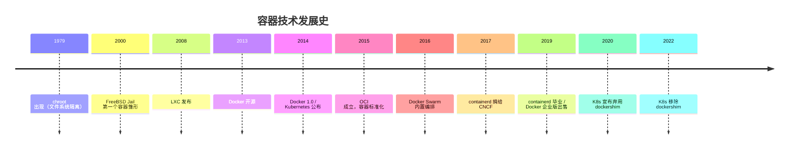

# Docker 使用

> 这篇笔记从"容器"的历史讲起：chroot 是起点，LXC 是雏形，Docker 让它流行，Kubernetes 让它标准化，containerd 让它沉淀为云原生时代的基石。最后是容器启动顺序的实战记录和常用命令速查。

## 一、容器技术的历史（按时间顺序）



### 1. 萌芽：chroot 与隔离技术（1979~2008）

容器的核心思想是**隔离**——让一个进程以为自己独占了一台机器。这个思想最早可追溯到 **1979 年** Unix V7 引入的 **chroot**：它能让进程的根目录被"换掉"，进程只能看到指定目录里的文件，相当于最早的**文件系统隔离**。

之后的隔离技术按"隔离的彻底程度"逐步升级：

- **2000 年**：FreeBSD 推出 **Jail**，第一次实现了文件系统、进程、网络等全方位隔离，被视为第一个真正意义上的"容器"技术
- **2006 年**：Google 工程师提出 **cgroups**（控制组，最早叫 process containers），限制进程的 CPU、内存等资源用量，2008 年合入 Linux 内核 2.6.24
- 同期 Linux 内核还陆续合入了 **namespaces**（命名空间）：让进程拥有独立的 PID、网络、挂载点等视图

**cgroups（资源限制）+ namespaces（视图隔离）**，正是现代容器技术的两大支柱。

### 2. 雏形：LXC（2008）

2008 年，IBM 工程师 Daniel Lezcano 基于 cgroups + namespaces 开发了 **LXC**（LinuX Containers），让 Linux 上可以运行"接近完整操作系统"的隔离环境。LXC 是 Linux 社区的第一个容器方案，但使用门槛高、镜像分发困难，始终是"技术极客的工具"。

### 3. 诞生：Docker 开源（2013）

**2013 年 3 月**，一家叫 **dotCloud** 的 PaaS 公司（创始人 **Solomon Hykes**）把内部使用的容器管理工具开源，命名 **Docker**。它最初就是基于 LXC 的封装，但做了三件革命性的事：

1. **镜像（Image）**：把"应用 + 运行环境"打包成一个可分发的只读镜像，配合 Dockerfile 可以自动构建
2. **分层存储**：镜像由一层层可复用的文件层组成，多个镜像共享底层，传输和存储都大幅节省
3. **一条命令运行**：`docker run` 让任何人都能一键启动一个应用环境，"Build, Ship and Run"（构建、运输、运行）成为它的口号

2013 年底，Docker 0.7 用自研的 **libcontainer** 取代了对 LXC 的依赖，从此不再受制于外部容器方案。Docker 一出生就踩中了"微服务兴起、环境一致性成为痛点"的时代节拍，迅速成为开发者工具界的新星。

### 4. 爆发与标准化：Docker 1.0、Kubernetes、OCI（2014~2015）

- **2014 年 6 月**：DockerCon 大会发布 **Docker 1.0**，dotCloud 正式更名 **Docker Inc.**，标志着 Docker 进入商业化阶段
- **2014 年 6 月**：Google 公布 **Kubernetes**（k8s），2015 年 7 月发布 1.0——容器编排战争从此开打
- **2014 年**：Docker 收购 **fig** 并改名 **docker-compose**，多容器编排的本地化体验大大简化
- **2015 年 6 月**：Docker、Google、CoreOS、Red Hat 等公司共同成立 **OCI**（Open Container Initiative，开放容器倡议），Docker 捐出 libcontainer 演化的 **runc** 作为参考实现。容器格式从此有了公开标准，不再是任何一家公司的私有技术

### 5. 编排大战：Swarm vs Kubernetes（2016~2017）

容器解决了"怎么跑"，还缺"怎么管"——大量容器的调度、扩缩容、负载均衡、故障恢复，需要一个**编排系统**。2016~2017 年爆发了三方混战：

- **Docker Swarm**：Docker 1.12（2016 年）内置 Swarm mode，与 Docker 深度集成，上手最简单
- **Kubernetes**：Google 出品，理念先进、生态繁荣，得到了微软、AWS、Red Hat 等巨头支持
- **Mesos + Marathon**：老牌资源管理器，擅长大数据场景

最终 **Kubernetes 胜出**，成为容器编排的事实标准。2017 年 Docker 也宣布企业版支持 Kubernetes——"编排之战"落幕。

### 6. 拆分与沉淀：containerd、dockershim 谢幕（2017~2022）

容器生态后来发生了两件影响深远的事：

- **2017 年**：Docker 将容器运行时 **containerd**（负责镜像管理、容器生命周期）捐给 **CNCF**（云原生计算基金会），2019 年 2 月成为 CNCF 首批毕业项目之一。containerd 从"Docker 内部组件"变成了"行业标准运行时"
- **2019 年 11 月**：Docker 把企业版业务出售给 Mirantis，聚焦开发者工具（Docker Desktop）
- **2020~2022 年**：Kubernetes 宣布弃用 **dockershim**（k8s 调用 Docker 的中间层），2022 年 5 月 K8s 1.24 正式移除。K8s 改用 containerd 直接管理容器——Docker 作为"容器运行时"的时代结束，但 Docker 镜像是标准，Docker Desktop 仍是开发者的最爱

### 今天：云原生时代

- 事实标准变为：**OCI 标准 + containerd/runc**，所有容器工具都兼容 Docker 镜像
- 出现了 podman、nerdctl 等无守护进程的替代品，以及 buildkit 等新一代构建工具
- 容器 + Kubernetes 构成了云原生（Cloud Native）世界的底座

## 二、Docker 的核心概念

### 镜像（Image）

**镜像是只读的模板**，包含一个应用运行所需的完整环境：代码、依赖、配置、基础系统文件。镜像是**分层**的——由一层层只读文件层（layer）堆叠而成，每一层都有哈希值标识：

- 两个镜像共享相同的基础层时，只存储一份，节省空间
- 构建时只有变化的层会被重建，未变化的层直接复用缓存，构建飞快
- Dockerfile 中的每一条指令（`RUN`、`COPY` 等）通常产生一个层

### 容器（Container）

**容器是镜像的运行实例**。镜像本身不能运行，`docker run` 会在镜像之上加一个**可写的容器层**，启动其中的进程。容器可以被启动、停止、删除，容器内产生的数据写在该可写层中——**容器一删除，可写层的数据也随之消失**（要持久化请用数据卷）。

### 仓库（Registry）

**仓库是存放镜像的地方**，最著名的是 **Docker Hub**（Docker 官方仓库）。镜像的全名形如 `仓库地址/命名空间/镜像名:标签`，如 `mysql:8.0`。`docker pull` 从仓库拉取镜像，`docker push` 上传镜像。企业内网通常搭建私有仓库（registry / Harbor）。

### 数据卷（Volume）

容器删除后数据就没了，因此需要**数据卷**把数据放到宿主机上持久化。两种方式：

- **命名卷（named volume）**：由 Docker 管理，`docker run -v mydata:/var/lib/mysql`，备份迁移方便
- **绑定挂载（bind mount）**：直接映射宿主机目录，`docker run -v /home/data:/data`，修改宿主机文件即时生效，方便调试

### 网络（Network）

Docker 默认提供三种网络模式：

| 模式 | 说明 |
| --- | --- |
| **bridge**（默认） | 容器之间通过虚拟网桥互通，配合 `-p 8080:80` 把容器端口映射到宿主机 |
| **host** | 容器直接使用宿主机网络，无端口映射，性能最好 |
| **none** | 容器没有网络，适合离线任务 |

多个容器要互相访问时，把它们加入**同一个自定义网络**，直接用**容器名**作为主机名访问，比记忆 IP 方便得多（这是 docker-compose 的默认行为）。

### Dockerfile

**Dockerfile 是构建镜像的脚本**，常用指令：

| 指令 | 作用 |
| --- | --- |
| `FROM` | 指定基础镜像，必须是第一条指令 |
| `RUN` | 执行构建时的命令（安装依赖等） |
| `COPY` / `ADD` | 把文件复制进镜像 |
| `WORKDIR` | 设置工作目录 |
| `ENV` / `ARG` | 设置环境变量 / 构建参数 |
| `EXPOSE` | 声明容器监听的端口 |
| `CMD` / `ENTRYPOINT` | 指定容器启动时执行的命令 |
| `HEALTHCHECK` | 定义健康检查 |

### Docker 的整体架构

```
docker client ──> docker daemon (dockerd) ──> containerd ──> runc ──> 容器进程
                     │
                     └── 镜像存储（分层文件）
```

- **客户端**：`docker` 命令行，把用户指令发给守护进程
- **dockerd**：Docker 守护进程，负责镜像管理、网络、卷等，是用户接触最多的部分
- **containerd**：更底层的容器运行时，负责镜像解包、容器生命周期，可被 K8s 等直接调用
- **runc**：OCI 标准的参考实现，真正调用内核能力创建容器进程

### 容器 vs 虚拟机

| 对比项 | 容器 | 虚拟机 |
| --- | --- | --- |
| 隔离级别 | 进程级（共享宿主机内核） | 硬件级（独立内核，虚拟 CPU/内存） |
| 启动速度 | 秒级 | 分钟级 |
| 资源占用 | 小（只打包应用层） | 大（每个都要完整系统） |
| 镜像大小 | MB 级 | GB 级 |
| 隔离强度 | 较弱（共享内核） | 强（完全隔离） |

容器快、轻，但隔离不如虚拟机彻底，两者常混合使用。

## 三、容器启动顺序（实战）

这里使用 `tomcat9`和`mysql8` 作为演示，其中 mysql8的启动，参考 `教程/MySql8` 下的启动过程

tomcat9依赖mysql8，因此，我们将tomcat9的容器 放在 mysql8容器启动之后。

mysql8容器没有要依赖的容器，设置成随docker启动自启就行，因此，只设置 tomcat9的顺序

整个过程中，关键的地方是 **延迟容器启动时间**

首先拉取 tomcat9的 docker镜像

```shell
docker pull tomcat:9-jdk8-corretto
```

创建一个存放应用文件的目录，同时将tomcat的`logs`和`webapp`目录映射到宿主机上

```shell
# 创建应用文件目录
mkdir -p /home/tomcat9/app_files
# 创建tomcat的映射目录
mkdir -p /home/tomcat9/logs
mkdir -p /home/tomcat9/webapp
```

启动容器

```shell
docker run -d --name tomcat9 -p 8080:8080 -v /home/tomcat9/logs:/usr/local/tomcat/logs -v /home/tomcat9/webapp:/usr/local/tomcat/webapps -v /home/tomcat9/app_files:/data/files tomcat:9-jdk8-corretto
```

### 配置容器启动顺序

将docker设置为开机自启

```shell
systemctl enable docker.service
```

编辑**rc-local.service** 文件

```shell
vim /lib/systemd/system/rc-local.service
```

末尾添加以下内容

```txt
[Install]
WantedBy=multi-user.target
Alias=rc-local.service
```

编辑 **rc.local** 文件

先查看一下tomcat9容器的id

```shell
docker ps
```

我这里，tomcat9的容器id是 `f887619c2c11`

编辑 `rc.local`文件

```shell
vim /etc/rc.local
```

文件末尾添加以下内容

```txt
sleep 10s;docker start f887619c2c11
```

延迟`10s`启动tomcat9容器

ok，重启服务器，试一下效果。

## 四、Docker 常用命令

> 下面按用途分组整理常用命令。命令中的 `<>` 表示替换成实际值，如 `<镜像名>` 填 `mysql:8.0`。

### 镜像相关

```shell
# 拉取镜像
docker pull <镜像名>

# 列出本地镜像
docker images
docker image ls

# 删除镜像（先删依赖的容器）
docker rmi <镜像名或ID>

# 给镜像打标签
docker tag <镜像名> <新名称:新标签>

# 推送镜像到仓库
docker push <镜像名>

# 根据 Dockerfile 构建镜像
docker build -t <镜像名> .

# 镜像导出/导入（离线迁移）
docker save -o myimage.tar <镜像名>
docker load -i myimage.tar

# 查看镜像分层和构建历史
docker history <镜像名>

# 查看镜像详细信息
docker inspect <镜像名>
```

### 容器相关

```shell
# 运行容器：-d 后台 -p 端口映射 --name 命名 -v 数据卷
docker run -d -p 8080:8080 --name myapp -v /home/data:/data <镜像名>

# 列出容器（-a 包含已停止的）
docker ps
docker ps -a

# 启停/重启容器
docker start <容器名或ID>
docker stop <容器名或ID>
docker restart <容器名或ID>

# 删除容器（-f 强制删除运行中的）
docker rm <容器名或ID>
docker rm -f <容器名或ID>

# 查看日志（-f 持续输出 --tail 只看末尾 N 行）
docker logs -f --tail 100 <容器名或ID>

# 进入容器执行命令
docker exec -it <容器名或ID> bash

# 在容器和宿主机之间复制文件
docker cp 宿主机文件 <容器名或ID>:/容器路径
docker cp <容器名或ID>:/容器路径 宿主机路径

# 查看容器资源占用
docker stats
docker top <容器名或ID>

# 暂停/恢复容器
docker pause <容器名或ID>
docker unpause <容器名或ID>

# 把容器打包成新镜像（不推荐，应使用 Dockerfile）
docker commit <容器名或ID> <新镜像名>
```

### 数据卷

```shell
# 创建/查看/删除命名卷
docker volume create mydata
docker volume ls
docker volume rm mydata

# 清理未使用的卷
docker volume prune

# 查看卷挂载详情
docker inspect <容器名或ID>
```

### 网络

```shell
# 创建自定义网络（容器之间可用容器名互相访问）
docker network create mynet

# 查看网络列表/详情
docker network ls
docker network inspect mynet

# 把容器接入/断开网络
docker network connect mynet <容器名或ID>
docker network disconnect mynet <容器名或ID>

# 删除网络
docker network rm mynet
```

### docker compose（多容器编排）

```shell
# 启动服务（-d 后台）
docker compose up -d

# 查看服务状态
docker compose ps

# 查看日志
docker compose logs -f

# 停止并删除服务
docker compose down

# 重新构建镜像后启动
docker compose up -d --build

# 在某个服务容器内执行命令
docker compose exec <服务名> bash
```

> 老版本使用 `docker-compose`（带横杠），新版本使用 `docker compose`（空格）。

### 清理与系统

```shell
# 查看磁盘占用
docker system df

# 一键清理：停止的容器、未使用的镜像和网络
docker system prune -a

# 只清理某类资源
docker container prune   # 停止的容器
docker image prune -a    # 未使用的镜像
docker volume prune      # 未使用的卷

# 查看 Docker 版本与系统信息
docker version
docker info
```

### 其他

```shell
# 登录/退出镜像仓库（默认 Docker Hub）
docker login
docker logout

# 镜像仓库搜索
docker search <关键词>
```
