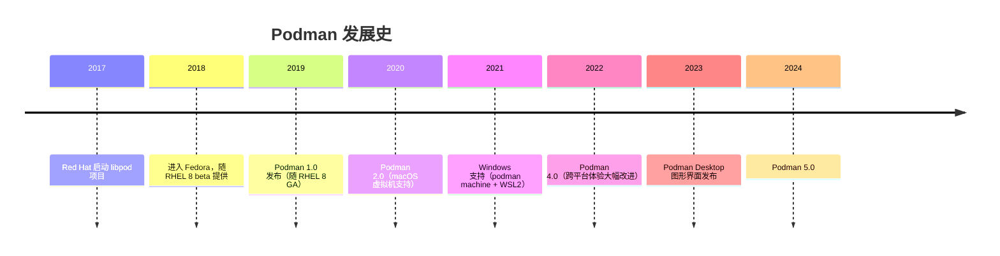

# 使用Podman

podman官网： [https://podman.io/](https://podman.io/)

> 这篇笔记从 Podman 的历史讲起：它是 Red Hat 推出的"无守护进程、普通用户可运行"的容器工具，命令行与 Docker 完全兼容。最后是 Windows 下配合 WSL 的使用记录和常用命令速查。

## 一、Podman 的历史（按时间顺序）



### 2017 年：Red Hat 启动 libpod 项目

Docker 一家独大的时代，Red Hat 的工程师（以 **Dan Walsh** 为首，他是 SELinux 领域的专家）开始担心：容器技术如果被一家公司完全掌控，生态会受限。2017 年，Red Hat 启动了 **libpod** 项目，目标明确：

- **无守护进程**（daemonless）：不依赖像 dockerd 那样常驻的中央守护进程
- **rootless**：普通用户就能运行容器，不需要 root 权限
- **兼容 Docker CLI**：`podman` 命令与 `docker` 语法一致，迁移零成本

2018 年，这个项目对外发布为 **Podman**（Pod Manager，荚管理器），并进入 Fedora 和 RHEL 8 beta。

### 2018~2019 年：Podman 1.0 与 RHEL 8

- **2019 年 4 月**，Podman 1.0 发布，同年 RHEL 8 正式版将其作为默认容器工具——Red Hat 明确表态：用 Podman 取代 Docker。这也是 RHEL 8 起"不再内置 Docker"的原因

### 2020~2021 年：podman machine 与跨平台

Podman 早期只支持 Linux。为了让 Mac、Windows 开发者也能用，Red Hat 引入了 **podman machine**：在宿主机上自动创建一个轻量级 Linux 虚拟机，容器跑在虚拟机里：

- **2020 年**（Podman 2.0）：支持 macOS
- **2021 年**（Podman 2.2~3.x）：支持 **Windows + WSL2** 后端

从这时起，Podman 成为 Docker Desktop 的完整替代选项。

### 2022~2023 年：Podman 4.0 与 Podman Desktop

- **2022 年**，Podman 4.0 发布，Windows/macOS 虚拟机的管理体验大幅改进，资源占用明显优于 Docker Desktop
- **2023 年**，Red Hat 推出 **Podman Desktop** 图形界面（对标 Docker Desktop），支持可视化地管理容器、镜像，甚至可以直接操作 Kubernetes 集群
- 同期引入 **Quadlet**：把容器声明成 systemd 单元文件，容器随系统开机自启，Linux 服务器上非常实用

### 2024 年至今：Podman 5.0

- **2024 年 3 月**，Podman 5.0 发布，底层改用 **sqlite** 数据库、原生支持 Mac 的虚拟化框架，性能进一步提升
- 今天的 Podman 已经完全兼容 OCI 标准：能运行任何 Docker 镜像、Dockerfile、docker-compose 编排，是"无守护进程、默认 rootless"的容器方案代表

## 二、Podman 的核心特点

### 1. 无守护进程架构

Docker 是"客户端—守护进程"架构：`docker` 命令发请求给常驻的 **dockerd**，由它创建容器。Podman 没有常驻守护进程：

- 每个 `podman` 命令直接**fork/exec 出容器进程**，由 OCI 运行时（默认是 Red Hat 的 **crun**，比 runc 更轻更快）直接执行
- 容器进程的父进程是 systemd 而不是某个守护进程——**容器死掉后不会出现"守护进程崩溃导致孤儿容器"的问题**
- 需要 Docker API 兼容时，可启动 `podman system service` 提供 Docker socket，让老工具无缝对接

### 2. rootless（非 root 运行）

普通用户直接运行容器，无需 sudo：

- 底层利用**用户命名空间**（user namespace）把容器内的 root 映射为宿主机的普通用户，容器内即使被攻破，权限也受限
- 文件存储默认用 **fuse-overlayfs**（新内核原生支持无特权 overlayfs），普通用户即可拥有镜像分层能力
- 安全性更好，也是很多运维团队从 Docker 迁移到 Podman 的核心原因

### 3. Pod 概念

Podman 名字里的 "Pod"，借鉴了 Kubernetes 的 **Pod** 模型：把多个容器组成一个**荚**，共享同一个网络命名空间，可以用一条命令统一启停：

```shell
podman pod create --name mypod
podman run -d --pod mypod <镜像名>   # 容器加入 Pod
podman pod start mypod
podman pod stop mypod
```

### 4. 与 Docker 的对比

| 对比项 | Docker | Podman |
| --- | --- | --- |
| 架构 | 客户端 + 常驻守护进程 dockerd | 无守护进程，命令直接管理 |
| rootless | 需额外配置 | 默认支持 |
| Pod（荚） | 无原生支持 | 原生支持 |
| 与 systemd 集成 | 一般 | 原生（Quadlet） |
| 命令行 | `docker` | `podman`（语法兼容 docker） |
| 镜像 | OCI / Docker | OCI / Docker（完全通用） |
| 图形界面 | Docker Desktop | Podman Desktop |

### 5. 与 Docker 的兼容性

- **命令兼容**：`podman run`、`podman ps` 等语法与 `docker` 一致，甚至可以 `alias docker=podman` 直接替换
- **镜像兼容**：完全支持 Docker Hub 镜像和 Dockerfile 构建
- **编排兼容**：支持 docker-compose（`podman compose` / podman-compose）
- **API 兼容**：`podman system service` 可模拟 Docker API socket，Compose 等工具无需改动即可使用

## 三、Windows 下使用（WSL2）

安装的时候，选择 wsl

### 1. 启动虚拟机

需要先启动虚拟机， 常用命令

```shell
# 初始化虚拟机。此过程会下载 VM 镜像，需要一些时间
podman machine init
# 启动虚拟机
podman machine start
# 进入虚拟机
podman machine ssh
```

### 2. 虚拟机管理

```shell
# 查看虚拟机信息
podman machine status
# 查看虚拟机 IP
podman machine ip
# 关闭虚拟机
podman machine stop
# 删除虚拟机
podman machine rm
```

### 3. 验证运行

```shell
# 验证是否可以运行容器（拉取 hello-world 镜像并运行它，成功会输出）
podman run hello-world

# 查看安装信息
podman info
```

### 4. 配置镜像源

需要以root的 身份启动虚拟机

```shell
# 设置 root 身份
podman machine set --rootful
# 启动虚拟机
podman machine start
# 进入虚拟机
podman machine ssh
# 编辑配置文件
cd /etc/containers/
cp registries.conf registries.conf_bck
vi registries.conf
```

加入以下内容

```txt
# 默认情况下，podman pull 和 podman search 命令以指定顺序在 unqualified-search-registries 列表中列出的注册表中搜索容器镜像
unqualified-search-registries = ["docker.m.daocloud.io", "registry.access.redhat.com", "registry.redhat.io", "docker.io"]
# short-name-mode = "disabled"

# 设置 docker.io 前缀的 docker 地址使用其他镜像地址
[[registry]]
prefix = "docker.io"
location = "docker.1ms.run"
# location = docker.m.daocloud.io
# 当 registry.location 无法访问时，会以 mirror 顺序访问镜像源
[[registry.mirror]]
location = "hub.mirrorify.net"
insecure = true
[[registry.mirror]]
location = "dislabaiot.xyz"
insecure = true
[[registry.mirror]]
location = "doublezonline.cloud"
insecure = true

# 设置 quay.io 镜像地址 -- Redhat 镜像中心
[[registry]]
prefix = "quay.io"
location = "quay.mirrorify.net"
# location = "quay.m.daocloud.io"

# 设置 ghcr.io 镜像地址 -- github 镜像中心
[[registry]]
prefix = "ghcr.io"
location = "ghcr.mirrorify.net"
# location = "ghcr.m.daocloud.io"

# 设置 gcr.io 镜像地址 -- google 镜像中心
[[registry]]
prefix = "gcr.io"
location = "gcr.mirrorify.net"
# location = "gcr.m.daocloud.io"

# 设置 k8s.gcr.io 镜像地址
[[registry]]
prefix = "k8s.gcr.io"
location = "k8s.mirrorify.net"
# location = "k8s.m.daocloud.io"
```

执行以下命令验证

```shell
podman info
```

## 四、Podman 常用命令

> 命令与 `docker` 语法基本一致，带 `< >` 的参数替换成实际值。下面按用途分组整理。

### 镜像相关

```shell
# 拉取/列出/删除镜像
podman pull <镜像名>
podman images
podman rmi <镜像名或ID>

# 搜索/登录镜像仓库
podman search <关键词>
podman login
podman logout

# 根据 Dockerfile 构建镜像
podman build -t <镜像名> .

# 给镜像打标签 / 推送
podman tag <镜像名> <新名称:新标签>
podman push <镜像名>

# 镜像导出/导入（离线迁移）
podman save -o myimage.tar <镜像名>
podman load -i myimage.tar

# 查看镜像信息
podman history <镜像名>
podman inspect <镜像名>
```

### 容器相关

```shell
# 运行容器：-d 后台 -p 端口映射 --name 命名 -v 数据卷
podman run -d -p 8080:8080 --name myapp -v /home/data:/data <镜像名>

# 列出容器（-a 包含已停止的）
podman ps
podman ps -a

# 启停/重启/删除容器
podman start <容器名或ID>
podman stop <容器名或ID>
podman restart <容器名或ID>
podman rm <容器名或ID>

# 查看日志（-f 持续输出 --tail 只看末尾 N 行）
podman logs -f --tail 100 <容器名或ID>

# 进入容器执行命令
podman exec -it <容器名或ID> bash

# 容器与宿主机之间复制文件
podman cp 宿主机文件 <容器名或ID>:/容器路径
podman cp <容器名或ID>:/容器路径 宿主机路径

# 查看资源占用
podman stats
podman top <容器名或ID>

# 容器转为镜像（不推荐，应使用 Dockerfile）
podman commit <容器名或ID> <新镜像名>
```

### Pod（荚）

```shell
# 创建/查看/删除 Pod
podman pod create --name mypod
podman pod list

# 启动/停止 Pod（统一管理其中的所有容器）
podman pod start mypod
podman pod stop mypod
podman pod rm mypod

# 查看 Pod 中的容器
podman pod ps
```

### 数据卷

```shell
# 创建/查看/删除命名卷
podman volume create mydata
podman volume ls
podman volume rm mydata

# 清理未使用的卷
podman volume prune
```

### 网络

```shell
# 创建自定义网络（容器之间可用容器名互相访问）
podman network create mynet

# 查看网络列表/详情
podman network ls
podman network inspect mynet

# 容器接入/断开网络
podman network connect mynet <容器名或ID>
podman network disconnect mynet <容器名或ID>

# 删除网络
podman network rm mynet
```

### podman machine（Windows/macOS）

```shell
# 初始化/启动/停止虚拟机
podman machine init
podman machine start
podman machine stop

# 查看状态与 IP
podman machine status
podman machine ip

# 进入虚拟机 / 删除虚拟机
podman machine ssh
podman machine rm

# 切换 root 身份模式（rootful / rootless）
podman machine set --rootful
podman machine set --rootless
```

### docker compose 兼容

```shell
# 新版 Podman 自带 compose 子命令
podman compose up -d
podman compose ps
podman compose logs -f
podman compose down

# 旧版本使用独立的 podman-compose
podman-compose up -d
```

### 清理与系统

```shell
# 查看磁盘占用
podman system df

# 一键清理：停止的容器、未使用的镜像和网络
podman system prune -a

# 查看版本与系统信息
podman version
podman info

# 启动 Docker 兼容 API（让 docker compose 等老工具直接使用）
podman system service --time=0 unix:///var/run/docker.sock

# 直接替代 docker 命令
alias docker=podman
```
