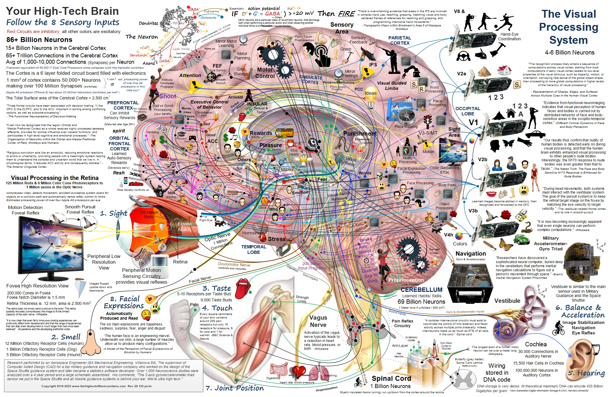

# 大脑功能？

大脑功能对应图。

原图链接: [https://www.thehighestofthemountains.com/images/thehighestofthemountains_brain_map_brainwithquotes28-125px.jpg](https://www.thehighestofthemountains.com/images/thehighestofthemountains_brain_map_brainwithquotes28-125px.jpg)

> 上面这张图是一张流传很广的"大脑功能地图"，把记忆、情绪、创造力、音乐等五花八门的功能画到了大脑的不同位置。它更像是一张**趣味示意图**——真实的大脑功能划分没有这么浪漫，但也同样精彩。这篇笔记就从这个话题展开：大脑由哪些部分组成，各区域负责什么，左右脑又是怎么回事。

## 大脑的基本构成

### 神经元：大脑的基本单元

大脑由约 **860 亿个神经元**（神经细胞）组成。一个神经元大致分三部分：

- **树突**：接收来自其他神经元的信号
- **细胞体**：汇总、处理信号
- **轴突**：把信号传给下一个神经元，末端通过**突触**与其他神经元相连

神经元之间通过**电信号 + 化学递质**传递信息，信号在突触处会转化为化学信号（多巴胺、血清素、乙酰胆碱等都是递质）。大脑的复杂行为，本质上就是这 860 亿个细胞之间的连接和放电。

### 灰质与白质

- **灰质**：神经元的细胞体聚集区，位于大脑**表层**（即大脑皮层）和深部核团，负责**计算和处理**
- **白质**：轴突聚集区，位于灰质**内侧**，负责**连接**——把各个脑区连成网络

大脑皮层是灰质的表层褶皱，总面积约 2.2~2.5 平方米（展开约一张报纸大小）。为了塞进颅骨，皮层折叠成一个个**沟回**，所以大脑看起来像核桃仁。

## 大脑的四大区域（脑叶）

大脑两半球表面各分为四个"脑叶"，以颅骨上方的骨缝（中央沟、外侧裂等）为分界，各自承担不同的功能：

| 脑叶 | 位置 | 主要功能 | 受损的典型表现 |
| --- | --- | --- | --- |
| **额叶** | 前额后方，最大 | 运动控制、计划与决策、人格、语言表达（Broca 区） | 性格突变、难以计划、行动迟缓 |
| **顶叶** | 头顶中央 | 躯体感觉（触觉、痛觉、温度）、空间方位 | 感觉障碍、分不清左右 |
| **颞叶** | 太阳穴两侧 | 听觉、语言理解（Wernicke 区）、记忆（海马体）、人脸识别 | 听不懂话、记不住新事物 |
| **枕叶** | 后脑勺 | 视觉处理 | 看得到物体却"认不出"（视觉失认） |

几点说明：

- **运动**由额叶中央前回（运动皮层）发出指令，**感觉**由顶叶中央后回（躯体感觉皮层）接收，两者在头顶中央沟两侧"一出一进"
- 历史上最著名的脑损伤案例之一——1848 年铁路工头**菲尼亚斯·盖奇**（Phineas Gage）被铁棍穿过前额，奇迹般活下来，但性格大变、行为失控。这个案例让人类第一次认识到：**额叶负责"人格"**

## 小脑与脑干

大脑皮层之下、后下方，还有两个重要的部分：

- **小脑**：位于后脑勺、大脑半球下方，负责**平衡与动作协调**。虽然只占脑重约 10%，却容纳了全脑一半以上的神经元。喝醉后走不稳、打乒乓球时精准击球，都是小脑在工作
- **脑干**：连接大脑和脊髓的"生命中枢"，由延髓、脑桥、中脑组成，控制**呼吸、心跳、血压**等最基本的生命活动。脑干受损，即使大脑完好也会失去生命体征

## 边缘系统：情绪与记忆

大脑皮层深处包裹着一组参与情绪和记忆的结构，统称**边缘系统**：

- **海马体**：负责把短期记忆转化为长期记忆。阿尔茨海默病最早损伤的往往就是海马体，所以早期症状是"记不住新东西"
- **杏仁核**：处理恐惧、愤怒等情绪，参与"战斗或逃跑"反应
- **下丘脑**：调节体温、饥饱、内分泌，是维持内环境稳定的"总控制台"
- **扣带回**：连接情绪与认知，参与痛觉和情感调控

## 左右脑的分工

### 交叉控制

大脑最奇妙的规律之一：**左半球控制右半边身体，右半球控制左半边身体**。左右半球的信号通过**胼胝体**（约 2 亿条神经纤维组成的"信息高速公路"）传递交换。

### 裂脑实验：理论的来源

上世纪 60 年代，美国神经科学家**罗杰·斯佩里**（Roger Sperry）研究了切断胼胝体的"裂脑人"（当时用来治疗重度癫痫的手术），发现左右半球各有所长，因此在 **1981 年获得诺贝尔生理学或医学奖**。其核心发现：

- **左半球**：语言、逻辑、分析、数字、顺序处理
- **右半球**：空间、音乐、绘画、面孔识别、整体感知

### 左右脑对照表

| 左脑（"逻辑脑"） | 右脑（"艺术脑"） |
| --- | --- |
| 语言表达与理解 | 空间方位感 |
| 逻辑推理 | 音乐旋律 |
| 数学计算 | 绘画与图像 |
| 分析、按顺序处理 | 整体、全局感知 |
| 细节 | 面孔识别 |

### 流行的误解

"左脑理性、右脑感性""多用右脑可以开发创造力"这类说法流传极广，但**真实情况远比这复杂**：

- 左右脑并非独立工作，绝大多数功能需要**两个半球协同**完成，靠胼胝体沟通
- 功能影像研究显示：做"右脑任务"时左脑同样在活跃
- 所谓"右脑开发""左脑训练"没有科学依据，大脑是整体运作的
- 左右脑分工的差异是**相对**的（语言主要靠左脑、空间主要靠右脑），不是绝对的

正确的认识是：**左右脑有分工倾向，但大脑是一个整体网络。**

## 语言中枢

语言是左脑的"主场"（约 95% 的右利手和约 70% 的左利手，语言中枢在左脑）。大脑里有两个著名的语言区，都由法国医生**保尔·布罗卡**（Paul Broca，1861 年发现）和德国医生**卡尔·韦尼克**（Carl Wernicke，1874 年发现）的研究而得名：

| 区域 | 位置 | 负责 | 受损表现 |
| --- | --- | --- | --- |
| **布罗卡区**（Broca） | 左额叶 | 语言的"生产"——组织词语、说话 | **运动性失语**：心里明白、想得清楚，但说不出来 |
| **韦尼克区**（Wernicke） | 左颞叶 | 语言的"理解" | **感觉性失语**：能流利说话，但语无伦次，也听不懂别人 |

两个区域通过**弓状束**相连。布罗卡区受损的人"说不了"，韦尼克区受损的人"听不懂"，两个案例合起来告诉人们：**语言的产生和理解，是不同脑区各管一段的流水线**。

## 大脑的有趣数字

| 指标 | 数值 |
| --- | --- |
| 神经元数量 | 约 860 亿个 |
| 突触数量 | 约 100 万亿个 |
| 重量 | 约 1.4 千克（占体重约 2%） |
| 耗能 | 约占全身能量的 20%，功率约 20 瓦 |
| 皮层面积 | 展开约 2.2~2.5 平方米 |
| 连接大脑两半球的胼胝体 | 约 2 亿条神经纤维 |
| 大脑工作电压 | 约 0.07 伏（微弱电信号） |

大脑是全身**耗能最高的器官**：只占体重 2%，却消耗约 20% 的能量，思考真的会"费脑子"。

## 三脑理论：一个流行的简化模型

神经科学家**保罗·麦克莱恩**（Paul MacLean）上世纪 60 年代提出"**三位一体大脑**"（Triune Brain）理论，把大脑按进化层次分成三层：

1. **爬虫脑**（脑干、小脑）：最古老，掌管生存本能——呼吸、心跳、攻击、逃跑
2. **边缘系统（古哺乳脑）**：掌管情绪、记忆、社交
3. **新皮层（新哺乳脑）**：最晚进化出来，掌管理性、语言、抽象思维

这个模型非常直观好记，也因此广为流传。但现代神经科学普遍认为它是**过度简化**：三个"层次"并非各自独立运行，而是高度交织的网络。它可以作为理解大脑的入门框架，但不要把它当作精确的解剖事实。

## 总结

- 大脑由**灰质（计算）+ 白质（连接）**构成，表面是折叠的大脑皮层
- 四个**脑叶**各管一摊：额叶管运动和人格，顶叶管感觉和空间，颞叶管听觉和记忆，枕叶管视觉
- **小脑管协调，脑干保命，边缘系统管情绪**
- **左右脑分工**真实存在（斯佩里的裂脑实验），但"左右脑对立"是流行文化的夸大，大脑实际是整体协同工作
- 语言中枢（布罗卡区、韦尼克区）让人们明白：再高级的认知功能，也能在大脑里找到对应的"硬件位置"
