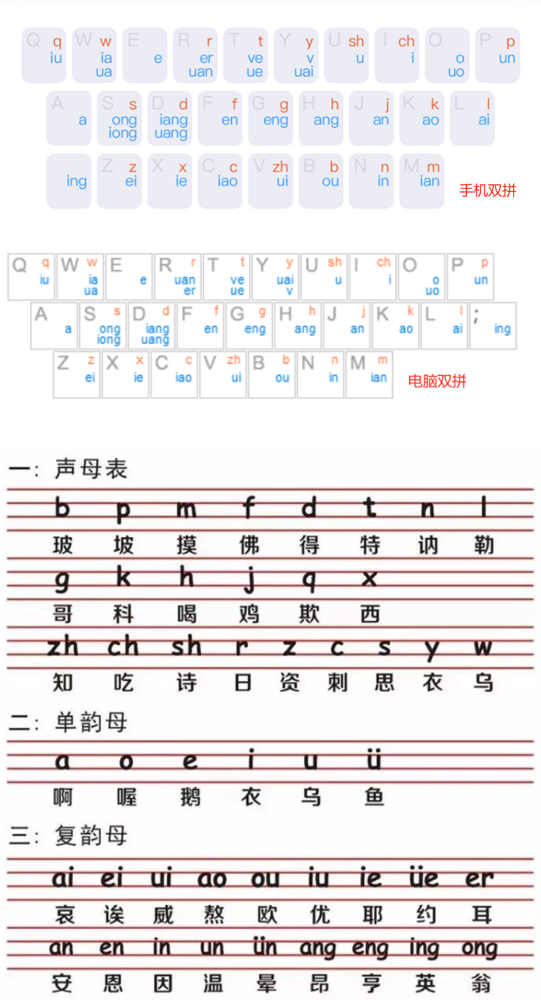
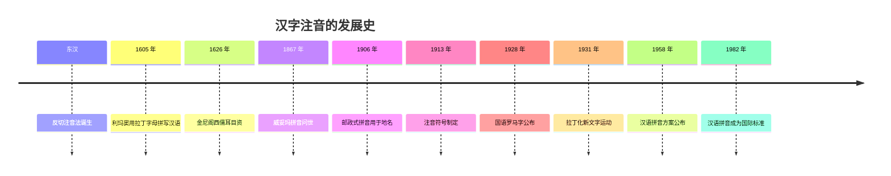

# 搜狗双拼

搜狗双拼输入法，按键对应关系图

## 关系对应
1. 26个英文字母的“发音”
2. 26个英文字母+符号 对应的 “按键”名
3. 键盘按键和“手指”的对应关系
4. 23个声母和 24个韵母 对应的 “按键”名
> 1. 26个英文字母 => 按键 => 手指
> 2. 47个声韵母 => 按键 => 手指
> 3. 中英文的发音字母 => 手指 的 对应关系

需要注意：
1. 图片中**橙色=>声母**，而**蓝色=>韵母(组合)**
2. 韵母**U(鱼)** 对应字母 **V**
3. 一个键上只有1个韵母的是**a、e、;(PC的ing)**，共3个
4. 一个键上有3个声母或韵母的是**w、s、d、r、t、y**，共6个
5. 其余每个键上都有2个声母或韵母

## 拼音的发明史（按时间顺序）

### 汉字为什么需要注音

汉字是**表意文字**：字形承载意义，本身不直接表示读音。古人遇到不会读的字，需要一套"注音"手段：

- **直音**：用一个同音字注另一个字，如"嵩，读松"——但同音字不好找
- **反切**：用两个汉字拼一个字的读音，取上字的**声母**、下字的**韵母和声调**，如"练，朗甸切"（朗的声母 l + 甸的韵母 ian）

反切诞生于**东汉（约 2 世纪）**，比字母拼写早了一千五百多年，一直用到民国。但它终究是"用汉字注汉字"，普通人依然难学——要"拼音化"，必须等字母文字传入中国。

### 16 世纪：传教士的尝试

- **1605 年**，意大利传教士**利玛窦**（Matteo Ricci）出版《西字奇迹》，第一次系统地用**拉丁字母**为汉字注音——这是汉字"拼音化"的起点
- **1626 年**，法国传教士**金尼阁**（Nicolas Trigault）出版《西儒耳目资》，这是第一部完整的拉丁字母拼音方案，用 29 个字母拼写汉字

传教士们是为了学汉语方便传教，但他们的工作证明了：**汉字可以用字母拼出来**。

### 19 世纪：威妥玛拼音与邮政式拼音

- **1867 年**，英国外交官**威妥玛**（Thomas Wade）编写《语言自迩集》，用拉丁字母拼写汉语；后来**翟理斯**（Herbert Giles）修订，成为"**威妥玛-翟理斯拼音**"，是 19 世纪末到 20 世纪中叶西方拼写汉语的标准
- **1906 年**，清末邮政系统确定**邮政式拼音**用于地名——今天还能在旧地图、旧译名里看到：Peking（北京）、Tsingtao（青岛）、Kiangsu（江苏）

### 20 世纪上半叶：中国自己的注音尝试

- **1913 年**，民国教育部制定**注音符号**，1918 年公布：用汉字偏旁改造出 ㄅㄆㄇㄈ 等 37 个符号，至今仍在台湾使用
- **1928 年**，**赵元任**等制定**国语罗马字**（国罗），用字母拼法的变化表示声调
- **1931 年**，**瞿秋白、吴玉章**等在苏联海参崴制定"**拉丁化新文字**"（北拉），目标是直接用字母文字代替汉字

### 1958 年：汉语拼音方案

1955 年，中国文字改革委员会成立拼音方案委员会（**周有光**是核心设计者之一），**1958 年 2 月 11 日**全国人大批准《**汉语拼音方案**》——这就是我们今天用的拼音：

- 用 **26 个拉丁字母**（不新增字母），教学上归纳为 **23 个声母、24 个韵母**，声调用符号标注（ā á ǎ à）
- 定位是"给汉字注音和拼写普通话的**工具**"，不取代汉字本身
- 1977 年联合国地名标准化会议采用，**1982 年成为 ISO 7098 国际标准**——从此世界上拼写汉语，用的是汉语拼音而不是威妥玛拼音

### 同一个"中"字，各种拼法

| 时代 | 方案 | "中"的拼法 |
|---|---|---|
| 东汉 | 反切 | 陟弓切 |
| 1867 | 威妥玛拼音 | chung |
| 1913 | 注音符号 | ㄓㄨㄥ |
| 1958 | 汉语拼音 | zhōng |

### 拼音与双拼的关系

- **全拼**：把拼音的每一个字母都敲出来，如"中"要敲 z-h-o-n-g 五个键
- **双拼**：把**声母**和**韵母**各用一个键表示，任何字最多敲两键——正是本篇开头那张图做的事：23 个声母 + 24 个韵母，映射到 26 个按键上
- 所以，没有 1958 年的汉语拼音方案，就没有今天的全拼、双拼输入法——输入法本质上就是"拼音 → 汉字"的翻译器