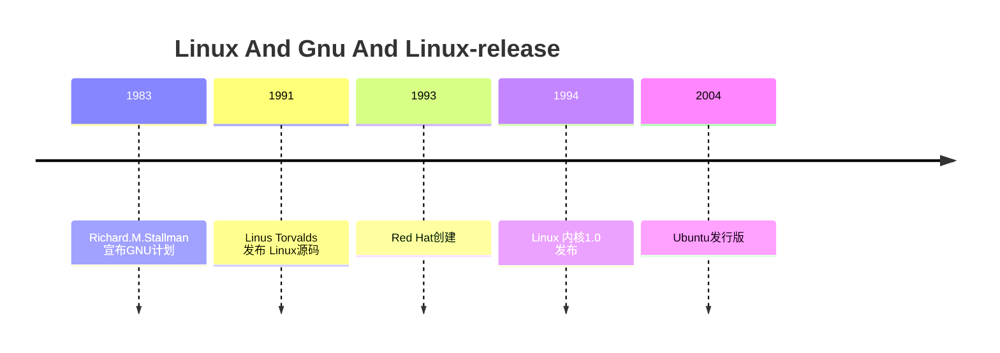

# Linux和各种发行版

## 历史
缘起Unix，之后Linux

## 0x01.GNU Project（GNU项目）
1983年Richard.M.Stallman公开宣布了“GNU”计划

参考：[Richard.M.Stallman介绍](https://zhuanlan.zhihu.com/p/638986117)

官网：https://www.gnu.org/

## 0x02.Linux Kernel（Linux内核）
1991年Linus Torvalds在网上公开自己的源码，开启了Linux内核的开发浪潮

官网：https://www.kernel.org/

## 0x03.Linux Release（Linux发行版）

### 1. Red Hat系
包安装器：rpm、 yum、dnf

### 2. Debian系
包安装器：deb、 apt

官网文档：https://www.debian.org/doc/
快速参考手册：https://www.debian.org/doc/manuals/debian-reference/
管理员手册：https://www.debian.org/doc/manuals/debian-handbook/index.zh-cn.html

### 3. 网站参考
<table><thead><tr><td>发行版本</td><td>官方网站</td><td>说明</td></tr></thead><tbody><tr><td>CentOS</td><td>www.centos.org</td><td>模仿 Red Hat Enterprise Linux 的非商业发行版本</td></tr><tr><td>Debian</td><td>www.debian.org</td><td>免费的非商业发行版本</td></tr><tr><td>Fedora</td><td>fedoraproject.org</td><td>Red Hat 公司赞助的社区项目免费发行版本</td></tr><tr><td>Gentoo</td><td>www.gentoo.org</td><td>基于源代码编译的发行版本</td></tr><tr><td>Mandriva</td><td>www.mandriva.com</td><td>前身 Mandrakelinux, 第一个为非技术类用户设计的 Linux 发行版本</td></tr><tr><td>openSUSE</td><td>www.opensuse.org</td><td>SUSE Linux 的免费发行版本</td></tr></tbody></table>

<table><thead><tr><td>发行版本</td><td>官方网站</td><td>说明</td></tr></thead><tbody><tr><td>Red Flag</td><td>www.redflag-linux.com</td><td>国内发展最好的 Linux 发行版本</td></tr><tr><td>Red Hat Enterprise</td><td>www.Red Hat.com</td><td>Red Hat 公司的企业级商业化发行版本</td></tr><tr><td>SUSE Linux Enterprise</td><td>www.suse.com/linux</td><td>Novell 公司的企业级商业化 Linux 发行版本</td></tr><tr><td>TurboLinux</td><td>www.turbolinux.com</td><td>在中国和日本取得较大成功的发行版本</td></tr><tr><td>Ubuntu</td><td>www.ubuntu.com</td><td>类似于 Debian 的免费发行版本</td></tr></tbody></table>

### 10.openmediavault
官网：https://www.openmediavault.org/
官网文档：https://docs.openmediavault.org/en/stable/

## 0x04.License（授权）
各种授权协议

## 0xFF.学习网站
<table><thead><tr><td>国外网站</td><td>说明</td></tr></thead><tbody><tr><td>lwn.net</td><td>来自 Linux 和开放源代码界的新闻</td></tr><tr><td>http://freecode.com/</td><td>最齐全的 Linux/Unix 软件库</td></tr><tr><td>www.justlinux.com</td><td>信息齐全的 Linux 学习网站</td></tr><tr><td>www.kernel.org</td><td>Linux 内核的官方网站</td></tr><tr><td>www.linux.com</td><td>提供全方位的 Linux 信息 (尽管不是官方网站)</td></tr><tr><td>https://tldp.org/guides.html</td><td>提供更多的 Linux 学习相关</td></tr></tbody></table>
<table><thead><tr><td>国外网站</td><td>说明</td></tr></thead><tbody><tr><td>www.linuxhq.com</td><td>提供内核信息和补丁的汇总</td></tr><tr><td>www.linuxtoday.com</td><td>非常完整的Linux新闻站点</td></tr></tbody></table>
<table><thead><tr><td>国内网站</td><td>说明</td></tr></thead><tbody><tr><td>www.chinaunix.net</td><td>国内最大的Linux/Unix 技术社区网站</td></tr><tr><td>www.linuxeden.com</td><td>Linux 伊甸园, 最大的中文开源资讯门户网站</td></tr><tr><td>www.linuxfans.org</td><td>中国Linux公社, 拥有自己 的Linux发行版本 Magic Linux</td></tr><tr><td>www.linuxsir.org</td><td>提供Linux各种资源, 包括资讯、软件、手册等</td></tr></tbody></table>

## 操作系统的意义
操作各种硬件设备，Linux作为操作系统的内核，核心目的也是操作各种硬件设备。

## Linux核心
1. 一切皆是文件
2. 管道思想
3. 文件的权限

# Linux操作系统

包含Linux系统相关知识，主要以Debain进行说明。

linux系统

linux是一个多用户，多任务操作系统

linux系统用户管理和文件管理两个部分

## 网址
1. https://www.fsf.org
2. http://www.gnu.org
3. http://www.linux.org
4. http://www.kernel.org

## 发行版网址
### 国外
1. https://www.debian.org
2. https://ubuntu.com
3. https://www.redhat.com/en

### 国内
1. https://docs.openeuler.org/zh/
2. https://openanolis.cn/